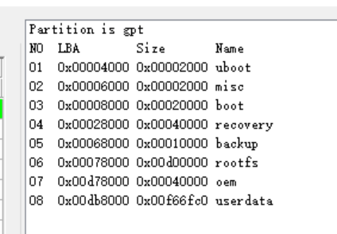

# 原厂固件分析


## 分区表

```shell
# fdisk -l full.img
Disk disk.img: 14.56 GiB, 15634268160 bytes, 30535680 sectors
Units: sectors of 1 * 512 = 512 bytes
Sector size (logical/physical): 512 bytes / 512 bytes
I/O size (minimum/optimal): 512 bytes / 512 bytes
Disklabel type: gpt
Disk identifier: 094B0000-0000-4631-8000-572C0000419B

Device         Start      End  Sectors  Size Type
disk.img1    16384    24575     8192    4M unknown
disk.img2    24576    32767     8192    4M unknown
disk.img3    32768   163839   131072   64M unknown
disk.img4   163840   425983   262144  128M unknown
disk.img5   425984   491519    65536   32M unknown
disk.img6   491520 14123007 13631488  6.5G unknown
disk.img7 14123008 14385151   262144  128M unknown
disk.img8 14385152 30535615 16150464  7.7G unknown


```



转为parameter.txt为：

```shell
FIRMWARE_VER: 1.0
MACHINE_MODEL: RK3588
MACHINE_ID: 007
MANUFACTURER: RK3588
MAGIC: 0x5041524B
ATAG: 0x00200800
MACHINE: 0xffffffff
CHECK_MASK: 0x80
PWR_HLD: 0,0,A,0,1
TYPE: GPT
GROW_ALIGN: 0
CMDLINE: mtdparts=:0x00002000@0x00004000(uboot),0x00002000@0x00006000(misc),0x00020000@0x00008000(boot),0x00040000@0x00028000(recovery),0x00010000@0x00068000(backup),0x00d00000@0x00078000(rootfs),0x00040000@0x00d78000(oem),-@0x00db8000(userdata:grow)
uuid:uboot=7a3f0000-0000-446a-8000-702f00006273
uuid:rootfs=614e0000-0000-4b53-8000-1d28000054a9

```

全盘镜像拆解：
```shell
7z x fulldisk.img -opartitions

```


全盘镜像，分区表信息：

```shell
00000000  00 00 00 00 00 00 00 00  00 00 00 00 00 00 00 00  |................|
*
000001c0  00 00 ee 00 00 00 01 00  00 00 ff ff ff ff 00 00  |................|
000001d0  00 00 00 00 00 00 00 00  00 00 00 00 00 00 00 00  |................|
*
000001f0  00 00 00 00 00 00 00 00  00 00 00 00 00 00 55 aa  |..............U.|
00000200  45 46 49 20 50 41 52 54  00 00 01 00 5c 00 00 00  |EFI PART....\...|
00000210  d8 c7 8c 97 00 00 00 00  01 00 00 00 00 00 00 00  |................|
00000220  ff ef d1 01 00 00 00 00  22 00 00 00 00 00 00 00  |........".......|
00000230  de ef d1 01 00 00 00 00  00 00 4b 09 00 00 31 46  |..........K...1F|
00000240  80 00 57 2c 00 00 41 9b  02 00 00 00 00 00 00 00  |..W,..A.........|
00000250  80 00 00 00 80 00 00 00  c8 be 73 da 00 00 00 00  |..........s.....|
00000260  00 00 00 00 00 00 00 00  00 00 00 00 00 00 00 00  |................|
*
00000400  00 00 3f 75 00 00 7e 45  80 00 64 c2 00 00 7c 64  |..?u..~E..d...|d|
00000410  00 00 66 b7 00 00 28 4d  80 00 48 39 00 00 0e 59  |..f...(M..H9...Y|
00000420  00 40 00 00 00 00 00 00  ff 5f 00 00 00 00 00 00  |.@......._......|
00000430  00 00 00 00 00 00 00 00  75 00 62 00 6f 00 6f 00  |........u.b.o.o.|
00000440  74 00 00 00 00 00 00 00  00 00 00 00 00 00 00 00  |t...............|
00000450  00 00 00 00 00 00 00 00  00 00 00 00 00 00 00 00  |................|
*
00000480  00 00 5d f3 00 00 73 44  80 00 0d d4 00 00 3b 4e  |..]...sD......;N|
00000490  00 00 61 8f 00 00 27 4d  80 00 67 1a 00 00 55 59  |..a...'M..g...UY|
000004a0  00 60 00 00 00 00 00 00  ff 7f 00 00 00 00 00 00  |.`..............|
000004b0  00 00 00 00 00 00 00 00  6d 00 69 00 73 00 63 00  |........m.i.s.c.|
000004c0  00 00 00 00 00 00 00 00  00 00 00 00 00 00 00 00  |................|
*
00000500  00 00 61 30 00 00 21 4e  80 00 44 cf 00 00 49 cd  |..a0..!N..D...I.|
00000510  00 00 3f 7a 00 00 6a 44  80 00 70 2f 00 00 62 73  |..?z..jD..p/..bs|
00000520  00 80 00 00 00 00 00 00  ff 7f 02 00 00 00 00 00  |................|
00000530  00 00 00 00 00 00 00 00  62 00 6f 00 6f 00 74 00  |........b.o.o.t.|
00000540  00 00 00 00 00 00 00 00  00 00 00 00 00 00 00 00  |................|
*
00000580  00 00 66 53 00 00 2b 4c  80 00 3b da 00 00 6c 8a  |..fS..+L..;...l.|
00000590  00 00 4e 5f 00 00 70 42  80 00 5d fa 00 00 19 bc  |..N_..pB..].....|
000005a0  00 80 02 00 00 00 00 00  ff 7f 06 00 00 00 00 00  |................|
000005b0  00 00 00 00 00 00 00 00  72 00 65 00 63 00 6f 00  |........r.e.c.o.|
000005c0  76 00 65 00 72 00 79 00  00 00 00 00 00 00 00 00  |v.e.r.y.........|
000005d0  00 00 00 00 00 00 00 00  00 00 00 00 00 00 00 00  |................|
*
00000600  00 00 1b 84 00 00 07 45  80 00 35 1d 00 00 3f 2d  |.......E..5...?-|
00000610  00 00 20 a7 00 00 27 48  80 00 3c 49 00 00 4c 71  |.. ...'H..<I..Lq|
00000620  00 80 06 00 00 00 00 00  ff 7f 07 00 00 00 00 00  |................|
00000630  00 00 00 00 00 00 00 00  62 00 61 00 63 00 6b 00  |........b.a.c.k.|
00000640  75 00 70 00 00 00 00 00  00 00 00 00 00 00 00 00  |u.p.............|
00000650  00 00 00 00 00 00 00 00  00 00 00 00 00 00 00 00  |................|
*
00000680  00 00 44 ed 00 00 7d 42  80 00 0a c1 00 00 30 5d  |..D...}B......0]|
00000690  00 00 4e 61 00 00 53 4b  80 00 1d 28 00 00 54 a9  |..Na..SK...(..T.|
000006a0  00 80 07 00 00 00 00 00  ff 7f d7 00 00 00 00 00  |................|
000006b0  00 00 00 00 00 00 00 00  72 00 6f 00 6f 00 74 00  |........r.o.o.t.|
000006c0  66 00 73 00 00 00 00 00  00 00 00 00 00 00 00 00  |f.s.............|
000006d0  00 00 00 00 00 00 00 00  00 00 00 00 00 00 00 00  |................|
*
00000700  00 00 38 b3 00 00 2c 4a  80 00 27 ee 00 00 02 c2  |..8...,J..'.....|
00000710  00 00 3a bf 00 00 39 43  80 00 2f 6c 00 00 4f 26  |..:...9C../l..O&|
00000720  00 80 d7 00 00 00 00 00  ff 7f db 00 00 00 00 00  |................|
00000730  00 00 00 00 00 00 00 00  6f 00 65 00 6d 00 00 00  |........o.e.m...|
00000740  00 00 00 00 00 00 00 00  00 00 00 00 00 00 00 00  |................|
*
00000780  00 00 62 01 00 00 06 46  80 00 0d cb 00 00 4d 05  |..b....F......M.|
00000790  00 00 5a de 00 00 79 48  80 00 43 91 00 00 4c 77  |..Z...yH..C...Lw|
000007a0  00 80 db 00 00 00 00 00  bf ef d1 01 00 00 00 00  |................|
000007b0  00 00 00 00 00 00 00 00  75 00 73 00 65 00 72 00  |........u.s.e.r.|
000007c0  64 00 61 00 74 00 61 00  00 00 00 00 00 00 00 00  |d.a.t.a.........|
000007d0  00 00 00 00 00 00 00 00  00 00 00 00 00 00 00 00  |................|
*
```

32MB镜像分区表信息：

```shell
# hexdump -C my-aigo-backup-32MB.img |more
00000000  00 00 00 00 00 00 00 00  00 00 00 00 00 00 00 00  |................|
*
000001c0  00 00 ee 00 00 00 01 00  00 00 ff ff ff ff 00 00  |................|
000001d0  00 00 00 00 00 00 00 00  00 00 00 00 00 00 00 00  |................|
*
000001f0  00 00 00 00 00 00 00 00  00 00 00 00 00 00 55 aa  |..............U.|
00000200  45 46 49 20 50 41 52 54  00 00 01 00 5c 00 00 00  |EFI PART....\...|
00000210  af 80 36 f3 00 00 00 00  01 00 00 00 00 00 00 00  |..6.............|
00000220  ff ef d1 01 00 00 00 00  22 00 00 00 00 00 00 00  |........".......|
00000230  de ef d1 01 00 00 00 00  00 00 48 75 00 00 62 4a  |..........Hu..bJ|
00000240  80 00 56 f9 00 00 28 07  02 00 00 00 00 00 00 00  |..V...(.........|
00000250  80 00 00 00 80 00 00 00  ff 94 25 5e 00 00 00 00  |..........%^....|
00000260  00 00 00 00 00 00 00 00  00 00 00 00 00 00 00 00  |................|
*
00000400  00 00 78 0c 00 00 5c 47  80 00 02 30 00 00 22 6e  |..x...\G...0.."n|
00000410  00 00 46 8a 00 00 6e 44  80 00 0d 65 00 00 6a 75  |..F...nD...e..ju|
00000420  00 40 00 00 00 00 00 00  ff 5f 00 00 00 00 00 00  |.@......._......|
00000430  00 00 00 00 00 00 00 00  75 00 62 00 6f 00 6f 00  |........u.b.o.o.|
00000440  74 00 00 00 00 00 00 00  00 00 00 00 00 00 00 00  |t...............|
00000450  00 00 00 00 00 00 00 00  00 00 00 00 00 00 00 00  |................|
*
00000480  00 00 64 ad 00 00 26 4f  80 00 3a 75 00 00 21 08  |..d...&O..:u..!.|
00000490  00 00 4b 72 00 00 1c 45  80 00 5c 7d 00 00 3d 54  |..Kr...E..\}..=T|
000004a0  00 60 00 00 00 00 00 00  ff 7f 00 00 00 00 00 00  |.`..............|
000004b0  00 00 00 00 00 00 00 00  6d 00 69 00 73 00 63 00  |........m.i.s.c.|
000004c0  00 00 00 00 00 00 00 00  00 00 00 00 00 00 00 00  |................|
*
00000500  00 00 4b 15 00 00 05 43  80 00 66 da 00 00 15 c6  |..K....C..f.....|
00000510  00 00 3f 7a 00 00 6a 44  80 00 70 2f 00 00 62 73  |..?z..jD..p/..bs|
00000520  00 80 00 00 00 00 00 00  ff 7f 02 00 00 00 00 00  |................|
00000530  00 00 00 00 00 00 00 00  62 00 6f 00 6f 00 74 00  |........b.o.o.t.|
00000540  00 00 00 00 00 00 00 00  00 00 00 00 00 00 00 00  |................|
*
00000580  00 00 6c 2a 00 00 6c 4a  80 00 71 48 00 00 2d 12  |..l*..lJ..qH..-.|
00000590  00 00 71 57 00 00 6a 4d  80 00 03 52 00 00 1d 05  |..qW..jM...R....|
000005a0  00 80 02 00 00 00 00 00  ff 7f 06 00 00 00 00 00  |................|
000005b0  00 00 00 00 00 00 00 00  72 00 65 00 63 00 6f 00  |........r.e.c.o.|
000005c0  76 00 65 00 72 00 79 00  00 00 00 00 00 00 00 00  |v.e.r.y.........|
000005d0  00 00 00 00 00 00 00 00  00 00 00 00 00 00 00 00  |................|
*
00000600  00 00 7a d6 00 00 7f 4b  80 00 3d a5 00 00 4c 53  |..z....K..=...LS|
00000610  00 00 79 25 00 00 57 43  80 00 1b de 00 00 70 a7  |..y%..WC......p.|
00000620  00 80 06 00 00 00 00 00  ff 7f 07 00 00 00 00 00  |................|
00000630  00 00 00 00 00 00 00 00  62 00 61 00 63 00 6b 00  |........b.a.c.k.|
00000640  75 00 70 00 00 00 00 00  00 00 00 00 00 00 00 00  |u.p.............|
00000650  00 00 00 00 00 00 00 00  00 00 00 00 00 00 00 00  |................|
*
00000680  00 00 1b 00 00 00 19 40  80 00 1c db 00 00 07 f0  |.......@........|
00000690  00 00 4e 61 00 00 53 4b  80 00 1d 28 00 00 54 a9  |..Na..SK...(..T.|
000006a0  00 80 07 00 00 00 00 00  ff 7f d7 00 00 00 00 00  |................|
000006b0  00 00 00 00 00 00 00 00  72 00 6f 00 6f 00 74 00  |........r.o.o.t.|
000006c0  66 00 73 00 00 00 00 00  00 00 00 00 00 00 00 00  |f.s.............|
000006d0  00 00 00 00 00 00 00 00  00 00 00 00 00 00 00 00  |................|
*
00000700  00 00 6c 90 00 00 47 40  80 00 57 d0 00 00 2a 53  |..l...G@..W...*S|
00000710  00 00 16 fe 00 00 7b 4c  80 00 18 c3 00 00 0e 87  |......{L........|
00000720  00 80 d7 00 00 00 00 00  ff 7f db 00 00 00 00 00  |................|
00000730  00 00 00 00 00 00 00 00  6f 00 65 00 6d 00 00 00  |........o.e.m...|
00000740  00 00 00 00 00 00 00 00  00 00 00 00 00 00 00 00  |................|
*
00000780  00 00 7b 6d 00 00 4b 43  80 00 29 6e 00 00 33 e3  |..{m..KC..)n..3.|
00000790  00 00 49 da 00 00 36 40  80 00 75 ec 00 00 55 95  |..I...6@..u...U.|
000007a0  00 80 db 00 00 00 00 00  bf ef d1 01 00 00 00 00  |................|
000007b0  00 00 00 00 00 00 00 00  75 00 73 00 65 00 72 00  |........u.s.e.r.|
000007c0  64 00 61 00 74 00 61 00  00 00 00 00 00 00 00 00  |d.a.t.a.........|
000007d0  00 00 00 00 00 00 00 00  00 00 00 00 00 00 00 00  |................|
*

```

**结论：两份 dump 的分区布局完全相同，差异只在 GUID 和两个 CRC 上。**

### 1. 保护性 MBR（0x000–0x1FF）：完全相同

| 偏移 | 字段 | 两者的值 | 含义 |
|---|---|---|---|
| 0x1C2 | 分区类型 | `ee` | GPT 保护分区 |
| 0x1C6 | 起始 LBA | `01 00 00 00` | 从 LBA 1 开始 |
| 0x1CA | 扇区数 | `ff ff ff ff` | 盘太大时的占位值 |
| 0x1FE | 引导签名 | `55 aa` | |

### 2. GPT 头（0x200，LBA 1）

| 偏移 | 字段 | 全盘镜像 | 32MB 镜像 | 是否相同 |
|---|---|---|---|---|
| 0x200 | 签名 | `EFI PART` | `EFI PART` | 相同 |
| 0x208 | 版本 | 1.0 | 1.0 | 相同 |
| 0x20C | 头大小 | 0x5C (92) | 0x5C (92) | 相同 |
| 0x210 | **头 CRC32** | `0x978CC7D8` | `0xF33680AF` | **不同** |
| 0x218 | 保留 | 0 | 0 | 相同 |
| 0x218+ | 当前 LBA | 1 | 1 | 相同 |
| 0x220 | 备份头 LBA | 0x01D1EFFF (30,535,679) | 同左 | 相同 |
| 0x228 | 首个可用 LBA | 34 | 34 | 相同 |
| 0x230 | 末个可用 LBA | 0x01D1EFDE (30,535,646) | 同左 | 相同 |
| 0x238 | **磁盘 GUID** | `094b0000-0000-4631-8000-572c0000419b` | `75480000-0000-4a62-8000-56f900002807` | **不同** |
| 0x248 | 分区表起始 LBA | 2 | 2 | 相同 |
| 0x250 | 表项数量 | 128 | 128 | 相同 |
| 0x254 | 每项大小 | 128 字节 | 128 字节 | 相同 |
| 0x258 | **分区数组 CRC32** | `0xDA73BEC8` | `0x5E2594FF` | **不同** |

- 磁盘总容量是 30,535,680 个扇区，约 15.6 GB。
- 头 CRC 覆盖整个头，包括磁盘 GUID 和数组 CRC。数组 CRC 覆盖全部 128 个表项。所以两个 CRC 不同是 GUID 不同的必然结果，不是独立的差异。

### 3. 分区表项（0x400 起，每项 128 字节）

每项的结构是：类型 GUID（16 字节）、唯一 GUID（16 字节）、起始 LBA、结束 LBA、属性、UTF-16LE 名称。

| # | 名称 | 起始 LBA | 结束 LBA | 大小 | 布局 | 类型 GUID | 唯一 GUID |
|---|---|---|---|---|---|---|---|
| 1 | uboot | 0x4000 | 0x5FFF | 4 MiB | 相同 | 不同 | 不同 |
| 2 | misc | 0x6000 | 0x7FFF | 4 MiB | 相同 | 不同 | 不同 |
| 3 | boot | 0x8000 | 0x27FFF | 64 MiB | 相同 | 不同 | **相同** |
| 4 | recovery | 0x28000 | 0x67FFF | 128 MiB | 相同 | 不同 | 不同 |
| 5 | backup | 0x68000 | 0x77FFF | 32 MiB | 相同 | 不同 | 不同 |
| 6 | rootfs | 0x78000 | 0xD77FFF | 6.5 GiB | 相同 | 不同 | **相同** |
| 7 | oem | 0xD78000 | 0xDB7FFF | 128 MiB | 相同 | 不同 | 不同 |
| 8 | userdata | 0xDB8000 | 0x1D1EFBF | 约 7.7 GiB | 相同 | 不同 | 不同 |

- 所有分区的属性字段都是 0，名称也都相同。
- 只有 boot 和 rootfs 的唯一 GUID 两边一致：
    - boot 是 `7a3f0000-0000-446a-8000-702f00006273`。
    - rootfs 是 `614e0000-0000-4b53-8000-1d28000054a9`。
- 这两个值我认得是 Rockchip 平台常见的写死 PARTUUID，内核命令行里 `root=PARTUUID=614e0000-...` 是典型写法。这是我凭记忆判断的，你可以对照 parameter 文件确认。
- 其余 GUID 应该是烧录工具写分区表时随机生成的，所以每次都会变。
- 这些 GUID 的高位字节大多是 0，像是低熵的随机数生成器产出的，属于正常现象。

### 4. 这说明什么

- 两份分区表来自同一份分区定义（同一个 parameter/布局），但不是同一次分区表写入产生的。要么是不同设备，要么是同一设备重新烧录过。光看这些数据分不出是哪种。
- 32MB 镜像只是磁盘的前 32MB，即 65536 个扇区。它的 GPT 头仍然声明备份头在 LBA 30,535,679，而这个位置在镜像里并不存在。
- 32MB 镜像里实际只有 uboot、misc 和 boot 的前 16 MiB。recovery 及之后的分区都在镜像之外。
- 用 gdisk 或 fdisk 打开这个 32MB 镜像，会提示备份 GPT 缺失、分区超出磁盘范围。主 GPT 本身是完好的，可以正常读取。


## RKSS idbloader


提取命令

```shell
dd if=full_disk.img of=idbloader.bin bs=1 skip=$((0x8000)) count=$((0x20180)) status=progress

```

```shell
00008000  52 4b 53 53 00 00 00 00  80 01 02 00 11 00 00 00  |RKSS............|
00008010  00 00 00 00 00 00 00 00  00 00 00 00 00 00 00 00  |................|
*
00008070  00 00 00 00 00 00 00 00  04 00 90 00 ff ff ff ff  |................|
00008080  00 00 00 00 01 00 00 00  00 00 00 00 00 00 00 00  |................|
00008090  e0 33 3e 57 e1 fc 08 6d  48 3e ab d8 82 8e f1 c6  |.3>W...mH>......|
000080a0  1b b3 35 a8 96 93 c3 8f  0e 42 d7 9f 7c e9 62 df  |..5......B..|.b.|
000080b0  00 00 00 00 00 00 00 00  00 00 00 00 00 00 00 00  |................|
*
000080d0  94 00 fc 01 ff ff ff ff  00 00 00 00 02 00 00 00  |................|
000080e0  00 00 00 00 00 00 00 00  04 dc b1 9d 10 dd 6a 7b  |..............j{|
000080f0  e8 aa 6a 15 79 56 99 6d  db 9e 24 d2 02 7d 2c 7c  |..j.yV.m..$..},||
00008100  08 6d 69 10 d4 79 a6 50  00 00 00 00 00 00 00 00  |.mi..y.P........|
00008110  00 00 00 00 00 00 00 00  00 00 00 00 00 00 00 00  |................|
*
00008200  0f 26 d1 9b 5a d5 58 5f  a2 1a 2c 62 35 fd fc 13  |.&..Z.X_..,b5...|
00008210  c6 89 cf 25 cb 6d 77 c9  9d a8 d0 66 89 8e 5c 7e  |...%.mw....f..\~|
00008220  a5 a3 36 fd 6f 85 65 c4  fd 2d d4 85 66 1e 80 f8  |..6.o.e..-..f...|
00008230  9f 58 81 31 11 b9 f0 e1  34 7a 1e 53 2a a0 1d ac  |.X.1....4z.S*...|
00008240  7e 69 e7 2d 99 32 56 55  b1 11 de ac b2 f2 23 10  |~i.-.2VU......#.|
00008250  cb e2 ff e8 c3 b6 3c 88  c1 26 6e f5 4c ca 78 b2  |......<..&n.L.x.|
00008260  43 30 61 22 22 e9 11 07  36 f4 3a f9 01 e9 b8 3d  |C0a""...6.:....=|
00008270  57 53 39 47 1f 12 0d 9e  a1 78 fc 41 98 2c d6 27  |WS9G.....x.A.,.'|
00008280  56 e6 1e e0 2c c4 e2 14  45 c9 56 85 10 97 b2 78  |V...,...E.V....x|
00008290  06 65 38 05 ce a1 0c ac  f7 2a 07 ce 8a 45 c5 3d  |.e8......*...E.=|
000082a0  ec 89 12 3c eb 6d 82 a0  29 a3 55 56 51 f9 19 c2  |...<.m..).UVQ...|
000082b0  41 f4 7d 6c 6e 97 17 72  fd 7b 74 70 30 a5 63 1f  |A.}ln..r.{tp0.c.|
000082c0  47 80 a1 21 74 f0 73 e5  43 bb 20 3d 05 86 63 bd  |G..!t.s.C. =..c.|
000082d0  1e 9f 4d 8d 66 67 3d 3b  5b 8d 9b 3f 45 a5 db ff  |..M.fg=;[..?E...|
000082e0  b4 83 69 e3 7b 80 d6 f1  8b 5a c7 84 8f 89 f4 be  |..i.{....Z......|
000082f0  30 a0 2f 37 44 f0 16 5a  e4 70 ae a7 80 02 55 ae  |0./7D..Z.p....U.|
00008300  00 00 00 00 00 00 00 00  00 00 00 00 00 00 00 00  |................|
*
00008400  01 00 01 00 00 00 00 00  00 00 00 00 00 00 00 00  |................|
00008410  30 6f 0e 35 07 b4 24 4b  ce a7 32 e8 cb e4 d1 7e  |0o.5..$K..2....~|
00008420  17 00 00 00 00 00 00 00  00 00 00 00 00 00 00 00  |................|
00008430  00 00 00 00 00 00 00 00  00 00 00 00 00 00 00 00  |................|
*
00008600  03 78 b5 25 6c bb 67 5e  56 70 8d 25 53 56 6b 0a  |.x.%l.g^Vp.%SVk.|
```


根据您提供的 `idbloader.txt` 文件内容，以下是针对该 RKSS idbloader 二进制结构的详细字段拆解与分析。

### 📋 RKSS idbloader 结构字段拆解表

| 偏移 (Hex) | 长度 | 字段名称 | 原始值 (Little-Endian) | 解析值 / 含义 | 详细说明 |
| :--- | :--- | :--- | :--- | :--- | :--- |
| **0x0000** | 4B | Magic Number | `52 4B 53 53` | **"RKSS"** | Rockchip Secure Storage 格式标识符。区别于标准 U-Boot SPL 的 "RK33" 或 "SPL!"，表明启用了安全启动/加密容器封装。 |
| 0x0004 | 4B | Version / Flags | `00 00 00 00` | 0 | 格式版本或特性标志位。当前为 0，表示基础 RKSS v1 结构。 |
| 0x0008 | 4B | Total Image Size | `80 01 02 00` | **131,456 B** (0x20180) | 整个 idbloader.bin 镜像的总大小（含头部、描述符、签名及代码载荷）。即 128KB + 384B。 |
| 0x000C | 4B | Header Version | `11 00 00 00` | **v17** | 头部结构版本号。v17 对应较新的 Rockchip SoC 平台（如 RK3588/RK3568/RK3566 系列）。 |
| 0x0010 | 96B | Reserved | `00...00` | - | 保留区域，全零填充，用于未来扩展或对齐。 |
| 0x0070 | 4B | Key/Cert Offset | `04 00 90 00` | 0x00900004 | 指向公钥证书链或密钥表的偏移地址/索引。在 RKSS 中用于定位验签所需的公钥信息。 |
| 0x0074 | 4B | Header Terminator | `FF FF FF FF` | 0xFFFFFFFF | 头部结束标记，表示全局头部字段到此为止。 |


| 偏移 (Hex) | 长度 | 字段名称 | 原始值 (Little-Endian) | 解析值 / 含义 | 详细说明 |
| :--- | :--- | :--- | :--- | :--- | :--- |
| **0x0080** | 64B | Stage 0 Descriptor | *(见下方详解)* | TPL/First Stage | 第一阶段加载描述符。包含 Stage ID=1 及对应的 Hash/Signature 前 32 字节。 |
| **0x00D0** | 64B | Stage 1 Descriptor | *(见下方详解)* | SPL/Second Stage | 第二阶段加载描述符。包含 Stage ID=2、Size/Offset 参数 (0x01FC0094) 及 48B 验证数据块。 |
| **0x0200** | 512B | Crypto Payload | *(高熵随机数据)* | 签名/加密块 | 数字签名区或加密配置数据。BootROM 使用 OTP/eFuse 中的公钥对此区域验签，失败则拒绝启动。 |
| **0x0400** | 16B | Runtime Config | `01 00 01 00...` | 安全启动标志 | 运行时参数。`01 00 01 00` 通常表示 Secure Boot + Encryption 双使能。 |
| 0x0410 | 16B | Device Fingerprint | `30 6f 0e 35...` | Chip ID / Binding | 设备指纹或芯片绑定数据。用于将固件绑定到特定硬件，防止跨设备克隆。 |
| 0x0420 | 4B | Anti-Rollback Ver | `17 00 00 00` | **23** | 防回滚版本号。BootROM 会对比 eFuse 中的版本计数器，低于已烧录值的固件将被拒绝。 |
| **0x0600** | 16B+ | Secondary Verify | `03 78 b5 25...` | HMAC / IV / DDR Checksum | 二级校验数据。可能是 HMAC Tag、AES 初始化向量(IV)，或 DDR 初始化参数的完整性校验和。 |


1. Stage 描述符结构 (每个 64B)

Stage 描述符是 RKSS 的核心调度单元，BootROM 按顺序读取并加载各阶段：

| 子偏移 | 字段 | Stage 0 值 | Stage 1 值 | 说明 |
| :--- | :--- | :--- | :--- | :--- |
| +0x00 | Flags/Attr | `00 00 00 00` | `94 00 FC 01` | 属性标志。Stage1 的值可能编码了该阶段在镜像内的偏移与长度 |
| +0x04 | Next Stage | `FF FF FF FF` | `FF FF FF FF` | 下一阶段指针。0xFFFFFFFF 表示无后续链接或终止 |
| +0x08 | Reserved | `00 00 00 00` | `00 00 00 00` | 保留 |
| +0x0C | Stage ID | `01 00 00 00` | `02 00 00 00` | 阶段编号。1=TPL, 2=SPL, 3=Trust 等 |
| +0x10 | Crypto Data | 32B Hash/Sig | 48B Verify Block | 该阶段的完整性验证数据。Stage0 为 32B (SHA-256)，Stage1 为 48B (可能含 HMAC) |
| +0x30 | Padding | 16B Zero | 16B Zero | 填充至 64B 对齐 |

2. 安全机制三重验证

该 idbloader 体现了 Rockchip 安全启动的三层防护：

-   **镜像级验签:** 0x0200 处的 512B Crypto Payload 是整个镜像的数字签名，BootROM 首先验证此签名。
-   **阶段级校验:** 每个 Stage Descriptor 内嵌独立的 Hash/HMAC，确保各加载阶段代码完整性。
-   **硬件绑定 + 防回滚:** 0x0410 的设备指纹防止固件被移植到其他设备；0x0420 的 Anti-Rollback Version=23 防止降级攻击。

3. 平台代际判断

Header Version = **v17** 是关键指标：

-   v3/v5 → RK3288 / RK3399 (老一代)
-   v9/v11 → RK3328 / RK3368
-   **v17 → RK3568 / RK3588 / RK3566** (新一代 ARMv8.2-A 平台)

这意味着该 idbloader 适用于 RK35xx 系列芯片，其 BootROM 支持更复杂的信任链和更大的寻址空间。

4. 重要注意事项

> **不可直接编辑：** 由于 RKSS 是安全容器格式，所有关键字段均受密码学保护。使用 Hex Editor 修改任何字段（包括 DDR 参数、UART 配置等）都会导致验签失败，设备将无法启动。
>
> **重新打包要求：** 如需修改，必须拥有：
> 1.  原始私钥文件 (.pem / .key)
> 2.  Rockchip 官方打包工具 (`rkImageMaker`, `afptool`)
> 3.  完整的源码或预编译二进制组件
>
> 修改后需重新签名生成新的 idbloader.bin。


安全校验的完整分析过程：


1. 硬件根信任与 BROM 启动

-   **上电/复位：** RK3588 内部固化的 BootROM 开始执行。BROM 代码位于只读存储区，不可篡改，是整个信任链的**硬件根**。
-   **eFuse 读取：** BROM 首先读取芯片内部的 eFuse，获取以下关键安全状态：
  -   **Secure Boot Enable:** 确认是否开启安全启动。
  -   **Public Key Hash:** 预烧录的公钥哈希值（通常为 SHA-256）。
  -   **Anti-Rollback Counter:** 当前允许的最小固件版本号。
  -   **Chip ID / UID:** 用于设备绑定的唯一标识。

2. RKSS 头部解析与完整性预检

BROM 从存储介质（eMMC/SPI NOR）加载 `idbloader.bin` 到 SRAM 后，进行初步结构验证：

| 校验步骤 | 对应字段 (Offset) | 校验逻辑 | 失败后果 |
| :--- | :--- | :--- | :--- |
| Magic 检查 | `0x0000` ("RKSS") | 确认是否为有效的 RKSS 容器 | 停止启动，进入 Maskrom |
| 版本兼容性 | `0x000C` (v17) | 确认 Header Version 是否被当前 BROM 支持 | 拒绝加载 |
| 大小边界检查 | `0x0008` (0x20180) | 确认 Total Size 未超出 SRAM 容量且对齐合法 | 拒绝加载 |
| 防回滚预检 | `0x0420` (Ver=23) | 比较镜像版本 ≥ eFuse 中的 Anti-Rollback Counter | **永久拒绝**，防止降级攻击 |

3. 公钥验证与镜像级验签 (核心步骤)

这是建立软件信任锚点的关键环节：

1.  **提取公钥：** BROM 根据 `0x0070` (Key Offset = 0x00900004) 定位并提取嵌入在镜像中的公钥证书。
2.  **公钥合法性验证：** 计算提取公钥的 SHA-256 哈希，与 eFuse 中烧录的 **Public Key Hash** 进行比对。
  -   ✅ **匹配：** 确认该公钥是由 OEM 授权的合法密钥。
  -   ❌ **不匹配：** 立即终止启动（防止攻击者替换签名和公钥）。
3.  **镜像签名验证：** 使用验证通过的公钥，对 `0x0200` 处的 **512B Crypto Payload** 进行 RSA/ECDSA 验签。
  -   该签名覆盖了 RKSS 头部 + Stage Descriptors + 代码载荷的哈希摘要。
  -   ✅ **验签通过：** 确认整个 idbloader 镜像未被篡改。

4. 设备绑定校验 (Anti-Clone)

-   BROM 读取 `0x0410` 处的 **Device Fingerprint** (16B)。
-   将其与当前芯片的 eFuse UID/Chip ID 进行运算比对。
-   **目的：** 确保该固件只能在指定的硬件设备上运行，防止从量产设备中提取固件并刷入其他设备。

5. 分阶段加载与逐级校验

RKSS 的多 Stage 设计实现了**最小权限原则**，每个阶段独立校验：

```text
┌─────────────┐     ┌──────────────────┐     ┌──────────────────┐
│  BROM       │────▶│ Stage 0 (TPL)    │────▶│ Stage 1 (SPL)    │
│ (HW Root)   │     │ Desc @ 0x0080    │     │ Desc @ 0x00D0    │
└─────────────┘     │ Hash/Sig Verify  │     │ HMAC/Hash Verify │
                    └──────────────────┘     └──────────────────┘
                             │                        │
                             ▼                        ▼
                      DDR Init / Early         U-Boot SPL / Trust
                      Security Setup           OS Loading Prep
```

-   **Stage 0 (TPL) 校验：** BROM 使用 `0x0080` 描述符中的 32B Hash/Signature 验证 TPL 代码体。通过后跳转执行 TPL（通常负责 DDR 初始化和早期安全配置）。
-   **Stage 1 (SPL) 校验：** TPL 执行完毕后，读取 `0x00D0` 描述符，使用其中的 48B 验证数据块校验 SPL 代码体。通过后跳转执行 SPL。
-   **关键点：** 每一级只校验下一级的完整性，形成严格的**信任传递链**。任何一级校验失败都会触发安全异常处理。

6. 运行时安全参数生效

-   `0x0400` 处的 Runtime Config (`01 00 01 00`) 指示 SPL/Trust 阶段启用额外的安全特性：
  -   Secure Boot 持续使能标志
  -   加密存储解密使能
  -   JTAG/SWD 调试端口锁定策略
-   这些参数本身受镜像签名保护，无法被单独篡改。


安全模型总结与攻击面分析

| 安全机制 | 防护目标 | 强度评估 |
| :--- | :--- | :--- |
| eFuse Public Key Hash | 防止伪造签名 | 🟢 极高 (硬件级) |
| RSA/ECDSA 镜像签名 | 防止代码篡改 | 🟢 高 (取决于密钥长度) |
| Anti-Rollback Version | 防止降级攻击 | 🟢 高 (eFuse 单调递增) |
| Device Fingerprint | 防止固件克隆 | 🟡 中 (依赖 UID 不可读性) |
| Stage-wise Verification | 防止单点突破 | 🟢 高 (纵深防御) |
| Crypto Payload (0x0200) | 保护敏感配置 | 🟢 高 (加密+签名双重保护) |

> **⚠️ 重要提示：** RK3588 的 RKSS 安全校验完全依赖 **私钥保密性**。如果 OEM 的签名私钥泄露，整个信任链将从根本上崩塌。此外，BROM 本身的漏洞（如早期 Rockchip SoC 曾出现的 USB 下载模式绕过）也可能绕过上述校验流程。对于高安全场景，建议同时启用 eFuse 写保护、JTAG 永久禁用和 Secure Debug 认证机制。


## 启动日志

```shell
DDR 3488111f83 cym 24/04/12-12:49:26,fwver: v1.17
LPDDR4X, 2112MHz
channel[0] BW=16 Col=10 Bk=8 CS0 Row=16 CS1 Row=16 CS=2 Die BW=16 Size=2048MB
channel[1] BW=16 Col=10 Bk=8 CS0 Row=16 CS1 Row=16 CS=2 Die BW=16 Size=2048MB
channel[2] BW=16 Col=10 Bk=8 CS0 Row=16 CS1 Row=16 CS=2 Die BW=16 Size=2048MB
channel[3] BW=16 Col=10 Bk=8 CS0 Row=16 CS1 Row=16 CS=2 Die BW=16 Size=2048MB
Manufacturer ID:0x1
CH0 RX Vref:27.5%, TX Vref:20.8%,20.8%DQ rds:
h1 l0, h1 l0, h4 l0, h2 l0, h1 l0, h0 l0, h1 l0, h2 l0,
h1 l0, h2 l0, h1 l0, h3 l0, h2 l0, h7 l0, h0 l0, h2 l0,

CH1 RX Vref:27.1%, TX Vref:20.8%,21.8%DQ rds:
h4 l0, h0 l0, h2 l0, h0 l0, h5 l0, h0 l1, h0 l0, h0 l0,
h5 l0, h0 l0, h1 l0, h1 l0, h0 l0, h0 l0, h0 l0, h1 l0,

CH2 RX Vref:29.7%, TX Vref:20.8%,20.8%DQ rds:
h3 l0, h1 l0, h3 l0, h0 l0, h4 l0, h2 l0, h1 l0, h3 l0,
h0 l0, h1 l0, h2 l0, h6 l0, h1 l0, h5 l0, h2 l0, h2 l0,

CH3 RX Vref:28.5%, TX Vref:20.8%,19.8%DQ rds:
h0 l0, h0 l0, h3 l0, h1 l0, h1 l0, h2 l0, h4 l0, h3 l0,
h0 l0, h3 l0, h2 l0, h1 l0, h3 l0, h0 l0, h4 l0, h0 l0,

stride=0x2, ddr_config=0x4
hash ch_mask0-1 0x20 0x40, bank_mask0-3 0xa00 0x1400 0x2800 0x0, rank_mask0 0x401000
change to F1: 528MHz
change to F2: 1068MHz
change to F3: 1560MHz
change to F0: 2112MHz
out
U-Boot SPL board init
U-Boot SPL 2017.09 (May 08 2025 - 18:58:22)
sfc cmd=9fH(6BH-x4)
unknown raw ID 0 0 0
unrecognized JEDEC id bytes: 00, 00, 00
Trying to boot from MMC2
MMC: no card present
mmc_init: -123, time 0
spl: mmc init failed with error: -123
Trying to boot from MMC1
SPL: A/B-slot: _a, successful: 0, tries-remain: 7
Trying fit image at 0x4000 sector
## Verified-boot: 1
sha256,rsa2048:dev## Verified-boot: 1
+
## Checking atf-1 0x00040000 (gzip @0x00240000) ... sha256(19ebbe6f2f...) + sha256(64122e141b...) + OK
## Checking uboot 0x00200000 (gzip @0x00400000) ... sha256(6390a096b1...) + sha256(046d2945e1...) + OK
## Checking fdt 0x00349710 ... sha256(18d5b4b842...) + OK
## Checking atf-2 0xff100000 ... sha256(ce8968e34f...) + OK
## Checking atf-3 0x000f0000 ... sha256(ce48b69fdd...) + OK
## Checking optee 0x08400000 (gzip @0x08600000) ... sha256(0bfd4ad654...) + sha256(b866e4e4a1...) + OK
Jumping to U-Boot(0x00200000) via ARM Trusted Firmware(0x00040000)
Total: 101.659/289.311 ms

INFO:    Preloader serial: 2
NOTICE:  BL31: v2.3():v2.3-765-g588059758:derrick.huang, fwver: v1.46
NOTICE:  BL31: Built : 18:13:16, Apr 29 2024
INFO:    spec: 0x1
INFO:    code: 0x88
INFO:    ext 32k is not valid
INFO:    ddr: stride-en 4CH
INFO:    GICv3 without legacy support detected.
INFO:    ARM GICv3 driver initialized in EL3
INFO:    valid_cpu_msk=0xff bcore0_rst = 0x0, bcore1_rst = 0x0
INFO:    l3 cache partition cfg-0
INFO:    system boots from cpu-hwid-0
INFO:    bypass memory repair
INFO:    idle_st=0x21fff, pd_st=0x11fff9, repair_st=0xfff70001
INFO:    dfs DDR fsp_params[0].freq_mhz= 2112MHz
INFO:    dfs DDR fsp_params[1].freq_mhz= 528MHz
INFO:    dfs DDR fsp_params[2].freq_mhz= 1068MHz
INFO:    dfs DDR fsp_params[3].freq_mhz= 1560MHz
INFO:    BL31: Initialising Exception Handling Framework
INFO:    BL31: Initializing runtime services
INFO:    BL31: Initializing BL32
I/TC:
I/TC: OP-TEE version: 3.13.0-791-g185dc3c92 #hisping.lin (gcc version 10.2.1 20201103 (GNU Toolchain for the A-profile Architecture 10.2-2020.11 (arm-10.16))) #2 Tue Apr 16 11:16:18 CST 2024 aarch64, fwver: v1.16
I/TC: OP-TEE memory: TEEOS 0x200000 TA 0xc00000 SHM 0x200000
I/TC: Primary CPU initializing
I/TC: Primary CPU switching to normal world boot
INFO:    BL31: Preparing for EL3 exit to normal world
INFO:    Entry point address = 0x200000
INFO:    SPSR = 0x3c9


U-Boot 2017.09 (May 08 2025 - 18:58:22 +0800)

Model: Rockchip RK3588 Evaluation Board
MPIDR: 0x0
PreSerial: 2, raw, 0xfeb50000
DRAM:  8 GiB
Sysmem: init
Relocation Offset: eda14000
Relocation fdt: eb9f93e0 - eb9fecd0
CR: M/C/I
Using default environment

Cmd interface: disabled
optee api revision: 2.0
mmc@fe2c0000: 1, mmc@fe2e0000: 0
Bootdev(atags): mmc 0
MMC0: HS400 Enhanced Strobe, 200Mhz
PartType: EFI
TEEC: Waring: Could not find security partition
DM: v2
boot mode: None
conf: sha256,rsa2048:dev+
RESC: 'boot', blk@0x0001be55
resource: sha256+
FIT: signed, conf required
DTB: rk-kernel.dtb
HASH(c): OK
usb dr_mode not found
usb dr_mode not found
I2c0 speed: 100000Hz
vsel-gpios- not found!
en-gpios- not found!
vdd_cpu_big0_s0 800000 uV
vsel-gpios- not found!
en-gpios- not found!
vdd_cpu_big1_s0 800000 uV
I2c2 speed: 100000Hz
vsel-gpios- not found!
en-gpios- not found!
vdd_npu_s0 800000 uV
spi2: RK806: 2
ON=0x40, OFF=0x00
vdd_gpu_s0 750000 uV
vdd_cpu_lit_s0 init 800000 uV
vdd_log_s0 750000 uV
vdd_vdenc_s0 init 750000 uV
vdd_ddr_s0 850000 uV
get vp0 plane mask:0x5, primary id:2, cursor_plane:-1, from dts
get vp1 plane mask:0xa, primary id:3, cursor_plane:-1, from dts
get vp2 plane mask:0x140, primary id:8, cursor_plane:-1, from dts
get vp3 plane mask:0x280, primary id:9, cursor_plane:-1, from dts
Could not find baseparameter partition
Model: Rockchip RK3588 NVR DEMO LP4 V10 S60 Board
Minidump: init...
Rockchip UBOOT DRM driver version: v1.0.1
vp0 have layer nr:2[0 2 ], primary plane: 2
vp1 have layer nr:2[1 3 ], primary plane: 3
vp2 have layer nr:2[6 8 ], primary plane: 8
vp3 have layer nr:2[7 9 ], primary plane: 9
phy@fed80000: mode 0x02 is not support
PHY: Failed to power on dp-port: -22.
dp@fde50000 disconnected
CLK: (sync kernel. arm: enter 1008000 KHz, init 1008000 KHz, kernel 0N/A)
  b0pll 24000 KHz
  b1pll 24000 KHz
  lpll 24000 KHz
  v0pll 24000 KHz
  aupll 786431 KHz
  cpll 1500000 KHz
  gpll 1188000 KHz
  npll 850000 KHz
  ppll 1100000 KHz
  aclk_center_root 702000 KHz
  pclk_center_root 100000 KHz
  hclk_center_root 396000 KHz
  aclk_center_low_root 500000 KHz
  aclk_top_root 750000 KHz
  pclk_top_root 100000 KHz
  aclk_low_top_root 396000 KHz
Net:   FEC: can't find phy-handle
FEC: can't find phy-handle
eth1: ethernet@fe1c0000, eth0: ethernet@fe1b0000
Hit key to stop autoboot('CTRL+C'):  0
## Booting FIT Image at 0xe902d9c0 with size 0x027caa00
Fdt Ramdisk skip relocation
## Loading kernel from FIT Image at e902d9c0 ...
   Using 'conf' configuration
## Verified-boot: 1
   Verifying Hash Integrity ... sha256,rsa2048:dev+ OK
   Trying 'kernel' kernel subimage
     Description:  unavailable
     Type:         Kernel Image
     Compression:  uncompressed
     Data Start:   0xe90711c0
     Data Size:    41447936 Bytes = 39.5 MiB
     Architecture: AArch64
     OS:           Linux
     Load Address: 0x00400000
     Entry Point:  0x00400000
     Hash algo:    sha256
     Hash value:   5174ba0ec5ea57f7cb137dca5b5ac0f85b2ef9795f04bd0731c16583c0ef02c2
   Verifying Hash Integrity ... sha256+ OK
## Loading fdt from FIT Image at e902d9c0 ...
   Using 'conf' configuration
   Trying 'fdt' fdt subimage
     Description:  unavailable
     Type:         Flat Device Tree
     Compression:  uncompressed
     Data Start:   0xe902ebc0
     Data Size:    271488 Bytes = 265.1 KiB
     Architecture: AArch64
     Load Address: 0x08300000
     Hash algo:    sha256
     Hash value:   46ef9d6c82c4b4ce2652c5d3212b5bad739c3dfa60dd25cd0e6b59bd83e60047
   Verifying Hash Integrity ... sha256+ OK
   Loading fdt from 0x08300000 to 0x08300000
   Booting using the fdt blob at 0x08300000
   Loading Kernel Image from 0xe90711c0 to 0x00400000 ... OK
   kernel loaded at 0x00400000, end = 0x02b87200
   Using Device Tree in place at 0000000008300000, end 000000000834547f
## reserved-memory:
  drm-logo@0: addr=edf00000 size=15a000
  ramoops@110000: addr=110000 size=e0000
Adding bank: 0x00200000 - 0x08400000 (size: 0x08200000)
Adding bank: 0x09400000 - 0xf0000000 (size: 0xe6c00000)
Adding bank: 0x100000000 - 0x200000000 (size: 0x100000000)
Adding bank: 0x2f0000000 - 0x300000000 (size: 0x10000000)
Total: 991.662/1357.378 ms

Starting kernel ...

[    1.362306] Booting Linux on physical CPU 0x0000000000 [0x412fd050]
[    1.362328] Linux version 6.1.75 (lunzn@lunznubuntu) (aarch64-none-linux-gnu-gcc (GNU Toolchain for the A-profile Architecture 10.3-2021.07 (arm-10.29)) 10.3.1 20210621, GNU ld (GNU Toolchain for the A-profile Architecture 10.3-2021.07 (arm-10.29)) 2.36.1.20210621) #281 SMP Thu May  8 18:59:15 CST 2025
[    1.365045] random: crng init done
[    1.369548] Machine model: Rockchip RK3588 NVR DEMO LP4 V10 S60 Board
[    1.381421] earlycon: uart8250 at MMIO32 0x00000000feb50000 (options '')
[    1.385948] printk: bootconsole [uart8250] enabled
[    1.388510] efi: UEFI not found.
[    1.390898] OF: fdt: Reserved memory: failed to reserve memory for node 'drm-cubic-lut@0': base 0x0000000000000000, size 0 MiB
[    1.391987] Reserved memory: created CMA memory pool at 0x00000002ff800000, size 8 MiB
[    1.392713] OF: reserved mem: initialized node cma, compatible id shared-dma-pool
[    1.507524] Zone ranges:
[    1.507765]   DMA      [mem 0x0000000000200000-0x00000000ffffffff]
[    1.508337]   DMA32    empty
[    1.508603]   Normal   [mem 0x0000000100000000-0x00000002ffffffff]
[    1.509171] Movable zone start for each node
[    1.509561] Early memory node ranges
[    1.509889]   node   0: [mem 0x0000000000200000-0x00000000083fffff]
[    1.510464]   node   0: [mem 0x0000000009400000-0x00000000efffffff]
[    1.511040]   node   0: [mem 0x0000000100000000-0x00000001ffffffff]
[    1.511617]   node   0: [mem 0x00000002f0000000-0x00000002ffffffff]
[    1.512192] Initmem setup node 0 [mem 0x0000000000200000-0x00000002ffffffff]
[    1.513494] On node 0, zone DMA: 512 pages in unavailable ranges
[    1.531596] On node 0, zone DMA: 4096 pages in unavailable ranges
[    1.553455] psci: probing for conduit method from DT.
[    1.554478] psci: PSCIv1.1 detected in firmware.
[    1.554903] psci: Using standard PSCI v0.2 function IDs
[    1.555383] psci: Trusted OS migration not required
[    1.555866] psci: SMC Calling Convention v1.2
[    1.556559] percpu: Embedded 26 pages/cpu s69096 r8192 d29208 u106496
[    1.557327] Detected VIPT I-cache on CPU0
[    1.557729] CPU features: detected: GIC system register CPU interface
[    1.558319] CPU features: detected: Virtualization Host Extensions
[    1.558890] CPU features: detected: ARM errata 1165522, 1319367, or 1530923
[    1.559529] alternatives: applying boot alternatives
[    1.561795] Built 1 zonelists, mobility grouping on.  Total pages: 2059848
[    1.562436] Kernel command line: storagemedia=emmc androidboot.storagemedia=emmc androidboot.mode=normal  fuse.programmed=1 rw rootwait earlycon=uart8250,mmio32,0xfeb50000 console=ttyFIQ0 irqchip.gicv3_pseudo_nmi=0 root=PARTUUID=614e0000-0000 rcupdate.rcu_expedited=1 rcu_nocbs=all fsck.mode=force fsck.repair=yes androidboot.fwver=ddr-v1.17-3488111f83,bl31-v1.46,bl32-v1.16,uboot-05/08/2025
[    1.565804] Unknown kernel command line parameters "storagemedia=emmc", will be passed to user space.
[    1.567386] Dentry cache hash table entries: 1048576 (order: 11, 8388608 bytes, linear)
[    1.568483] Inode-cache hash table entries: 524288 (order: 10, 4194304 bytes, linear)
[    1.569204] mem auto-init: stack:off, heap alloc:off, heap free:off
[    1.569778] software IO TLB: area num 8.
[    1.581807] software IO TLB: mapped [mem 0x00000000e9f00000-0x00000000edf00000] (64MB)
[    1.633475] Memory: 8090972K/8370176K available (21312K kernel code, 3804K rwdata, 7460K rodata, 7744K init, 673K bss, 271012K reserved, 8192K cma-reserved)
[    1.634871] SLUB: HWalign=64, Order=0-3, MinObjects=0, CPUs=8, Nodes=1
[    1.635498] ftrace: allocating 66576 entries in 261 pages
[    1.720150] ftrace: allocated 261 pages with 3 groups
[    1.720690] trace event string verifier disabled
[    1.721276] rcu: Hierarchical RCU implementation.
[    1.721711] rcu:     RCU event tracing is enabled.
[    1.722127]  All grace periods are expedited (rcu_expedited).
[    1.722652]  Rude variant of Tasks RCU enabled.
[    1.723068] rcu: RCU calculated value of scheduler-enlistment delay is 25 jiffies.
[    1.730472] NR_IRQS: 64, nr_irqs: 64, preallocated irqs: 0
[    1.733210] GICv3: GIC: Using split EOI/Deactivate mode
[    1.733694] GICv3: 480 SPIs implemented
[    1.734046] GICv3: 0 Extended SPIs implemented
[    1.734481] Root IRQ handler: gic_handle_irq
[    1.734883] GICv3: GICv3 features: 16 PPIs
[    1.735648] GICv3: CPU0: found redistributor 0 region 0:0x00000000fe680000
[    1.736546] ITS [mem 0xfe640000-0xfe65ffff]
[    1.736972] ITS@0x00000000fe640000: allocated 8192 Devices @100230000 (indirect, esz 8, psz 64K, shr 0)
[    1.737852] ITS@0x00000000fe640000: allocated 32768 Interrupt Collections @100240000 (flat, esz 2, psz 64K, shr 0)
[    1.738805] ITS: using cache flushing for cmd queue
[    1.739275] ITS [mem 0xfe660000-0xfe67ffff]
[    1.739691] ITS@0x00000000fe660000: allocated 8192 Devices @100260000 (indirect, esz 8, psz 64K, shr 0)
[    1.740569] ITS@0x00000000fe660000: allocated 32768 Interrupt Collections @100270000 (flat, esz 2, psz 64K, shr 0)
[    1.741521] ITS: using cache flushing for cmd queue
[    1.742148] GICv3: using LPI property table @0x0000000100280000
[    1.742795] GIC: using cache flushing for LPI property table
[    1.743316] GICv3: CPU0: using allocated LPI pending table @0x0000000100290000
[    1.744015] rcu:     Offload RCU callbacks from CPUs: 0-7.
[    1.744503] rcu: srcu_init: Setting srcu_struct sizes based on contention.
[    1.850402] arch_timer: cp15 timer(s) running at 24.00MHz (phys).
[    1.850969] clocksource: arch_sys_counter: mask: 0xffffffffffffff max_cycles: 0x588fe9dc0, max_idle_ns: 440795202592 ns
[    1.851961] sched_clock: 56 bits at 24MHz, resolution 41ns, wraps every 4398046511097ns
[    1.853763] Console: colour dummy device 80x25
[    1.854224] Calibrating delay loop (skipped), value calculated using timer frequency.. 48.00 BogoMIPS (lpj=96000)
[    1.855166] pid_max: default: 32768 minimum: 301
[    1.855688] Mount-cache hash table entries: 16384 (order: 5, 131072 bytes, linear)
[    1.856402] Mountpoint-cache hash table entries: 16384 (order: 5, 131072 bytes, linear)
[    1.858309] cblist_init_generic: Setting adjustable number of callback queues.
[    1.858972] cblist_init_generic: Setting shift to 3 and lim to 1.
[    1.859647] rcu: Hierarchical SRCU implementation.
[    1.860089] rcu:     Max phase no-delay instances is 1000.
[    1.861332] Platform MSI: msi-controller@fe640000 domain created
[    1.861892] Platform MSI: msi-controller@fe660000 domain created
[    1.862748] PCI/MSI: /interrupt-controller@fe600000/msi-controller@fe640000 domain created
[    1.863517] PCI/MSI: /interrupt-controller@fe600000/msi-controller@fe660000 domain created
[    1.864443] EFI services will not be available.
[    1.865072] smp: Bringing up secondary CPUs ...
I/TC: Secondary CPU 1 initializing
I/TC: Secondary CPU 1 switching to normal world boot
I/TC: Secondary CPU 2 initializing
I/TC: Secondary CPU 2 switching to normal world boot
I/TC: Secondary CPU 3 initializing
I/TC: Secondary CPU 3 switching to normal world boot
I/TC: Secondary CPU 4 initializing
I/TC: Secondary CPU 4 switching to normal world boot
I/TC: Secondary CPU 5 initializing
I/TC: Secondary CPU 5 switching to normal world boot
I/TC: Secondary CPU 6 initializing
I/TC: Secondary CPU 6 switching to normal world boot
I/TC: Secondary CPU 7 initializing
I/TC: Secondary CPU 7 switching to normal world boot
[    1.866576] Detected VIPT I-cache on CPU1
[    1.866640] GICv3: CPU1: found redistributor 100 region 0:0x00000000fe6a0000
[    1.866657] GICv3: CPU1: using allocated LPI pending table @0x00000001002a0000
[    1.866691] CPU1: Booted secondary processor 0x0000000100 [0x412fd050]
[    1.867810] Detected VIPT I-cache on CPU2
[    1.867871] GICv3: CPU2: found redistributor 200 region 0:0x00000000fe6c0000
[    1.867887] GICv3: CPU2: using allocated LPI pending table @0x00000001002b0000
[    1.867918] CPU2: Booted secondary processor 0x0000000200 [0x412fd050]
[    1.869030] Detected VIPT I-cache on CPU3
[    1.869090] GICv3: CPU3: found redistributor 300 region 0:0x00000000fe6e0000
[    1.869105] GICv3: CPU3: using allocated LPI pending table @0x00000001002c0000
[    1.869133] CPU3: Booted secondary processor 0x0000000300 [0x412fd050]
[    1.870266] CPU features: detected: Spectre-v4
[    1.870269] CPU features: detected: Spectre-BHB
[    1.870272] Detected PIPT I-cache on CPU4
[    1.870310] GICv3: CPU4: found redistributor 400 region 0:0x00000000fe700000
[    1.870320] GICv3: CPU4: using allocated LPI pending table @0x00000001002d0000
[    1.870339] CPU4: Booted secondary processor 0x0000000400 [0x414fd0b0]
[    1.871425] Detected PIPT I-cache on CPU5
[    1.871468] GICv3: CPU5: found redistributor 500 region 0:0x00000000fe720000
[    1.871477] GICv3: CPU5: using allocated LPI pending table @0x00000001002e0000
[    1.871497] CPU5: Booted secondary processor 0x0000000500 [0x414fd0b0]
[    1.872560] Detected PIPT I-cache on CPU6
[    1.872601] GICv3: CPU6: found redistributor 600 region 0:0x00000000fe740000
[    1.872610] GICv3: CPU6: using allocated LPI pending table @0x00000001002f0000
[    1.872630] CPU6: Booted secondary processor 0x0000000600 [0x414fd0b0]
[    1.873710] Detected PIPT I-cache on CPU7
[    1.873752] GICv3: CPU7: found redistributor 700 region 0:0x00000000fe760000
[    1.873761] GICv3: CPU7: using allocated LPI pending table @0x0000000100300000
[    1.873781] CPU7: Booted secondary processor 0x0000000700 [0x414fd0b0]
[    1.873825] smp: Brought up 1 node, 8 CPUs
[    1.890863] SMP: Total of 8 processors activated.
[    1.891295] CPU features: detected: 32-bit EL0 Support
[    1.891766] CPU features: detected: Data cache clean to the PoU not required for I/D coherence
[    1.892558] CPU features: detected: Common not Private translations
[    1.893132] CPU features: detected: CRC32 instructions
[    1.893602] CPU features: detected: RCpc load-acquire (LDAPR)
[    1.894125] CPU features: detected: LSE atomic instructions
[    1.894634] CPU features: detected: Privileged Access Never
[    1.895143] CPU features: detected: RAS Extension Support
[    1.895634] CPU features: detected: Speculative Store Bypassing Safe (SSBS)
[    1.896358] CPU: All CPU(s) started at EL2
[    1.896740] alternatives: applying system-wide alternatives
[    1.902456] devtmpfs: initialized
[    1.912405] Registered cp15_barrier emulation handler
[    1.912872] Registered setend emulation handler
[    1.913343] clocksource: jiffies: mask: 0xffffffff max_cycles: 0xffffffff, max_idle_ns: 7645041785100000 ns
[    1.914234] futex hash table entries: 2048 (order: 5, 131072 bytes, linear)
[    1.914973] pinctrl core: initialized pinctrl subsystem
[    1.915622] DMI not present or invalid.
[    1.916065] NET: Registered PF_NETLINK/PF_ROUTE protocol family
[    1.917122] DMA: preallocated 1024 KiB GFP_KERNEL pool for atomic allocations
[    1.917830] DMA: preallocated 1024 KiB GFP_KERNEL|GFP_DMA pool for atomic allocations
[    1.918592] DMA: preallocated 1024 KiB GFP_KERNEL|GFP_DMA32 pool for atomic allocations
[    1.919718] Registered FIQ tty driver
[    1.920141] thermal_sys: Registered thermal governor 'fair_share'
[    1.920143] thermal_sys: Registered thermal governor 'step_wise'
[    1.920698] thermal_sys: Registered thermal governor 'user_space'
[    1.921244] thermal_sys: Registered thermal governor 'power_allocator'
[    1.921869] cpuidle: using governor menu
[    1.922922] hw-breakpoint: found 6 breakpoint and 4 watchpoint registers.
[    1.923613] ASID allocator initialised with 65536 entries
[    1.925572] ramoops: dmesg-0 0x18000@0x0000000000110000
[    1.926050] ramoops: dmesg-1 0x18000@0x0000000000128000
[    1.926537] ramoops: console 0x80000@0x0000000000140000
[    1.927018] ramoops: pmsg    0x30000@0x00000000001c0000
[    1.927673] printk: console [ramoops-1] enabled
[    1.928087] pstore: Registered ramoops as persistent store backend
[    1.928650] ramoops: using 0xe0000@0x110000, ecc: 0
[    1.952370] platform fde50000.dp: Fixed dependency cycle(s) with /vop@fdd90000/ports/port@0/endpoint@0
[    1.960718] rockchip-gpio fd8a0000.gpio: probed /pinctrl/gpio@fd8a0000
[    1.961455] rockchip-gpio fec20000.gpio: probed /pinctrl/gpio@fec20000
[    1.962183] rockchip-gpio fec30000.gpio: probed /pinctrl/gpio@fec30000
[    1.962903] rockchip-gpio fec40000.gpio: probed /pinctrl/gpio@fec40000
[    1.963635] rockchip-gpio fec50000.gpio: probed /pinctrl/gpio@fec50000
[    1.964259] rockchip-pinctrl pinctrl: probed pinctrl
[    1.971301] fiq_debugger fiq_debugger.0: error -ENXIO: IRQ fiq not found
[    1.971920] fiq_debugger fiq_debugger.0: error -ENXIO: IRQ wakeup not found
[    1.972559] fiq_debugger_probe: could not install nmi irq handler
[[    1.973150] printk: console [ttyFIQ0] enabled
    1.973150] printk: console [ttyFIQ0] enabled
[    1.973927] printk: bootconsole [uart8250] disabled
[    1.973927] printk: bootconsole [uart8250] disabled
[    1.974435] Registered fiq debugger ttyFIQ0
[    1.975286] iommu: Default domain type: Translated
[    1.975292] iommu: DMA domain TLB invalidation policy: strict mode
[    1.975397] SCSI subsystem initialized
[    1.975452] usbcore: registered new interface driver usbfs
[    1.975465] usbcore: registered new interface driver hub
[    1.975477] usbcore: registered new device driver usb
[    1.975517] mc: Linux media interface: v0.10
[    1.975529] videodev: Linux video capture interface: v2.00
[    1.975550] pps_core: LinuxPPS API ver. 1 registered
[    1.975553] pps_core: Software ver. 5.3.6 - Copyright 2005-2007 Rodolfo Giometti <giometti@linux.it>
[    1.975559] PTP clock support registered
[    1.975573] EDAC MC: Ver: 3.0.0
[    1.975785] arm-scmi firmware:scmi: Enabled polling mode TX channel - prot_id:16
[    1.975818] arm-scmi firmware:scmi: SCMI Notifications - Core Enabled.
[    1.975842] arm-scmi firmware:scmi: SCMI Protocol v2.0 'rockchip:' Firmware version 0x0
[    1.976651] Advanced Linux Sound Architecture Driver Initialized.
[    1.976824] Bluetooth: Core ver 2.22
[    1.976835] NET: Registered PF_BLUETOOTH protocol family
[    1.976838] Bluetooth: HCI device and connection manager initialized
[    1.976843] Bluetooth: HCI socket layer initialized
[    1.976848] Bluetooth: L2CAP socket layer initialized
[    1.976853] Bluetooth: SCO socket layer initialized
[    1.978069] rockchip-cpuinfo cpuinfo: SoC            : 35881000
[    1.978075] rockchip-cpuinfo cpuinfo: Serial         : 522b9da4fb4aa27d
[    1.978331] clocksource: Switched to clocksource arch_sys_counter
[    1.980380] NET: Registered PF_INET protocol family
[    1.980477] IP idents hash table entries: 131072 (order: 8, 1048576 bytes, linear)
[    1.983381] tcp_listen_portaddr_hash hash table entries: 4096 (order: 4, 65536 bytes, linear)
[    1.983429] Table-perturb hash table entries: 65536 (order: 6, 262144 bytes, linear)
[    1.983447] TCP established hash table entries: 65536 (order: 7, 524288 bytes, linear)
[    1.983789] TCP bind hash table entries: 65536 (order: 9, 2097152 bytes, linear)
[    1.985074] TCP: Hash tables configured (established 65536 bind 65536)
[    1.985108] UDP hash table entries: 4096 (order: 5, 131072 bytes, linear)
[    1.985234] UDP-Lite hash table entries: 4096 (order: 5, 131072 bytes, linear)
[    1.985399] NET: Registered PF_UNIX/PF_LOCAL protocol family
[    1.985572] RPC: Registered named UNIX socket transport module.
[    1.985576] RPC: Registered udp transport module.
[    1.985579] RPC: Registered tcp transport module.
[    1.985582] RPC: Registered tcp NFSv4.1 backchannel transport module.
[    1.985826] PCI: CLS 0 bytes, default 64
[    1.986275] rockchip-thermal fec00000.tsadc: Missing rockchip,grf property
[    1.986431] thermal thermal_zone1: power_allocator: sustainable_power will be estimated
[    1.986478] thermal thermal_zone2: power_allocator: sustainable_power will be estimated
[    1.986524] thermal thermal_zone3: power_allocator: sustainable_power will be estimated
[    1.986569] thermal thermal_zone4: power_allocator: sustainable_power will be estimated
[    1.986615] thermal thermal_zone5: power_allocator: sustainable_power will be estimated
[    1.986660] thermal thermal_zone6: power_allocator: sustainable_power will be estimated
[    1.986837] rockchip-thermal fec00000.tsadc: tsadc is probed successfully!
[    1.987388] hw perfevents: enabled with armv8_pmuv3 PMU driver, 7 counters available
[    2.274586] Initialise system trusted keyrings
[    2.274696] workingset: timestamp_bits=46 max_order=21 bucket_order=0
[    2.276302] squashfs: version 4.0 (2009/01/31) Phillip Lougher
[    2.276531] NFS: Registering the id_resolver key type
[    2.276541] Key type id_resolver registered
[    2.276545] Key type id_legacy registered
[    2.276557] ntfs: driver 2.1.32 [Flags: R/O].
[    2.276599] jffs2: version 2.2. (NAND) © 2001-2006 Red Hat, Inc.
[    2.276672] fuse: init (API version 7.37)
[    2.276776] SGI XFS with security attributes, no debug enabled
[    2.297265] NET: Registered PF_ALG protocol family
[    2.297274] Key type asymmetric registered
[    2.297278] Asymmetric key parser 'x509' registered
[    2.297297] Block layer SCSI generic (bsg) driver version 0.4 loaded (major 242)
[    2.297302] io scheduler mq-deadline registered
[    2.297306] io scheduler kyber registered
[    2.304974] rk-pcie fe150000.pcie: invalid prsnt-gpios property in node
[    2.305023] iep: Module initialized.
[    2.305076] mpp_service mpp-srv: 238499828 author: rom@lunzn.com 2024-09-06 new
[    2.305081] mpp_service mpp-srv: probe start
[    2.306110] mpp_vepu2 jpege-ccu: probing start
[    2.306117] mpp_vepu2 jpege-ccu: probing finish
[    2.306702] mpp_rkvdec2 fdc30000.rkvdec-ccu: rkvdec-ccu, probing start
[    2.306749] mpp_rkvdec2 fdc30000.rkvdec-ccu: ccu-mode: 1
[    2.306754] mpp_rkvdec2 fdc30000.rkvdec-ccu: probing finish
[    2.306973] mpp_rkvenc2 rkvenc-ccu: probing start
[    2.306978] mpp_rkvenc2 rkvenc-ccu: probing finish
[    2.307222] mpp_service mpp-srv: probe success
[    2.314442] dma-pl330 fea10000.dma-controller: Loaded driver for PL330 DMAC-241330
[    2.314454] dma-pl330 fea10000.dma-controller:       DBUFF-128x8bytes Num_Chans-8 Num_Peri-32 Num_Events-16
[    2.315034] dma-pl330 fea30000.dma-controller: Loaded driver for PL330 DMAC-241330
[    2.315041] dma-pl330 fea30000.dma-controller:       DBUFF-128x8bytes Num_Chans-8 Num_Peri-32 Num_Events-16
[    2.315602] dma-pl330 fed10000.dma-controller: Loaded driver for PL330 DMAC-241330
[    2.315608] dma-pl330 fed10000.dma-controller:       DBUFF-128x8bytes Num_Chans-8 Num_Peri-32 Num_Events-16
[    2.316004] rockchip-pvtm fda40000.pvtm: pvtm@0 probed
[    2.316044] rockchip-pvtm fda50000.pvtm: pvtm@1 probed
[    2.316079] rockchip-pvtm fda60000.pvtm: pvtm@2 probed
[    2.316114] rockchip-pvtm fdaf0000.pvtm: pvtm@3 probed
[    2.316147] rockchip-pvtm fdb30000.pvtm: pvtm@4 probed
[    2.316433] rockchip-system-monitor rockchip-system-monitor: system monitor probe
[    2.316984] Serial: 8250/16550 driver, 15 ports, IRQ sharing disabled
[    2.321267] rk_iommu fdca0000.iommu: av1d iommu enabled
[    2.324053] rk-pcie fe150000.pcie: host bridge /pcie@fe150000 ranges:
[    2.324103] rk-pcie fe150000.pcie:       IO 0x00f0100000..0x00f01fffff -> 0x00f0100000
[    2.324145] rk-pcie fe150000.pcie:      MEM 0x00f0200000..0x00f0ffffff -> 0x00f0200000
[    2.324168] rk-pcie fe150000.pcie:      MEM 0x0900000000..0x093fffffff -> 0x0900000000
[    2.324230] rk-pcie fe150000.pcie: iATU unroll: enabled
[    2.324241] rk-pcie fe150000.pcie: iATU regions: 8 ob, 8 ib, align 64K, limit 8G
[    2.329736] brd: module loaded
[    2.331490] loop: module loaded
[    2.331615] zram: Added device: zram0
[    2.331718] lkdtm: No crash points registered, enable through debugfs
[    2.332487] ahci fe210000.sata: supply ahci not found, using dummy regulator
[    2.332529] ahci fe210000.sata: supply phy not found, using dummy regulator
[    2.332613] ahci fe210000.sata: supply target not found, using dummy regulator
[    2.332683] ahci fe210000.sata: forcing port_map 0x0 -> 0x1
[    2.332703] ahci fe210000.sata: AHCI 0001.0300 32 slots 1 ports 6 Gbps 0x1 impl platform mode
[    2.332712] ahci fe210000.sata: flags: ncq sntf pm led clo only pmp fbs pio slum part ccc apst
[    2.332724] ahci fe210000.sata: port 0 can do FBS, forcing FBSCP
[    2.333213] scsi host0: ahci
[    2.333309] ata1: SATA max UDMA/133 mmio [mem 0xfe210000-0xfe210fff] port 0x100 irq 56
[    2.333371] ahci fe230000.sata: supply ahci not found, using dummy regulator
[    2.333415] ahci fe230000.sata: supply phy not found, using dummy regulator
[    2.333453] ahci fe230000.sata: supply target not found, using dummy regulator
[    2.333512] ahci fe230000.sata: forcing port_map 0x0 -> 0x1
[    2.333530] ahci fe230000.sata: AHCI 0001.0300 32 slots 1 ports 6 Gbps 0x1 impl platform mode
[    2.333539] ahci fe230000.sata: flags: ncq sntf pm led clo only pmp fbs pio slum part ccc apst
[    2.333548] ahci fe230000.sata: port 0 can do FBS, forcing FBSCP
[    2.333937] scsi host1: ahci
[    2.334006] ata2: SATA max UDMA/133 mmio [mem 0xfe230000-0xfe230fff] port 0x100 irq 57
[    2.334090] ahci fe220000.sata: supply ahci not found, using dummy regulator
[    2.334128] ahci fe220000.sata: supply phy not found, using dummy regulator
[    2.334174] ahci fe220000.sata: supply target not found, using dummy regulator
[    2.334230] ahci fe220000.sata: forcing port_map 0x0 -> 0x1
[    2.334247] ahci fe220000.sata: AHCI 0001.0300 32 slots 1 ports 6 Gbps 0x1 impl platform mode
[    2.334255] ahci fe220000.sata: flags: ncq sntf pm led clo only pmp fbs pio slum part ccc apst
[    2.334266] ahci fe220000.sata: port 0 can do FBS, forcing FBSCP
[    2.334675] scsi host2: ahci
[    2.334736] ata3: SATA max UDMA/133 mmio [mem 0xfe220000-0xfe220fff] port 0x100 irq 58
[    2.335444] rockchip-spi feb20000.spi: no high_speed pinctrl state
[    2.335699] spi spi2.0: Fixed dependency cycle(s) with /spi@feb20000/rk806single@0/regulators/DCDC_REG7
[    2.335726] spi spi2.0: Fixed dependency cycle(s) with /spi@feb20000/rk806single@0/pinctrl_rk806/rk806_dvs1_slp
[    2.335735] spi spi2.0: Fixed dependency cycle(s) with /spi@feb20000/rk806single@0/pinctrl_rk806/rk806_dvs3_null
[    2.335744] spi spi2.0: Fixed dependency cycle(s) with /spi@feb20000/rk806single@0/pinctrl_rk806/rk806_dvs2_null
[    2.335751] spi spi2.0: Fixed dependency cycle(s) with /spi@feb20000/rk806single@0/pinctrl_rk806/rk806_dvs1_null
[    2.336110] rk806 spi2.0: chip id: RK806,ver:0x2, 0x1
[    2.336233] rk806 spi2.0: ON: 0x40 OFF:0x0
[    2.347516] rk806 spi2.0: no sleep-setting state
[    2.347524] rk806 spi2.0: no reset-setting pinctrl state
[    2.347529] rk806 spi2.0: no dvs-setting pinctrl state
[    2.348973] rockchip-spi feb20000.spi: probed, poll=0, rsd=0, cs-inactive=0, ready=0
[    2.349639] tun: Universal TUN/TAP device driver, 1.6
[    2.349699] CAN device driver interface
[    2.490587] realtek-smi switch: found an RTL8367S switch
[    2.531464] rk-pcie fe150000.pcie: PCIe Linking... LTSSM is 0x0
[    2.558348] rk-pcie fe150000.pcie: PCIe Linking... LTSSM is 0x0
[    2.586348] rk-pcie fe150000.pcie: PCIe Linking... LTSSM is 0x0
[    2.614349] rk-pcie fe150000.pcie: PCIe Linking... LTSSM is 0x0
[    2.634583] realtek-smi switch1: found an RTL8367RB-VB switch
[    2.635140] rk_gmac-dwmac fe1c0000.ethernet: IRQ eth_lpi not found
[    2.635253] rk_gmac-dwmac fe1c0000.ethernet: supply phy not found, using dummy regulator
[    2.635295] rk_gmac-dwmac fe1c0000.ethernet: clock input or output? (output).
[    2.635301] rk_gmac-dwmac fe1c0000.ethernet: TX delay(0x4f).
[    2.635307] rk_gmac-dwmac fe1c0000.ethernet: RX delay(0xf).
[    2.635325] rk_gmac-dwmac fe1c0000.ethernet: integrated PHY? (no).
[    2.635332] rk_gmac-dwmac fe1c0000.ethernet: cannot get clock mac_clk_rx
[    2.635337] rk_gmac-dwmac fe1c0000.ethernet: cannot get clock mac_clk_tx
[    2.635349] rk_gmac-dwmac fe1c0000.ethernet: cannot get clock clk_mac_speed
[    2.635564] rk_gmac-dwmac fe1c0000.ethernet: init for RGMII
[    2.635649] rk_gmac-dwmac fe1c0000.ethernet: User ID: 0x30, Synopsys ID: 0x51
[    2.635657] rk_gmac-dwmac fe1c0000.ethernet:         DWMAC4/5
[    2.635662] rk_gmac-dwmac fe1c0000.ethernet: DMA HW capability register supported
[    2.635667] rk_gmac-dwmac fe1c0000.ethernet: RX Checksum Offload Engine supported
[    2.635672] rk_gmac-dwmac fe1c0000.ethernet: TX Checksum insertion supported
[    2.635676] rk_gmac-dwmac fe1c0000.ethernet: Wake-Up On Lan supported
[    2.635701] rk_gmac-dwmac fe1c0000.ethernet: TSO supported
[    2.635706] rk_gmac-dwmac fe1c0000.ethernet: Enable RX Mitigation via HW Watchdog Timer
[    2.635711] rk_gmac-dwmac fe1c0000.ethernet: Enabled L3L4 Flow TC (entries=2)
[    2.635716] rk_gmac-dwmac fe1c0000.ethernet: Enabled RFS Flow TC (entries=10)
[    2.635721] rk_gmac-dwmac fe1c0000.ethernet: TSO feature enabled
[    2.635726] rk_gmac-dwmac fe1c0000.ethernet: Using 32/32 bits DMA host/device width
[    2.642353] rk-pcie fe150000.pcie: PCIe Linking... LTSSM is 0x0
[    2.643024] rk_gmac-dwmac fe1b0000.ethernet: IRQ eth_lpi not found
[    2.643232] rk_gmac-dwmac fe1b0000.ethernet: supply phy not found, using dummy regulator
[    2.643278] rk_gmac-dwmac fe1b0000.ethernet: clock input or output? (output).
[    2.643284] rk_gmac-dwmac fe1b0000.ethernet: TX delay(0x4f).
[    2.643290] rk_gmac-dwmac fe1b0000.ethernet: RX delay(0xf).
[    2.643298] rk_gmac-dwmac fe1b0000.ethernet: integrated PHY? (no).
[    2.643305] rk_gmac-dwmac fe1b0000.ethernet: cannot get clock mac_clk_rx
[    2.643310] rk_gmac-dwmac fe1b0000.ethernet: cannot get clock mac_clk_tx
[    2.643321] rk_gmac-dwmac fe1b0000.ethernet: cannot get clock clk_mac_speed
[    2.643537] rk_gmac-dwmac fe1b0000.ethernet: init for RGMII
[    2.643623] rk_gmac-dwmac fe1b0000.ethernet: User ID: 0x30, Synopsys ID: 0x51
[    2.643630] rk_gmac-dwmac fe1b0000.ethernet:         DWMAC4/5
[    2.643635] rk_gmac-dwmac fe1b0000.ethernet: DMA HW capability register supported
[    2.643640] rk_gmac-dwmac fe1b0000.ethernet: RX Checksum Offload Engine supported
[    2.643645] rk_gmac-dwmac fe1b0000.ethernet: TX Checksum insertion supported
[    2.643649] rk_gmac-dwmac fe1b0000.ethernet: Wake-Up On Lan supported
[    2.643672] rk_gmac-dwmac fe1b0000.ethernet: TSO supported
[    2.643677] rk_gmac-dwmac fe1b0000.ethernet: Enable RX Mitigation via HW Watchdog Timer
[    2.643683] rk_gmac-dwmac fe1b0000.ethernet: Enabled L3L4 Flow TC (entries=2)
[    2.643688] rk_gmac-dwmac fe1b0000.ethernet: Enabled RFS Flow TC (entries=10)
[    2.643693] rk_gmac-dwmac fe1b0000.ethernet: TSO feature enabled
[    2.643698] rk_gmac-dwmac fe1b0000.ethernet: Using 32/32 bits DMA host/device width
[    2.648490] ata1: SATA link down (SStatus 0 SControl 300)
[    2.648603] ata2: SATA link down (SStatus 0 SControl 300)
[    2.648612] ata3: SATA link down (SStatus 0 SControl 300)
[    2.650950] PPP generic driver version 2.4.2
[    2.651005] NET: Registered PF_PPPOX protocol family
[    2.651038] usbcore: registered new interface driver rtl8150
[    2.651049] usbcore: registered new device driver r8152-cfgselector
[    2.651064] usbcore: registered new interface driver r8152
[    2.651807] naneng-combphy fee20000.phy: phy type select 4 overwriting type 1
[    2.653434] xhci-hcd xhci-hcd.3.auto: xHCI Host Controller
[    2.653498] xhci-hcd xhci-hcd.3.auto: new USB bus registered, assigned bus number 1
[    2.653561] xhci-hcd xhci-hcd.3.auto: hcc params 0x0220fe64 hci version 0x110 quirks 0x0000800002010010
[    2.653584] xhci-hcd xhci-hcd.3.auto: irq 68, io mem 0xfcd00000
[    2.653636] xhci-hcd xhci-hcd.3.auto: xHCI Host Controller
[    2.653681] xhci-hcd xhci-hcd.3.auto: new USB bus registered, assigned bus number 2
[    2.653689] xhci-hcd xhci-hcd.3.auto: Host supports USB 3.0 SuperSpeed
[    2.653736] usb usb1: New USB device found, idVendor=1d6b, idProduct=0002, bcdDevice= 6.01
[    2.653744] usb usb1: New USB device strings: Mfr=3, Product=2, SerialNumber=1
[    2.653749] usb usb1: Product: xHCI Host Controller
[    2.653754] usb usb1: Manufacturer: Linux 6.1.75 xhci-hcd
[    2.653759] usb usb1: SerialNumber: xhci-hcd.3.auto
[    2.653916] hub 1-0:1.0: USB hub found
[    2.653928] hub 1-0:1.0: 1 port detected
[    2.654036] usb usb2: We don't know the algorithms for LPM for this host, disabling LPM.
[    2.654066] usb usb2: New USB device found, idVendor=1d6b, idProduct=0003, bcdDevice= 6.01
[    2.654073] usb usb2: New USB device strings: Mfr=3, Product=2, SerialNumber=1
[    2.654078] usb usb2: Product: xHCI Host Controller
[    2.654083] usb usb2: Manufacturer: Linux 6.1.75 xhci-hcd
[    2.654088] usb usb2: SerialNumber: xhci-hcd.3.auto
[    2.654207] hub 2-0:1.0: USB hub found
[    2.654217] hub 2-0:1.0: 1 port detected
[    2.654349] usbcore: registered new interface driver cdc_acm
[    2.654356] cdc_acm: USB Abstract Control Model driver for USB modems and ISDN adapters
[    2.654445] usbcore: registered new interface driver uas
[    2.654471] usbcore: registered new interface driver usb-storage
[    2.654500] usbcore: registered new interface driver usbserial_generic
[    2.654509] usbserial: USB Serial support registered for generic
[    2.654522] usbcore: registered new interface driver cp210x
[    2.654531] usbserial: USB Serial support registered for cp210x
[    2.654546] usbcore: registered new interface driver ftdi_sio
[    2.654555] usbserial: USB Serial support registered for FTDI USB Serial Device
[    2.654583] usbcore: registered new interface driver keyspan
[    2.654592] usbserial: USB Serial support registered for Keyspan - (without firmware)
[    2.654600] usbserial: USB Serial support registered for Keyspan 1 port adapter
[    2.654608] usbserial: USB Serial support registered for Keyspan 2 port adapter
[    2.654615] usbserial: USB Serial support registered for Keyspan 4 port adapter
[    2.654628] usbcore: registered new interface driver option
[    2.654636] usbserial: USB Serial support registered for GSM modem (1-port)
[    2.654673] usbcore: registered new interface driver oti6858
[    2.654681] usbserial: USB Serial support registered for oti6858
[    2.654700] usbcore: registered new interface driver pl2303
[    2.654708] usbserial: USB Serial support registered for pl2303
[    2.654722] usbcore: registered new interface driver qcserial
[    2.654730] usbserial: USB Serial support registered for Qualcomm USB modem
[    2.654745] usbcore: registered new interface driver sierra
[    2.654753] usbserial: USB Serial support registered for Sierra USB modem
[    2.655069] usbcore: registered new interface driver usbtouchscreen
[    2.655097] ehci-platform fc880000.usb: EHCI Host Controller
[    2.655112] ohci-platform fc8c0000.usb: Generic Platform OHCI controller
[    2.655159] ehci-platform fc800000.usb: EHCI Host Controller
[    2.655167] ohci-platform fc840000.usb: Generic Platform OHCI controller
[    2.655198] ehci-platform fc880000.usb: new USB bus registered, assigned bus number 3
[    2.655206] .. rk pwm remotectl v2.0 init
[    2.655252] ehci-platform fc800000.usb: new USB bus registered, assigned bus number 5
[    2.655266] ehci-platform fc880000.usb: irq 69, io mem 0xfc880000
[    2.655273] ohci-platform fc840000.usb: new USB bus registered, assigned bus number 6
[    2.655277] ohci-platform fc8c0000.usb: new USB bus registered, assigned bus number 4
[    2.655307] input: fd8b0030.pwm as /devices/platform/fd8b0030.pwm/input/input0
[    2.655308] ehci-platform fc800000.usb: irq 70, io mem 0xfc800000
[    2.655322] ohci-platform fc840000.usb: irq 71, io mem 0xfc840000
[    2.655401] ohci-platform fc8c0000.usb: irq 72, io mem 0xfc8c0000
[    2.655466] remotectl-pwm fd8b0030.pwm: Controller support pwrkey capture
[    2.656296] input: rk805 pwrkey as /devices/platform/feb20000.spi/spi_master/spi2/spi2.0/rk805-pwrkey.1.auto/input/input1
[    2.656471] i2c_dev: i2c /dev entries driver
[    2.670341] ehci-platform fc880000.usb: USB 2.0 started, EHCI 1.00
[    2.670345] rk-pcie fe150000.pcie: PCIe Linking... LTSSM is 0x0
[    2.670462] usb usb3: New USB device found, idVendor=1d6b, idProduct=0002, bcdDevice= 6.01
[    2.670471] usb usb3: New USB device strings: Mfr=3, Product=2, SerialNumber=1
[    2.670477] usb usb3: Product: EHCI Host Controller
[    2.670482] usb usb3: Manufacturer: Linux 6.1.75 ehci_hcd
[    2.670488] usb usb3: SerialNumber: fc880000.usb
[    2.670679] hub 3-0:1.0: USB hub found
[    2.670700] hub 3-0:1.0: 1 port detected
[    2.677757] i2c 6-0022: Fixed dependency cycle(s) with /usbdrd3_0/usb@fc000000/port/endpoint@0
[    2.680394] usbcore: registered new interface driver uvcvideo
[    2.681161] device-mapper: ioctl: 4.47.0-ioctl (2022-07-28) initialised: dm-devel@redhat.com
[    2.681302] Bluetooth: HCI UART driver ver 2.3
[    2.681308] Bluetooth: HCI UART protocol H4 registered
[    2.681313] Bluetooth: HCI UART protocol ATH3K registered
[    2.681334] usbcore: registered new interface driver bfusb
[    2.681352] usbcore: registered new interface driver btusb
[    2.682057] cpu cpu0: bin=0
[    2.682236] cpu cpu0: leakage=9
[    2.683686] cpu cpu0: pvtm=1396
[    2.683835] cpu cpu0: pvtm-volt-sel=0
[    2.685697] cpu cpu4: bin=0
[    2.685871] cpu cpu4: leakage=7
[    2.686341] ehci-platform fc800000.usb: USB 2.0 started, EHCI 1.00
[    2.686463] usb usb5: New USB device found, idVendor=1d6b, idProduct=0002, bcdDevice= 6.01
[    2.686472] usb usb5: New USB device strings: Mfr=3, Product=2, SerialNumber=1
[    2.686478] usb usb5: Product: EHCI Host Controller
[    2.686483] usb usb5: Manufacturer: Linux 6.1.75 ehci_hcd
[    2.686488] usb usb5: SerialNumber: fc800000.usb
[    2.686675] hub 5-0:1.0: USB hub found
[    2.686694] hub 5-0:1.0: 1 port detected
[    2.692570] cpu cpu4: pvtm=1606
[    2.696748] cpu cpu4: pvtm-volt-sel=1
[    2.698356] rk-pcie fe150000.pcie: PCIe Linking... LTSSM is 0x0
[    2.699811] cpu cpu6: bin=0
[    2.700007] cpu cpu6: leakage=7
[    2.706738] cpu cpu6: pvtm=1641
[    2.710872] cpu cpu6: pvtm-volt-sel=3
[    2.713115] cpu cpu0: avs=0
[    2.714584] cpu cpu4: avs=0
[    2.715815] cpu cpu6: avs=0
[    2.716011] cpu cpu0: l=15000 h=85000 hyst=5000 l_limit=0 h_limit=1608000000 h_table=0
[    2.716487] cpu cpu0: EM: created perf domain
[    2.717161] cpu cpu4: l=15000 h=85000 hyst=5000 l_limit=0 h_limit=2208000000 h_table=0
[    2.718416] usb usb6: New USB device found, idVendor=1d6b, idProduct=0001, bcdDevice= 6.01
[    2.718424] usb usb6: New USB device strings: Mfr=3, Product=2, SerialNumber=1
[    2.718429] usb usb6: Product: Generic Platform OHCI controller
[    2.718434] usb usb6: Manufacturer: Linux 6.1.75 ohci_hcd
[    2.718439] usb usb6: SerialNumber: fc840000.usb
[    2.718595] hub 6-0:1.0: USB hub found
[    2.718607] hub 6-0:1.0: 1 port detected
[    2.718815] usb usb4: New USB device found, idVendor=1d6b, idProduct=0001, bcdDevice= 6.01
[    2.718826] usb usb4: New USB device strings: Mfr=3, Product=2, SerialNumber=1
[    2.718834] usb usb4: Product: Generic Platform OHCI controller
[    2.718840] usb usb4: Manufacturer: Linux 6.1.75 ohci_hcd
[    2.718846] usb usb4: SerialNumber: fc8c0000.usb
[    2.719051] hub 4-0:1.0: USB hub found
[    2.719081] hub 4-0:1.0: 1 port detected
[    2.725581] cpu cpu4: EM: created perf domain
[    2.726210] cpu cpu6: l=15000 h=85000 hyst=5000 l_limit=0 h_limit=2208000000 h_table=0
[    2.726345] rk-pcie fe150000.pcie: PCIe Linking... LTSSM is 0x0
[    2.734294] cpu cpu6: EM: created perf domain
[    2.735161] sdhci: Secure Digital Host Controller Interface driver
[    2.735172] sdhci: Copyright(c) Pierre Ossman
[    2.735176] Synopsys Designware Multimedia Card Interface Driver
[    2.735491] sdhci-pltfm: SDHCI platform and OF driver helper
[    2.736434] mmc0: CQHCI version 5.10
[    2.736624] arm-scmi firmware:scmi: Failed. SCMI protocol 17 not active.
[    2.736666] SMCCC: SOC_ID: ARCH_SOC_ID not implemented, skipping ....
[    2.737087] cryptodev: driver 1.12 loaded.
[    2.737114] hid: raw HID events driver (C) Jiri Kosina
[    2.737241] usbcore: registered new interface driver usbhid
[    2.737249] usbhid: USB HID core driver
[    2.740962] optee: probing for conduit method.
[    2.740984] optee: revision 3.13 (185dc3c9)
[    2.741089] optee: dynamic shared memory is enabled
[    2.741200] optee: initialized driver
[    2.741499] usbcore: registered new interface driver snd-usb-audio
[    2.745419] Initializing XFRM netlink socket
[    2.745649] NET: Registered PF_INET6 protocol family
[    2.746141] Segment Routing with IPv6
[    2.746158] In-situ OAM (IOAM) with IPv6
[    2.746190] NET: Registered PF_PACKET protocol family
[    2.746201] NET: Registered PF_KEY protocol family
[    2.746271] can: controller area network core
[    2.746344] NET: Registered PF_CAN protocol family
[    2.746352] can: raw protocol
[    2.746361] can: broadcast manager protocol
[    2.746369] can: netlink gateway - max_hops=1
[    2.746457] Bluetooth: RFCOMM socket layer initialized
[    2.746469] Bluetooth: RFCOMM ver 1.11
[    2.746479] Bluetooth: HIDP (Human Interface Emulation) ver 1.2
[    2.746487] Bluetooth: HIDP socket layer initialized
[    2.746509] [BT_RFKILL]: Enter rfkill_rk_init
[    2.746514] [WLAN_RFKILL]: Enter rfkill_wlan_init
[    2.746753] Key type dns_resolver registered
[    2.747587] Loading compiled-in X.509 certificates
[    2.748208] pstore: Using crash dump compression: deflate
[    2.750959] rga3 fdb60000.rga: Adding to iommu group 2
[    2.751340] rga3 fdb60000.rga: probe successfully, irq = 39, hw_version:3.0.76831
[    2.751447] rga3 fdb70000.rga: Adding to iommu group 3
[    2.751713] rga3 fdb70000.rga: probe successfully, irq = 40, hw_version:3.0.76831
[    2.752204] rga2 fdb80000.rga: probe successfully, irq = 83, hw_version:3.2.63318
[    2.752333] rga_iommu: IOMMU binding successfully, default mapping core[0x1]
[    2.752416] rga: Module initialized. v1.3.4
[    2.754338] rk-pcie fe150000.pcie: PCIe Linking... LTSSM is 0x0
[    2.766347] mmc0: SDHCI controller on fe2e0000.mmc [fe2e0000.mmc] using ADMA
[    2.775450] mpp_vdpu2 fdb50400.vdpu: Adding to iommu group 1
[    2.775706] mpp_vdpu2 fdb50400.vdpu: probe device
[    2.775845] mpp_vdpu2 fdb50400.vdpu: reset_group->rw_sem_on=0
[    2.775858] mpp_vdpu2 fdb50400.vdpu: reset_group->rw_sem_on=0
[    2.775888] mpp_vdpu2 fdb50400.vdpu: probing finish
[    2.776026] mpp_vepu2 fdb50000.vepu: Adding to iommu group 1
[    2.776059] mpp_vepu2 fdb50000.vepu: probing start
[    2.776175] mpp_vepu2 fdb50000.vepu: reset_group->rw_sem_on=0
[    2.776185] mpp_vepu2 fdb50000.vepu: reset_group->rw_sem_on=0
[    2.776211] mpp_vepu2 fdb50000.vepu: probing finish
[    2.776352] mpp_vepu2 fdba0000.jpege-core: Adding to iommu group 5
[    2.776429] mpp_vepu2 fdba0000.jpege-core: probing start
[    2.776568] mpp_vepu2 fdba0000.jpege-core: attach ccu success
[    2.776596] mpp_vepu2 fdba0000.jpege-core: probing finish
[    2.776739] mpp_vepu2 fdba4000.jpege-core: Adding to iommu group 6
[    2.776815] mpp_vepu2 fdba4000.jpege-core: probing start
[    2.776947] mpp_vepu2 fdba4000.jpege-core: attach ccu success
[    2.776975] mpp_vepu2 fdba4000.jpege-core: probing finish
[    2.777116] mpp_vepu2 fdba8000.jpege-core: Adding to iommu group 7
[    2.777191] mpp_vepu2 fdba8000.jpege-core: probing start
[    2.777322] mpp_vepu2 fdba8000.jpege-core: attach ccu success
[    2.777350] mpp_vepu2 fdba8000.jpege-core: probing finish
[    2.777479] mpp_vepu2 fdbac000.jpege-core: Adding to iommu group 8
[    2.777566] mpp_vepu2 fdbac000.jpege-core: probing start
[    2.777696] mpp_vepu2 fdbac000.jpege-core: attach ccu success
[    2.777725] mpp_vepu2 fdbac000.jpege-core: probing finish
[    2.777854] mpp-iep2 fdbb0000.iep: Adding to iommu group 9
[    2.777934] mpp-iep2 fdbb0000.iep: probe device
[    2.778066] mpp-iep2 fdbb0000.iep: allocate roi buffer failed
[    2.778083] mpp-iep2 fdbb0000.iep: probing finish
[    2.778223] mpp_jpgdec fdb90000.jpegd: Adding to iommu group 4
[    2.778462] mpp_jpgdec fdb90000.jpegd: probe device
[    2.778621] mpp_jpgdec fdb90000.jpegd: probing finish
[    2.778783] mpp_rkvdec2 fdc38100.rkvdec-core: Adding to iommu group 12
[    2.779086] mpp_rkvdec2 fdc38100.rkvdec-core: rkvdec-core, probing start
[    2.779231] mpp_rkvdec2 fdc38100.rkvdec-core: shared_niu_a is not found!
[    2.779239] rkvdec2_init:1197: No niu aclk reset resource define
[    2.779247] mpp_rkvdec2 fdc38100.rkvdec-core: shared_niu_h is not found!
[    2.779253] rkvdec2_init:1200: No niu hclk reset resource define
[    2.779279] mpp_rkvdec2 fdc38100.rkvdec-core: no regulator, devfreq is disabled
[    2.779341] mpp_rkvdec2 fdc38100.rkvdec-core: core_mask=00010001
[    2.779349] mpp_rkvdec2 fdc38100.rkvdec-core: attach ccu as core 0
[    2.779512] mpp_rkvdec2 fdc38100.rkvdec-core: sram_start 0x00000000ff001000
[    2.779520] mpp_rkvdec2 fdc38100.rkvdec-core: rcb_iova 0x00000000fff00000
[    2.779526] mpp_rkvdec2 fdc38100.rkvdec-core: sram_size 491520
[    2.779532] mpp_rkvdec2 fdc38100.rkvdec-core: rcb_size 1048576
[    2.779539] mpp_rkvdec2 fdc38100.rkvdec-core: min_width 512
[    2.779547] mpp_rkvdec2 fdc38100.rkvdec-core: rcb_info_count 20
[    2.779553] mpp_rkvdec2 fdc38100.rkvdec-core: [136, 24576]
[    2.779559] mpp_rkvdec2 fdc38100.rkvdec-core: [137, 49152]
[    2.779566] mpp_rkvdec2 fdc38100.rkvdec-core: [141, 90112]
[    2.779572] mpp_rkvdec2 fdc38100.rkvdec-core: [140, 49152]
[    2.779578] mpp_rkvdec2 fdc38100.rkvdec-core: [139, 180224]
[    2.779584] mpp_rkvdec2 fdc38100.rkvdec-core: [133, 49152]
[    2.779590] mpp_rkvdec2 fdc38100.rkvdec-core: [134, 8192]
[    2.779596] mpp_rkvdec2 fdc38100.rkvdec-core: [135, 4352]
[    2.779602] mpp_rkvdec2 fdc38100.rkvdec-core: [138, 13056]
[    2.779608] mpp_rkvdec2 fdc38100.rkvdec-core: [142, 291584]
[    2.779642] mpp_rkvdec2 fdc38100.rkvdec-core: probing finish
[    2.779794] mpp_rkvdec2 fdc48100.rkvdec-core: Adding to iommu group 13
[    2.780040] mpp_rkvdec2 fdc48100.rkvdec-core: rkvdec-core, probing start
[    2.780187] mpp_rkvdec2 fdc48100.rkvdec-core: shared_niu_a is not found!
[    2.780195] rkvdec2_init:1197: No niu aclk reset resource define
[    2.780203] mpp_rkvdec2 fdc48100.rkvdec-core: shared_niu_h is not found!
[    2.780208] rkvdec2_init:1200: No niu hclk reset resource define
[    2.780232] mpp_rkvdec2 fdc48100.rkvdec-core: no regulator, devfreq is disabled
[    2.780282] mpp_rkvdec2 fdc48100.rkvdec-core: core_mask=00020002
[    2.780301] mpp_rkvdec2 fdc48100.rkvdec-core: attach ccu as core 1
[    2.780475] mpp_rkvdec2 fdc48100.rkvdec-core: sram_start 0x00000000ff079000
[    2.780483] mpp_rkvdec2 fdc48100.rkvdec-core: rcb_iova 0x00000000ffe00000
[    2.780490] mpp_rkvdec2 fdc48100.rkvdec-core: sram_size 487424
[    2.780496] mpp_rkvdec2 fdc48100.rkvdec-core: rcb_size 1048576
[    2.780503] mpp_rkvdec2 fdc48100.rkvdec-core: min_width 512
[    2.780511] mpp_rkvdec2 fdc48100.rkvdec-core: rcb_info_count 20
[    2.780516] mpp_rkvdec2 fdc48100.rkvdec-core: [136, 24576]
[    2.780522] mpp_rkvdec2 fdc48100.rkvdec-core: [137, 49152]
[    2.780529] mpp_rkvdec2 fdc48100.rkvdec-core: [141, 90112]
[    2.780535] mpp_rkvdec2 fdc48100.rkvdec-core: [140, 49152]
[    2.780541] mpp_rkvdec2 fdc48100.rkvdec-core: [139, 180224]
[    2.780547] mpp_rkvdec2 fdc48100.rkvdec-core: [133, 49152]
[    2.780553] mpp_rkvdec2 fdc48100.rkvdec-core: [134, 8192]
[    2.780559] mpp_rkvdec2 fdc48100.rkvdec-core: [135, 4352]
[    2.780565] mpp_rkvdec2 fdc48100.rkvdec-core: [138, 13056]
[    2.780571] mpp_rkvdec2 fdc48100.rkvdec-core: [142, 291584]
[    2.780605] mpp_rkvdec2 fdc48100.rkvdec-core: probing finish
[    2.780761] mpp_rkvenc2 fdbd0000.rkvenc-core: Adding to iommu group 10
[    2.780923] mpp_rkvenc2 fdbd0000.rkvenc-core: probing start
[    2.782342] rk-pcie fe150000.pcie: PCIe Linking... LTSSM is 0x0
[    2.784613] mpp_rkvenc2 fdbd0000.rkvenc-core: bin=0
[    2.784821] mpp_rkvenc2 fdbd0000.rkvenc-core: leakage=9
[    2.784832] mpp_rkvenc2 fdbd0000.rkvenc-core: leakage-volt-sel=0
[    2.785675] mpp_rkvenc2 fdbd0000.rkvenc-core: avs=0
[    2.785694] mpp_rkvenc2 fdbd0000.rkvenc-core: l=-2147483648 h=2147483647 hyst=0 l_limit=0 h_limit=0 h_table=0
[    2.785940] mpp_rkvenc2 fdbd0000.rkvenc-core: attach ccu as core 0
[    2.785972] mpp_rkvenc2 fdbd0000.rkvenc-core: probing finish
[    2.786132] mpp_rkvenc2 fdbe0000.rkvenc-core: Adding to iommu group 11
[    2.786301] mpp_rkvenc2 fdbe0000.rkvenc-core: probing start
[    2.786654] mpp_rkvenc2 fdbe0000.rkvenc-core: bin=0
[    2.786833] mpp_rkvenc2 fdbe0000.rkvenc-core: leakage=9
[    2.786843] mpp_rkvenc2 fdbe0000.rkvenc-core: leakage-volt-sel=0
[    2.787633] mpp_rkvenc2 fdbe0000.rkvenc-core: avs=0
[    2.787650] mpp_rkvenc2 fdbe0000.rkvenc-core: l=-2147483648 h=2147483647 hyst=0 l_limit=0 h_limit=0 h_table=0
[    2.787853] mpp_rkvenc2 fdbe0000.rkvenc-core: attach ccu as core 1
[    2.787885] mpp_rkvenc2 fdbe0000.rkvenc-core: probing finish
[    2.788043] mpp_av1dec fdc70000.av1d: Adding to iommu group 14
[    2.788281] mpp_av1dec fdc70000.av1d: probing start
[    2.788472] mpp_av1dec fdc70000.av1d: probing finish
[    2.788656] rockchip-vop2 fdd90000.vop: Adding to iommu group 15
[    2.789919] rockchip-vop2 fdd90000.vop: [drm:vop2_bind] vp0 assign plane mask: Cluster0 | Esmart0[0x5], primary plane phy id: Esmart0[2]
[    2.789939] rockchip-vop2 fdd90000.vop: [drm:vop2_bind] vp1 assign plane mask: Cluster1 | Esmart1[0xa], primary plane phy id: Esmart1[3]
[    2.789950] rockchip-vop2 fdd90000.vop: [drm:vop2_bind] vp2 assign plane mask: Cluster2 | Esmart2[0x140], primary plane phy id: Esmart2[8]
[    2.789961] rockchip-vop2 fdd90000.vop: [drm:vop2_bind] vp3 assign plane mask: Cluster3 | Esmart3[0x280], primary plane phy id: Esmart3[9]
[    2.789994] rockchip-drm display-subsystem: failed to get hdmi0_phy_pll: -517
[    2.790038] rockchip-drm display-subsystem: failed to get hdmi1_phy_pll: -517
[    2.790143] [drm] failed to init overlay plane Cluster0-win1
[    2.790177] [drm] failed to init overlay plane Cluster1-win1
[    2.790208] [drm] failed to init overlay plane Cluster2-win1
[    2.790245] [drm] failed to init overlay plane Cluster3-win1
[    2.804979] rockchip-vop2 fdd90000.vop: bin=0
[    2.805177] rockchip-vop2 fdd90000.vop: leakage=29
[    2.805189] rockchip-vop2 fdd90000.vop: leakage-volt-sel=0
[    2.805504] rockchip-vop2 fdd90000.vop: avs=0
[    2.805580] rockchip-vop2 fdd90000.vop: l=-2147483648 h=2147483647 hyst=0 l_limit=0 h_limit=0 h_table=0
[    2.810094] rockchip-vop2 fdd90000.vop: Supported VOP aclk dvfs, normal mode:500000000, reset mode:0, advanced mode:750000000
[    2.810109] rockchip-drm display-subsystem: bound fdd90000.vop (ops 0xffffffc0095ed620)
[    2.810368] rockchip-drm display-subsystem: bound fde50000.dp (ops 0xffffffc009609950)
[    2.810572] rockchip-drm display-subsystem: route-dp0: failed to get logo,offset
[    2.810584] rockchip-drm display-subsystem: can't not find any logo display
[    2.810592] rockchip-drm display-subsystem: failed to show kernel logo
[    2.811056] [drm] Initialized rockchip 4.0.0 20140818 for display-subsystem on minor 0
[    2.811103] rockchip-drm display-subsystem: [drm] Cannot find any crtc or sizes
[    2.811150] rockchip-drm display-subsystem: [drm] Cannot find any crtc or sizes
[    2.811724] mali fb000000.gpu: Kernel DDK version g21p0-01eac0
[    2.811801] mali fb000000.gpu: GPU metrics tracepoint support enabled
[    2.814286] mali fb000000.gpu: bin=0
[    2.814467] mali fb000000.gpu: leakage=12
[    2.814494] debugfs: Directory 'fb000000.gpu-mali' with parent 'vdd_gpu_s0' already present!
[    2.815800] mali fb000000.gpu: pvtm=852
[    2.815893] mali fb000000.gpu: pvtm-volt-sel=2
[    2.815928] debugfs: Directory 'fb000000.gpu-mali' with parent 'vdd_gpu_s0' already present!
[    2.816867] mali fb000000.gpu: avs=0
[    2.816888] W : [File] : drivers/gpu/arm/bifrost/platform/rk/mali_kbase_config_rk.c; [Line] : 144; [Func] : kbase_platform_rk_init(); power-off-delay-ms not available.
[    2.823136] mali fb000000.gpu: Register LUT 000a0800 initialized for GPU arch 0x000a0806
[    2.823148] mali fb000000.gpu: r0p0 status 5 not found in HW issues table;
[    2.823151] mali fb000000.gpu: falling back to closest match: r0p0 status 0
[    2.823155] mali fb000000.gpu: Execution proceeding normally with fallback match
[    2.823157] mali fb000000.gpu: GPU identified as 0x7 arch 10.8.6 r0p0 status 0
[    2.823203] mali fb000000.gpu: No priority control manager is configured
[    2.823207] mali fb000000.gpu: Large page allocation set to false after hardware feature check
[    2.823271] mali fb000000.gpu: No memory group manager is configured
[    2.823282] mali fb000000.gpu: Protected memory allocator not available
[    2.823869] mali fb000000.gpu: EM: created perf domain
[    2.824031] mali fb000000.gpu: l=15000 h=85000 hyst=5000 l_limit=0 h_limit=800000000 h_table=0
[    2.824551] mmc0: Command Queue Engine enabled
[    2.824564] mmc0: new HS400 Enhanced strobe MMC card at address 0001
[    2.824818] mmcblk0: mmc0:0001 AJTD4R 14.6 GiB
[    2.827712]  mmcblk0: p1 p2 p3 p4 p5 p6 p7 p8
[    2.828338] mmcblk0boot0: mmc0:0001 AJTD4R 4.00 MiB
[    2.828782] mmcblk0boot1: mmc0:0001 AJTD4R 4.00 MiB
[    2.829192] mmcblk0rpmb: mmc0:0001 AJTD4R 4.00 MiB, chardev (235:0)
[    2.835929] mali fb000000.gpu: * MALI kbase_mmap_min_addr compiled to CONFIG_DEFAULT_MMAP_MIN_ADDR, no runtime update possible! *
[    2.835935] mali fb000000.gpu: Probed as mali0
[    2.856182] vendor storage:20190527 ret = 0
[    2.954884] realtek-smi switch: found an RTL8367S switch
[    3.065134] realtek-smi switch: missing child interrupt-controller node
[    3.065154] realtek-smi switch: no interrupt support
[    3.082027] realtek-smi switch: configuring for fixed/rgmii link mode
[    3.082609] realtek-smi switch: Link is Up - 1Gbps/Full - flow control off
[    3.084169] realtek-smi switch eth1 (uninitialized): PHY [SMI-0:00] driver [RTL8365MB-VC Gigabit Ethernet] (irq=POLL)
[    3.086010] realtek-smi switch eth2 (uninitialized): PHY [SMI-0:01] driver [RTL8365MB-VC Gigabit Ethernet] (irq=POLL)
[    3.087777] realtek-smi switch eth3 (uninitialized): PHY [SMI-0:02] driver [RTL8365MB-VC Gigabit Ethernet] (irq=POLL)
[    3.089507] realtek-smi switch eth4 (uninitialized): PHY [SMI-0:03] driver [RTL8365MB-VC Gigabit Ethernet] (irq=POLL)
[    3.091256] realtek-smi switch eth5 (uninitialized): PHY [SMI-0:04] driver [RTL8365MB-VC Gigabit Ethernet] (irq=POLL)
[    3.092404] DSA: tree 0 setup
[    3.234787] realtek-smi switch1: found an RTL8367RB-VB switch
[    3.502458] realtek-smi switch1: missing child interrupt-controller node
[    3.502467] realtek-smi switch1: no interrupt support
[    3.503252] realtek-smi switch1: [rtl_api_setup][1761] Configure 0 port
[    3.503258] realtek-smi switch1: [rtl_api_port_set_learning][992]port:0 enable:false
[    3.503428] realtek-smi switch1: [rtl_api_setup][1761] Configure 1 port
[    3.503433] realtek-smi switch1: [rtl_api_port_set_learning][992]port:1 enable:false
[    3.503600] realtek-smi switch1: [rtl_api_setup][1761] Configure 2 port
[    3.503605] realtek-smi switch1: [rtl_api_port_set_learning][992]port:2 enable:false
[    3.503781] realtek-smi switch1: [rtl_api_setup][1761] Configure 3 port
[    3.503786] realtek-smi switch1: [rtl_api_port_set_learning][992]port:3 enable:false
[    3.503953] realtek-smi switch1: [rtl_api_setup][1761] Configure 4 port
[    3.503958] realtek-smi switch1: [rtl_api_port_set_learning][992]port:4 enable:false
[    3.504134] realtek-smi switch1: [rtl_api_setup][1761] Configure 5 port
[    3.504138] realtek-smi switch1: [rtl_api_setup][1761] Configure 6 port
[    3.504143] realtek-smi switch1: [rtl_api_setup][1761] Configure 7 port
[    3.504147] realtek-smi switch1: [rtl_api_setup][1761] Configure 8 port
[    3.504151] realtek-smi switch1: [rtl_api_setup][1761] Configure 9 port
[    3.504156] realtek-smi switch1: [rtl_api_setup][1761] Configure 10 port
[    3.504160] realtek-smi switch1: [rtl_api_setup][1761] Configure 11 port
[    3.504165] realtek-smi switch1: [rtl_api_setup][1761] Configure 12 port
[    3.504169] realtek-smi switch1: [rtl_api_setup][1761] Configure 13 port
[    3.504173] realtek-smi switch1: [rtl_api_setup][1761] Configure 14 port
[    3.504178] realtek-smi switch1: [rtl_api_setup][1761] Configure 15 port
[    3.504182] realtek-smi switch1: [rtl_api_setup][1761] Configure 16 port
[    3.504186] realtek-smi switch1: [rtl_api_port_set_learning][992]port:16 enable:false
[    3.504191] realtek-smi switch1: [rtl_api_port_set_learning][995]no support 16 port set
[    3.504196] realtek-smi switch1: [rtl_api_port_stp_state_set][976]no support 16 port set
[    3.504201] realtek-smi switch1: [rtl_api_setup][1761] Configure 17 port
[    3.504205] realtek-smi switch1: [rtl_api_setup][1761] Configure 18 port
[    3.517842] realtek-smi switch1: [rtl_api_phylink_mac_link_down][884]port:16 mode:1
[    3.517849] realtek-smi switch1: [rtl_api_phylink_get_caps][813]port:16
[    3.517860] realtek-smi switch1: [rtl_api_port_stp_state_set][976]no support 16 port set
[    3.517864] realtek-smi switch1: configuring for fixed/rgmii link mode
[    3.517869] realtek-smi switch1: [rtl_api_ext_config_rgmii][667]no support 16 port configuration for tx and rx Delay
[    3.517885] realtek-smi switch1: [rtl_api_phylink_mac_link_up][920]port:16 mode:1 phy_interface:9 speed:1000 duplex:1 tx_pause:false rx_pause:false
[    3.517900] realtek-smi switch1: [rtl_api_ext_config_forcemode][740]port:16 link:true speed:1000 duplex:1 tx_pause:false rx_pausefalse
[    3.517908] realtek-smi switch1: [rtl_api_phylink_get_caps][813]port:0
[    3.517918] realtek-smi switch1: [rtl_api_ext_config_forcemode][743]not support set ext config forcemode
[    3.517926] realtek-smi switch1: Link is Up - 1Gbps/Full - flow control off
[    3.518690] realtek-smi switch1 eth6 (uninitialized): PHY [SMI-1:00] driver [RTL8365MB-VC Gigabit Ethernet] (irq=POLL)
[    3.518854] realtek-smi switch1: [rtl_api_phylink_get_caps][813]port:1
[    3.519659] realtek-smi switch1 eth7 (uninitialized): PHY [SMI-1:01] driver [RTL8365MB-VC Gigabit Ethernet] (irq=POLL)
[    3.519770] realtek-smi switch1: [rtl_api_phylink_get_caps][813]port:2
[    3.520301] realtek-smi switch1 eth8 (uninitialized): PHY [SMI-1:02] driver [RTL8365MB-VC Gigabit Ethernet] (irq=POLL)
[    3.520399] realtek-smi switch1: [rtl_api_phylink_get_caps][813]port:3
[    3.521020] realtek-smi switch1 eth9 (uninitialized): PHY [SMI-1:03] driver [RTL8365MB-VC Gigabit Ethernet] (irq=POLL)
[    3.521118] realtek-smi switch1: [rtl_api_phylink_get_caps][813]port:4
[    3.521658] realtek-smi switch1 eth10 (uninitialized): PHY [SMI-1:04] driver [RTL8365MB-VC Gigabit Ethernet] (irq=POLL)
[    3.521738] realtek-smi switch1: [rtl_api_port_stp_state_set][976]no support 5 port set
[    3.521743] realtek-smi switch1: [rtl_api_port_stp_state_set][976]no support 6 port set
[    3.521746] realtek-smi switch1: [rtl_api_port_stp_state_set][976]no support 7 port set
[    3.521750] realtek-smi switch1: [rtl_api_port_stp_state_set][976]no support 8 port set
[    3.521753] realtek-smi switch1: [rtl_api_port_stp_state_set][976]no support 9 port set
[    3.521757] realtek-smi switch1: [rtl_api_port_stp_state_set][976]no support 10 port set
[    3.521760] realtek-smi switch1: [rtl_api_port_stp_state_set][976]no support 11 port set
[    3.521764] realtek-smi switch1: [rtl_api_port_stp_state_set][976]no support 12 port set
[    3.521767] realtek-smi switch1: [rtl_api_port_stp_state_set][976]no support 13 port set
[    3.521771] realtek-smi switch1: [rtl_api_port_stp_state_set][976]no support 14 port set
[    3.521774] realtek-smi switch1: [rtl_api_port_stp_state_set][976]no support 15 port set
[    3.521777] realtek-smi switch1: [rtl_api_port_stp_state_set][976]no support 17 port set
[    3.521781] realtek-smi switch1: [rtl_api_port_stp_state_set][976]no support 18 port set
[    3.521811] DSA: tree 1 setup
[    3.527738] input: adc-keys as /devices/platform/adc-keys/input/input2
[    3.527829] realtek-smi switch1: failed call rtk_stat_port_getAll ret : 0x0000000a
[    3.540813] rockchip-dmc dmc: bin=0
[    3.541066] rockchip-dmc dmc: leakage=29
[    3.541085] rockchip-dmc dmc: leakage-volt-sel=0
[    3.541097] rockchip-dmc dmc: soc version=0, speed=0
[    3.542181] rockchip-dmc dmc: avs=0
[    3.542195] rockchip-dmc dmc: current ATF version 0x100
[    3.542405] rockchip-dmc dmc: normal_rate = 1560000000
[    3.542415] rockchip-dmc dmc: reboot_rate = 2112000000
[    3.542421] rockchip-dmc dmc: suspend_rate = 528000000
[    3.542428] rockchip-dmc dmc: video_4k_rate = 1560000000
[    3.542435] rockchip-dmc dmc: video_4k_10b_rate = 1560000000
[    3.542441] rockchip-dmc dmc: video_svep_rate = 1560000000
[    3.542447] rockchip-dmc dmc: boost_rate = 2112000000
[    3.542454] rockchip-dmc dmc: fixed_rate(isp|cif0|cif1|dualview) = 2112000000
[    3.542460] rockchip-dmc dmc: performance_rate = 2112000000
[    3.542467] rockchip-dmc dmc: hdmirx_rate = 2112000000
[    3.542473] rockchip-dmc dmc: deep_suspend_rate = 2112000000
[    3.542482] rockchip-dmc dmc: failed to get vop bandwidth to dmc rate
[    3.542488] rockchip-dmc dmc: failed to get vop pn to msch rl
[    3.542808] rockchip-dmc dmc: l=15000 h=2147483647 hyst=5000 l_limit=0 h_limit=0 h_table=0
[    3.561380] RKNPU fdab0000.npu: Adding to iommu group 0
[    3.561478] RKNPU fdab0000.npu: RKNPU: rknpu iommu is enabled, using iommu mode
[    3.562526] RKNPU fdab0000.npu: can't request region for resource [mem 0xfdab0000-0xfdabffff]
[    3.562545] RKNPU fdab0000.npu: can't request region for resource [mem 0xfdac0000-0xfdacffff]
[    3.562554] RKNPU fdab0000.npu: can't request region for resource [mem 0xfdad0000-0xfdadffff]
[    3.562710] [drm] Initialized rknpu 0.9.7 20240424 for fdab0000.npu on minor 1
[    3.567168] RKNPU fdab0000.npu: RKNPU: bin=0
[    3.567346] RKNPU fdab0000.npu: leakage=7
[    3.567370] debugfs: Directory 'fdab0000.npu-rknpu' with parent 'vdd_npu_s0' already present!
[    3.573842] RKNPU fdab0000.npu: pvtm=853
[    3.577792] RKNPU fdab0000.npu: pvtm-volt-sel=2
[    3.577824] debugfs: Directory 'fdab0000.npu-rknpu' with parent 'vdd_npu_s0' already present!
[    3.579456] RKNPU fdab0000.npu: avs=0
[    3.579526] RKNPU fdab0000.npu: l=15000 h=85000 hyst=5000 l_limit=0 h_limit=800000000 h_table=0
[    3.589769] cfg80211: Loading compiled-in X.509 certificates for regulatory database
[    3.590610] cfg80211: Loaded X.509 cert 'wens: 61c038651aabdcf94bd0ac7ff06c7248db18c600'
[    3.591041] cfg80211: Loaded X.509 cert 'sforshee: 00b28ddf47aef9cea7'
[    3.591948] rockchip-pm rockchip-suspend: not set pwm-regulator-config
[    3.592203] rockchip-suspend not set sleep-mode-config for mem-lite
[    3.592208] rockchip-suspend not set wakeup-config for mem-lite
[    3.592214] rockchip-suspend not set sleep-mode-config for mem-ultra
[    3.592218] rockchip-suspend not set wakeup-config for mem-ultra
[    3.592814] I : [File] : drivers/gpu/arm/mali400/mali/linux/mali_kernel_linux.c; [Line] : 407; [Func] : mali_module_init(); svn_rev_string_from_arm of this mali_ko is '', rk_ko_ver is '5', built at '14:10:25', on 'Nov 29 2024'.
[    3.592960] Mali:
[    3.592962] Mali device driver loaded
[    3.592971] ALSA device list:
[    3.592977]   No soundcards found.
[    3.593258] platform regulatory.0: Direct firmware load for regulatory.db failed with error -2
[    3.593266] cfg80211: failed to load regulatory.db
[    3.639676] EXT4-fs (mmcblk0p6): recovery complete
[    3.640261] EXT4-fs (mmcblk0p6): mounted filesystem with ordered data mode. Quota mode: disabled.
[    3.640304] VFS: Mounted root (ext4 filesystem) on device 179:6.
[    3.640611] devtmpfs: mounted
[    3.644304] Freeing unused kernel memory: 7744K
[    3.686416] Run /sbin/init as init process
[    3.804579] systemd[1]: System time before build time, advancing clock.
[    3.807878] systemd[1]: Failed to find module 'autofs4'

Welcome to Debian GNU/Linux 12 (bookworm)!

Configuration file /lib/systemd/system/rkaiq_3A.service is marked world-writable. Please remove world writability permission bits. Proceeding anyway.
/lib/systemd/system/bootanim.service:9: Unit uses KillMode=none. This is unsafe, as it disables systemd's process lifecycle management for the service. Please update the service to use a safer KillMode=, such as 'mixed' or 'control-group'. Support for KillMode=none is deprecated and will eventually be removed.
[  OK  ] Created slice system-getty.slice - Slice /system/getty.
[  OK  ] Created slice system-modpr…lice - Slice /system/modprobe.
[  OK  ] Created slice system-seria… - Slice /system/serial-getty.
[  OK  ] Created slice system-syste… - Slice /system/systemd-fsck.
[  OK  ] Created slice user.slice - User and Session Slice.
[  OK  ] Started ntpsec-systemd-netif.path.
[  OK  ] Started systemd-ask-passwo…quests to Console Directory Watch.
[  OK  ] Started systemd-ask-passwo… Requests to Wall Directory Watch.
         Expecting device dev-disk-…0m - /dev/disk/by-partlabel/oem...
         Expecting device dev-disk-…/dev/disk/by-partlabel/userdata...
         Expecting device dev-ttyFIQ0.device - /dev/ttyFIQ0...
[  OK  ] Reached target cryptsetup.…get - Local Encrypted Volumes.
[  OK  ] Reached target integrityse…Local Integrity Protected Volumes.
[  OK  ] Reached target remote-fs.target - Remote File Systems.
[  OK  ] Reached target slices.target - Slice Units.
[  OK  ] Reached target swap.target - Swaps.
[  OK  ] Reached target veritysetup… - Local Verity Protected Volumes.
[  OK  ] Listening on syslog.socket - Syslog Socket.
[  OK  ] Listening on systemd-fsckd…sck to fsckd communication Socket.
[  OK  ] Listening on systemd-initc… initctl Compatibility Named Pipe.
[  OK  ] Listening on systemd-journ…t - Journal Socket (/dev/log).
[  OK  ] Listening on systemd-journald.socket - Journal Socket.
[  OK  ] Listening on systemd-udevd….socket - udev Control Socket.
[  OK  ] Listening on systemd-udevd…l.socket - udev Kernel Socket.
         Mounting sys-kernel-config.mount - /sys/kernel/config...
         Mounting sys-kernel-debug.mount - /sys/kernel/debug...
         Mounting sys-kernel-tracin… - Kernel Trace File System...
         Starting async-commit.serv…T for Rockchip BSP kernel > 4.4...
         Starting keyboard-setup.se…Set the console keyboard layout...
         Starting modprobe@dm_mod.s…[0m - Load Kernel Module dm_mod...
         Starting modprobe@drm.service - Load Kernel Module drm...
         Starting modprobe@efi_psto…- Load Kernel Module efi_pstore...
         Starting modprobe@fuse.ser…e - Load Kernel Module fuse...
         Starting modprobe@loop.ser…e - Load Kernel Module loop...
         Starting rkaiq_3A.service▒▒le Rockchip camera engine rkaiq...
systemd-journald.service: unit configures an IP firewall, but the local system does not support BPF/cgroup firewalling.
(This warning is only shown for the first unit using IP firewalling.)
         Starting systemd-journald.service - Journal Service...
         Starting systemd-modules-l…rvice - Load Kernel Modules...
         Starting systemd-remount-f…nt Root and Kernel File Systems...
         Starting systemd-udev-trig…[0m - Coldplug All udev Devices...
[  OK  ] Mounted sys-kernel-config.mount - /sys/kernel/config.
[  OK  ] Mounted sys-kernel-debug.mount - /sys/kernel/debug.
[  OK  ] Mounted sys-kernel-tracing…nt - Kernel Trace File System.
[  OK  ] Finished modprobe@dm_mod.s…e - Load Kernel Module dm_mod.
[  OK  ] Finished modprobe@drm.service - Load Kernel Module drm.
[  OK  ] Finished modprobe@efi_psto…m - Load Kernel Module efi_pstore.
[  OK  ] Finished modprobe@fuse.service - Load Kernel Module fuse.
[  OK  ] Finished modprobe@loop.service - Load Kernel Module loop.
[  OK  ] Finished async-commit.serv…MIT for Rockchip BSP kernel > 4.4.
         Mounting sys-fs-fuse-conne… - FUSE Control File System...
[  OK  ] Started rkaiq_3A.service▒▒able Rockchip camera engine rkaiq.
[  OK  ] Finished systemd-remount-f…ount Root and Kernel File Systems.
         Starting systemd-random-se…ice - Load/Save Random Seed...
         Starting systemd-sysusers.…rvice - Create System Users...
[  OK  ] Finished systemd-modules-l…service - Load Kernel Modules.
[  OK  ] Mounted sys-fs-fuse-connec…nt - FUSE Control File System.
         Starting systemd-sysctl.se…ce - Apply Kernel Variables...
[  OK  ] Finished systemd-sysctl.service - Apply Kernel Variables.
[  OK  ] Finished systemd-sysusers.service - Create System Users.
         Starting systemd-tmpfiles-…ate Static Device Nodes in /dev...
[  OK  ] Finished systemd-random-se…rvice - Load/Save Random Seed.
[  OK  ] Finished systemd-tmpfiles-…reate Static Device Nodes in /dev.
         Starting systemd-udevd.ser…ger for Device Events and Files...
[  OK  ] Started systemd-journald.service - Journal Service.
         Starting systemd-journal-f…h Journal to Persistent Storage...
[    4.280102] systemd-journald[287]: Received client request to flush runtime journal.
[    4.280919] systemd-journald[287]: File /var/log/journal/5eba03bee0a94bc2a429632a7bee7da6/system.journal corrupted or uncleanly shut down, renaming and replacing.
[  OK  ] Finished systemd-udev-trig…e - Coldplug All udev Devices.
         Starting ifupdown-pre.serv…ynchronize boot up for ifupdown...
[  OK  ] Finished ifupdown-pre.serv… synchronize boot up for ifupdown.
[  OK  ] Finished systemd-journal-f…ush Journal to Persistent Storage.
[  OK  ] Started systemd-udevd.serv…nager for Device Events and Files.
[    4.446242] rk_gmac-dwmac fe1b0000.ethernet end0: renamed from eth00
[    4.458648] rk_gmac-dwmac fe1c0000.ethernet end1: renamed from eth01
[  OK  ] Found device dev-ttyFIQ0.device - /dev/ttyFIQ0.
[  OK  ] Found device dev-disk-by\x… - /dev/disk/by-partlabel/oem.
[  OK  ] Found device dev-disk-by\x…- /dev/disk/by-partlabel/userdata.
[  OK  ] Listening on systemd-rfkil…l Switch Status /dev/rfkill Watch.
[  OK  ] Reached target usb-gadget.…m - Hardware activated USB gadget.
[  OK  ] Finished keyboard-setup.se…- Set the console keyboard layout.
[  OK  ] Reached target local-fs-pr…reparation for Local File Systems.
         Starting systemd-fsck@dev-…k on /dev/disk/by-partlabel/oem...
         Starting systemd-fsck@dev-…/dev/disk/by-partlabel/userdata...
[  OK  ] Started systemd-fsckd.serv…tem Check Daemon to report status.
[  OK  ] Finished systemd-fsck@dev-…eck on /dev/disk/by-partlabel/oem.
[  OK  ] Finished systemd-fsck@dev-…n /dev/disk/by-partlabel/userdata.
         Mounting oem.mount - /oem...
         Mounting userdata.mount - /userdata...
[    5.195903] EXT4-fs (mmcblk0p7): mounted filesystem with ordered data mode. Quota mode: disabled.
[    5.195964] ext4 filesystem being mounted at /oem supports timestamps until 2038 (0x7fffffff)
[    5.198894] EXT4-fs (mmcblk0p8): mounted filesystem without journal. Quota mode: disabled.
[    5.198943] ext4 filesystem being mounted at /userdata supports timestamps until 2038 (0x7fffffff)
[  OK  ] Mounted oem.mount - /oem.
[  OK  ] Mounted userdata.mount - /userdata.
[  OK  ] Reached target local-fs.target - Local File Systems.
         Starting bootanim.service - Boot time animation...
         Starting console-setup.ser…m - Set console font and keymap...
         Starting log-guardian.serv…es when no space left on device...
         Starting resize-all.servic…all internal mounted partitions...
[  OK  ] Started rockchip.service▒▒tup rockchip platform environment.
         Starting binfmt-support.se…ional executable binary formats...
         Starting systemd-tmpfiles-…te System Files and Directories...
         Starting usbdevice.service…m - Manage USB device functions...
         Starting wifibt-init.service - Init Rockchip Wifi/BT...
[  OK  ] Started bootanim.service - Boot time animation.
[  OK  ] Finished log-guardian.serv…iles when no space left on device.
[  OK  ] Finished binfmt-support.se…itional executable binary formats.
[  OK  ] Finished wifibt-init.service - Init Rockchip Wifi/BT.
         Starting async-commit.serv…T for Rockchip BSP kernel > 4.4...
         Starting modprobe@dm_mod.s…[0m - Load Kernel Module dm_mod...
         Starting modprobe@efi_psto…- Load Kernel Module efi_pstore...
         Starting modprobe@loop.ser…e - Load Kernel Module loop...
[    5.313353] rockchip-drm display-subsystem: [drm] Cannot find any crtc or sizes
         Starting rkaiq_3A.service▒▒le Rockchip camera engine rkaiq...
[  OK  ] Finished systemd-tmpfiles-…eate System Files and Directories.
[  OK  ] Finished modprobe@dm_mod.s…e - Load Kernel Module dm_mod.
[  OK  ] Finished modprobe@efi_psto…m - Load Kernel Module efi_pstore.
[  OK  ] Finished modprobe@loop.service - Load Kernel Module loop.
[  OK  ] Finished async-commit.serv…MIT for Rockchip BSP kernel > 4.4.
[  OK  ] Started rkaiq_3A.service▒▒able Rockchip camera engine rkaiq.
[  OK  ] Started resolvconf.service… - Nameserver information manager.
[  OK  ] Reached target network-pre…get - Preparation for Network.
         Starting networking.service - Raise network interfaces...
         Starting systemd-update-ut…rd System Boot/Shutdown in UTMP...
[    5.342344] rk-pcie fe150000.pcie: PCIe Link Fail, LTSSM is 0x0, hw_retries=0
[    5.342358] rk-pcie fe150000.pcie: failed to initialize host
[    5.347726] EXT4-fs (mmcblk0p8): re-mounted. Quota mode: disabled.
[    5.349605] EXT4-fs (mmcblk0p7): re-mounted. Quota mode: disabled.
[    5.356159] EXT4-fs (mmcblk0p6): re-mounted. Quota mode: disabled.
[  OK  ] Finished resize-all.servic…e all internal mounted partitions.
[  OK  ] Finished systemd-update-ut…cord System Boot/Shutdown in UTMP.
[  OK  ] Reached target sysinit.target - System Initialization.
[  OK  ] Started acpid.path - ACPI Events Check.
[  OK  ] Started anacron.timer - Trigger anacron every hour.
[  OK  ] Started apt-daily.timer - Daily apt download activities.
[  OK  ] Started apt-daily-upgrade.… apt upgrade and clean activities.
[  OK  ] Started dpkg-db-backup.tim… Daily dpkg database backup timer.
[  OK  ] Started e2scrub_all.timer▒▒etadata Check for All Filesystems.
[  OK  ] Started fstrim.timer - Discard unused blocks once a week.
[  OK  ] Started ntpsec-rotate-stat…mer - Rotate ntpd stats daily.
[  OK  ] Started systemd-tmpfiles-c… Cleanup of Temporary Directories.
[  OK  ] Reached target paths.target - Path Units.
[  OK  ] Reached target timers.target - Timer Units.
[  OK  ] Listening on acpid.socket - ACPID Listen Socket.
[  OK  ] Listening on dbus.socket▒▒- D-Bus System Message Bus Socket.
         Starting docker.socket - Docker Socket for the API...
[  OK  ] Listening on docker.socket - Docker Socket for the API.
[  OK  ] Reached target sockets.target - Socket Units.
[  OK  ] Reached target basic.target - Basic System.
[  OK  ] Started acpid.service - ACPI event daemon.
[  OK  ] Started anacron.service - Run anacron jobs.
         Starting blueman-mechanism… Bluetooth management mechanism...
         Starting dbus.service - D-Bus System Message Bus...
         Starting e2scrub_reap.serv…e ext4 Metadata Check Snapshots...
[  OK  ] Started input-event-daemon.service - Input Event Daemon.
[  OK  ] Started irqbalance.service - irqbalance daemon.
         Starting loadcpufreq.servi…eeded to enable cpufreq scaling...
[  OK  ] Started ntpsec-systemd-netif.service.
         Starting rsyslog.service - System Logging Service...
         Starting systemd-logind.se…ice - User Login Management...
         Starting udisks2.service - Disk Manager...
         Starting uml-utilities.ser…nd stop UML networking services...
[  OK  ] Started rsyslog.service - System Logging Service.
[  OK  ] Started dbus.service - D-Bus System Message Bus.
         Starting NetworkManager.service - Network Manager...
         Starting wpa_supplicant.service - WPA supplicant...
[  OK  ] Finished e2scrub_reap.serv…ine ext4 Metadata Check Snapshots.
[  OK  ] Started systemd-logind.service - User Login Management.
[  OK  ] Started loadcpufreq.servic… needed to enable cpufreq scaling.
         Starting cpufrequtils.serv…: set CPUFreq kernel parameters...
[  OK  ] Finished networking.service - Raise network interfaces.
         Starting polkit.service - Authorization Manager...
[  OK  ] Started wpa_supplicant.service - WPA supplicant.
[    5.507856] rd 0-7: Disabling EAS, schedutil is mandatory
[  OK  ] Started cpufrequtils.servi…SB: set CPUFreq kernel parameters.
[  OK  ] Started polkit.service - Authorization Manager.
[  OK  ] Started NetworkManager.service - Network Manager.
[  OK  ] Reached target network.target - Network.
         Starting containerd.servic… - containerd container runtime...
         Starting ntpsec.service - Network Time Service...
         Starting rc-local.service▒▒m - /etc/rc.local Compatibility...
         Starting ssh.service - OpenBSD Secure Shell server...
         Starting systemd-user-sess…vice - Permit User Sessions...
[  OK  ] Started sysupgrade_service.service - sysupgrade service.
[    5.577491] file system registered
[  OK  ] Started work_service.service - work service.
[  OK  ] Started rc-local.service - /etc/rc.local Compatibility.
[  OK  ] Finished systemd-user-sess…ervice - Permit User Sessions.
[  OK  ] Started getty@tty1.service - Getty on tty1.
[  OK  ] Started serial-getty@ttyFI…ice - Serial Getty on ttyFIQ0.
[  OK  ] Reached target getty.target - Login Prompts.
         Starting systemd-hostnamed.service - Hostname Service...
[  OK  ] Started ntpsec.service - Network Time Service.
[    5.648755] read descriptors
[    5.648790] read strings
[  OK  ] Started udisks2.service - Disk Manager.
[  OK  ] Started systemd-hostnamed.service - Hostname Service.
[FAILED] Failed to start console-se…[0m - Set console font and keymap.
See 'systemctl status console-setup.service' for details.
         Starting lightdm.service - Light Display Manager...
[  OK  ] Started ssh.service - OpenBSD Secure Shell server.
         Starting NetworkManager-di…nager Script Dispatcher Service...
[FAILED] Failed to start lightdm.service - Light Display Manager.
See 'systemctl status lightdm.service' for details.
[    5.745942] rk_gmac-dwmac fe1b0000.ethernet end0: Register MEM_TYPE_PAGE_POOL RxQ-0
[    5.746528] dwmac4: Master AXI performs any burst length
[    5.746551] rk_gmac-dwmac fe1b0000.ethernet end0: No Safety Features support found
[    5.746573] rk_gmac-dwmac fe1b0000.ethernet end0: IEEE 1588-2008 Advanced Timestamp supported
[    5.746810] rk_gmac-dwmac fe1b0000.ethernet end0: registered PTP clock
[    5.755296] rk_gmac-dwmac fe1b0000.ethernet end0: FPE workqueue start
[    5.755329] rk_gmac-dwmac fe1b0000.ethernet end0: configuring for fixed/rgmii link mode
[    5.755385] rk_gmac-dwmac fe1b0000.ethernet end0: Link is Up - 1Gbps/Full - flow control off
[    5.755666] IPv6: ADDRCONF(NETDEV_CHANGE): end0: link becomes ready
[  OK  ] Started NetworkManager-dis…Manager Script Dispatcher Service.
[    5.772764] rk_gmac-dwmac fe1c0000.ethernet end1: Register MEM_TYPE_PAGE_POOL RxQ-0
[    5.773827] dwmac4: Master AXI performs any burst length
[    5.773855] rk_gmac-dwmac fe1c0000.ethernet end1: No Safety Features support found
[    5.773875] rk_gmac-dwmac fe1c0000.ethernet end1: IEEE 1588-2008 Advanced Timestamp supported
[    5.774120] rk_gmac-dwmac fe1c0000.ethernet end1: registered PTP clock
[    5.774543] rk_gmac-dwmac fe1c0000.ethernet end1: FPE workqueue start
[    5.774556] rk_gmac-dwmac fe1c0000.ethernet end1: configuring for fixed/rgmii link mode
[    5.774584] rk_gmac-dwmac fe1c0000.ethernet end1: Link is Up - 1Gbps/Full - flow control off
[    5.788975] realtek-smi switch eth1: configuring for phy/gmii link mode
[    5.803183] realtek-smi switch1 eth10: configuring for phy/gmii link mode
[    5.814108] realtek-smi switch eth2: configuring for phy/gmii link mode
[    5.825537] realtek-smi switch eth3: configuring for phy/gmii link mode
[    5.836883] realtek-smi switch eth4: configuring for phy/gmii link mode
[    5.847801] realtek-smi switch eth5: configuring for phy/gmii link mode
[    5.862383] realtek-smi switch1 eth6: configuring for phy/gmii link mode
[    5.878693] realtek-smi switch1 eth7: configuring for phy/gmii link mode
[    5.891615] realtek-smi switch1 eth8: configuring for phy/gmii link mode
[    5.910015] realtek-smi switch1 eth9: configuring for phy/gmii link mode
[  OK  ] Stopped lightdm.service - Light Display Manager.
         Starting lightdm.service - Light Display Manager...
[FAILED] Failed to start lightdm.service - Light Display Manager.
See 'systemctl status lightdm.service' for details.
[  OK  ] Started containerd.service…0m - containerd container runtime.
[  OK  ] Started blueman-mechanism.… - Bluetooth management mechanism.
         Stopping ntpsec.service - Network Time Service...
[  OK  ] Stopped ntpsec.service - Network Time Service.
[  OK  ] Stopped lightdm.service - Light Display Manager.
         Starting lightdm.service - Light Display Manager...
[FAILED] Failed to start lightdm.service - Light Display Manager.
See 'systemctl status lightdm.service' for details.
         Starting ntpsec.service - Network Time Service...
[  OK  ] Started ntpsec.service - Network Time Service.
[  OK  ] Started uml-utilities.serv… and stop UML networking services.
[  OK  ] Reached target multi-user.target - Multi-User System.
[  OK  ] Stopped lightdm.service - Light Display Manager.
         Starting lightdm.service - Light Display Manager...
[FAILED] Failed to start lightdm.service - Light Display Manager.
See 'systemctl status lightdm.service' for details.
[  OK  ] Reached target graphical.target - Graphical Interface.
         Starting systemd-update-ut… Record Runlevel Change in UTMP...
[  OK  ] Finished systemd-update-ut… - Record Runlevel Change in UTMP.
[    6.778347] IPv6: ADDRCONF(NETDEV_CHANGE): end1: link becomes ready
[  OK  ] Stopped lightdm.service - Light Display Manager.
         Starting lightdm.service - Light Display Manager...
[FAILED] Failed to start lightdm.service - Light Display Manager.
See 'systemctl status lightdm.service' for details.
[  OK  ] Stopped lightdm.service - Light Display Manager.
[FAILED] Failed to start lightdm.service - Light Display Manager.
See 'systemctl status lightdm.service' for details.
[    7.773796] realtek-smi switch eth2: configuring for phy/gmii link mode
[    7.786374] realtek-smi switch eth3: configuring for phy/gmii link mode
[    7.797556] realtek-smi switch eth4: configuring for phy/gmii link mode
[    7.806301] realtek-smi switch eth5: configuring for phy/gmii link mode
[    7.816454] realtek-smi switch1 eth6: configuring for phy/gmii link mode
[    7.824800] realtek-smi switch1 eth7: configuring for phy/gmii link mode
[    7.836811] realtek-smi switch1 eth8: configuring for phy/gmii link mode
[    7.847836] realtek-smi switch1 eth9: configuring for phy/gmii link mode
[    7.856333] realtek-smi switch1 eth10: configuring for phy/gmii link mode
[  OK  ] Finished usbdevice.service - Manage USB device functions.
[    7.904992] ttyFIQ ttyFIQ0: tty_port_close_start: tty->count = 1 port count = 2
[    8.000426] android_work: did not send uevent (0 0 0000000000000000)

Debian GNU/Linux 12 linaro-alip ttyFIQ0

linaro-alip login: [   17.947387] platform dp0-sound: deferred probe pending
[   17.947431] platform mtd_vendor_storage: deferred probe pending


```


## uboot.img分析

```shell
# dumpimage -l 0.uboot.img 
FIT description: FIT Image with ATF/OP-TEE/U-Boot/MCU
Created:         Thu May  8 18:58:27 2025
 Image 0 (uboot)
  Description:  U-Boot
  Created:      Thu May  8 18:58:27 2025
  Type:         Standalone Program
  Compression:  gzip compressed
  Data Size:    589374 Bytes = 575.56 KiB = 0.56 MiB
  Architecture: AArch64
  Load Address: 0x00200000
  Entry Point:  unavailable
  Hash algo:    sha256
  Hash value:   6390a096b146621568ce789073bfa9aa5fadddae80975118c7d636ee7987bb9b
 Image 1 (atf-1)
  Description:  ARM Trusted Firmware
  Created:      Thu May  8 18:58:27 2025
  Type:         Firmware
  Compression:  gzip compressed
  Data Size:    69679 Bytes = 68.05 KiB = 0.07 MiB
  Architecture: AArch64
  OS:           ARM Trusted Firmware
  Load Address: 0x00040000
  Hash algo:    sha256
  Hash value:   19ebbe6f2fd0bcfe93258ff878c3da1f6345279789f3de11f1ad4d00de20e600
 Image 2 (atf-2)
  Description:  ARM Trusted Firmware
  Created:      Thu May  8 18:58:27 2025
  Type:         Firmware
  Compression:  uncompressed
  Data Size:    36864 Bytes = 36.00 KiB = 0.04 MiB
  Architecture: AArch64
  OS:           ARM Trusted Firmware
  Load Address: 0xff100000
  Hash algo:    sha256
  Hash value:   ce8968e34f76e8ddeb0e00dd5ee66002712278aace1d04fd289f1b311e22f0b9
 Image 3 (atf-3)
  Description:  ARM Trusted Firmware
  Created:      Thu May  8 18:58:27 2025
  Type:         Firmware
  Compression:  uncompressed
  Data Size:    24576 Bytes = 24.00 KiB = 0.02 MiB
  Architecture: AArch64
  OS:           ARM Trusted Firmware
  Load Address: 0x000f0000
  Hash algo:    sha256
  Hash value:   ce48b69fdd46587775fdc2fcc5202886ef8969b8911fd5aad373f50dd9d02361
 Image 4 (optee)
  Description:  OP-TEE
  Created:      Thu May  8 18:58:27 2025
  Type:         Firmware
  Compression:  gzip compressed
  Data Size:    228595 Bytes = 223.24 KiB = 0.22 MiB
  Architecture: AArch64
  OS:           Unknown OS
  Load Address: 0x08400000
  Hash algo:    sha256
  Hash value:   0bfd4ad654d08b50e739a7856ab61e2c8abbb1947701d4b3c1f93b9a9b8822c2
 Image 5 (fdt)
  Description:  U-Boot dtb
  Created:      Thu May  8 18:58:27 2025
  Type:         Flat Device Tree
  Compression:  uncompressed
  Data Size:    11939 Bytes = 11.66 KiB = 0.01 MiB
  Architecture: AArch64
  Hash algo:    sha256
  Hash value:   18d5b4b842a79287cd9f737b74eac8bce7ae65af5b7a0b72e3851f0fa0e87fa2
 Default Configuration: 'conf'
 Configuration 0 (conf)
  Description:  rk3588-evb
  Kernel:       unavailable
  Firmware:     atf-1
  FDT:          fdt
  Loadables:    uboot
                atf-2
                atf-3
                optee
  Sign algo:    sha256,rsa2048:dev
  Sign padding: pss
  Sign value:   29d4ac29f90cc75c478d3e4887b8344c2fe59c26f61c7b10ef71bf122e34d7fd6fba40cd4701de5864e9b6955a407c1f47785c7a1cc1dcd09e9da4e521df07b2276217488f215bcd5ab610483d07299bef0e3efbd6e8b19a828cd33beab32a57b3811e13354c7163ba637704063d26ab57c86b3d3eb1ac9822c64152ecd9ce2213818b81d0592b368d0cae8848ef8a33868bcc3a1a19caa625df4221060d6f02a0618c88ad038b693287e911996fcfe846a2010556aeec022725ae40ae166b3b5e478827b1e2d26e1b3949a5237bf25c64abb3070747d188a9fc60fe6f2cad75c77400a8f3b4b609eb601e73f7dcf8d324588fc862f0e481a856bf5fec7fb505
  Timestamp:    Thu May  8 18:58:27 2025

```


这是一个典型的 Rockchip RK3588 **FIT (Flattened Image Tree)** 格式镜像，包含了启动所需的全部组件：

| 组件 | 描述 | 加载地址 | 备注 |
| :--- | :--- | :--- | :--- |
| **atf-1** | ARM Trusted Firmware (BL31) | 0x00040000 | EL3 运行时服务，**默认固件** |
| **uboot** | U-Boot Proper | 0x00200000 | 作为 Loadable 加载，gzip 压缩 |
| **atf-2** | ATF 额外固件段 | 0xff100000 | 可能是 M0/M1 协处理器固件或 PMU 固件 |
| **atf-3** | ATF 额外固件段 | 0x000f0000 | SRAM 区域的辅助固件 |
| **optee** | OP-TEE OS | 0x08400000 | TEE 可信执行环境，gzip 压缩 |
| **fdt** | Device Tree Blob | - | U-Boot 使用的设备树 |

**关键观察：**
*   **整体签名：** Configuration `conf` 对整个镜像集合进行了签名。FIT 的签名机制是对所有引用节点的哈希进行联合签名，**修改任何一个组件都会使签名失效**。
*   **Entry Point: unavailable：** U-Boot 没有独立入口点，说明它依赖 ATF (BL31) 完成初始化后跳转进入，这是 ARMv8 标准启动流程。
*   **rk3588-evb：** 目标平台为 RK3588 评估板。

---

Rockchip 安全启动链路如下：

```
BootROM → 验证 SPL/idbloader → SPL 验证 FIT 镜像签名 → 加载 ATF/U-Boot/OP-TEE
```

FIT 签名 (`Sign value`) 覆盖了 `uboot`, `atf-1`, `atf-2`, `atf-3`, `optee`, `fdt` 所有节点。替换 U-Boot 后：
1.  U-Boot 的 SHA256 哈希值改变
2.  原有 RSA2048 签名不再匹配
3.  SPL/BootROM 拒绝加载 → **启动中止**


即使关闭了安全启动，新 U-Boot 也必须满足：
*   加载地址仍为 `0x00200000`
*   解压后大小不能超过内存布局允许范围
*   必须与当前 ATF/OP-TEE/FDT 版本兼容（API 接口可能变化）


## boot.img分析

```shell
# dumpimage -l 2.boot.img 
FIT description: U-Boot FIT source file for arm
Created:         Thu May  8 18:59:43 2025
 Image 0 (fdt)
  Description:  unavailable
  Created:      Thu May  8 18:59:43 2025
  Type:         Flat Device Tree
  Compression:  uncompressed
  Data Size:    271488 Bytes = 265.12 KiB = 0.26 MiB
  Architecture: AArch64
  Load Address: 0x08300000
  Hash algo:    sha256
  Hash value:   46ef9d6c82c4b4ce2652c5d3212b5bad739c3dfa60dd25cd0e6b59bd83e60047
 Image 1 (kernel)
  Description:  unavailable
  Created:      Thu May  8 18:59:43 2025
  Type:         Kernel Image
  Compression:  uncompressed
  Data Size:    41447936 Bytes = 40476.50 KiB = 39.53 MiB
  Architecture: AArch64
  OS:           Linux
  Load Address: 0x00400000
  Entry Point:  0x00400000
  Hash algo:    sha256
  Hash value:   5174ba0ec5ea57f7cb137dca5b5ac0f85b2ef9795f04bd0731c16583c0ef02c2
 Image 2 (resource)
  Description:  unavailable
  Created:      Thu May  8 18:59:43 2025
  Type:         Multi-File Image
  Compression:  uncompressed
  Data Size:    309760 Bytes = 302.50 KiB = 0.30 MiB
  Hash algo:    sha256
  Hash value:   32b46fefef23cd1e0b979c83c4e8aab9b70fa123f72fbd5fa13e0971d91a3d69
 Default Configuration: 'conf'
 Configuration 0 (conf)
  Description:  unavailable
  Kernel:       kernel
  FDT:          fdt
  Sign algo:    sha256,rsa2048:dev
  Sign padding: pss
  Sign value:   69480bbf3b190c2c28b6a55ed7f8f378c335dba5dfeb0dbac44985f1b08d290563ebda468b81ccdff2185fb02ba88b612cbf398463dd7c29011e5179033270c556b841b601ed2c285fd271487a99bb8188047de1ca2538994a93d69f24c999a4e6f30dd3c4b5f19ced3235d7d812d8576f8b3cbc4e3e0cf5949fd5a3c4609789b5d337a5c5d9eec51b65a8b09fe091399aa3c575ea3b33aca74bf6b18f5c203122a09a90aa99f6a191d00f2fc87345b4a0058e1743948fe219398716e568d2073e362d19032d10f40d3c57576bacaec8df3e5995d7db555ed25bd07db1358f008a6a9432d83e226e218850fc88783a573f7b5452a8d5d735a1c87238b5ec47ba
  Timestamp:    Thu May  8 18:59:43 2025
  
```


## recovery.img分析

```shell
# dumpimage -l 3.recovery.img 
FIT description: U-Boot FIT source file for arm
Created:         Thu May  8 19:15:21 2025
 Image 0 (fdt)
  Description:  unavailable
  Created:      Thu May  8 19:15:21 2025
  Type:         Flat Device Tree
  Compression:  uncompressed
  Data Size:    271488 Bytes = 265.12 KiB = 0.26 MiB
  Architecture: AArch64
  Load Address: 0x08300000
  Hash algo:    sha256
  Hash value:   46ef9d6c82c4b4ce2652c5d3212b5bad739c3dfa60dd25cd0e6b59bd83e60047
 Image 1 (kernel)
  Description:  unavailable
  Created:      Thu May  8 19:15:21 2025
  Type:         Kernel Image
  Compression:  uncompressed
  Data Size:    41447936 Bytes = 40476.50 KiB = 39.53 MiB
  Architecture: AArch64
  OS:           Linux
  Load Address: 0x00400000
  Entry Point:  0x00400000
  Hash algo:    sha256
  Hash value:   5174ba0ec5ea57f7cb137dca5b5ac0f85b2ef9795f04bd0731c16583c0ef02c2
 Image 2 (ramdisk)
  Description:  unavailable
  Created:      Thu May  8 19:15:21 2025
  Type:         RAMDisk Image
  Compression:  uncompressed
  Data Size:    9256248 Bytes = 9039.30 KiB = 8.83 MiB
  Architecture: AArch64
  OS:           Linux
  Load Address: 0x0a200000
  Entry Point:  unavailable
  Hash algo:    sha256
  Hash value:   3010c910078848e4291299ad62f72f6667abf24b84aaa0368cfcf7978f2d904c
 Image 3 (resource)
  Description:  unavailable
  Created:      Thu May  8 19:15:21 2025
  Type:         Multi-File Image
  Compression:  uncompressed
  Data Size:    309760 Bytes = 302.50 KiB = 0.30 MiB
  Hash algo:    sha256
  Hash value:   32b46fefef23cd1e0b979c83c4e8aab9b70fa123f72fbd5fa13e0971d91a3d69
 Default Configuration: 'conf'
 Configuration 0 (conf)
  Description:  unavailable
  Kernel:       kernel
  Init Ramdisk: ramdisk
  FDT:          fdt
  Sign algo:    sha256,rsa2048:dev
  Sign padding: pss
  Sign value:   56b545fbb195f32e84224df94690123095cb0a9156a09e86a1ae09fcc8ce7cd25da442b14d2d2846cbb540d1a7ba4dd4aec0faaf3bdeab93267e76407994ef8e7ea55a3942136f573fa2d500ef346a56c003c09a120eff2ad05d1f2aa70ef64c5f71e2c33aef1481b67f393986d72d43c68fe582b1f40b6b4b8a1d365c3800b1276358baafaa103a37597037daf161939bc2711eee45116c65ed69fb01c51fd8ab99232e4b9505c6882f93a1fd6b93137e7457604d95c7a39345bb644039bf3f91f188be1082be39c8e9c7cccb07b3f8b2ed7a3f037439dc38169666f24c0ce89015e9d8a36271c3c3b297be2e49b234ae9deb45232ce173b595de012d8fa79a
  Timestamp:    Thu May  8 19:15:21 2025


```


## backup.img分析

```shell
# hexdump -C 4.backup.img |more
00000000  00 00 00 00 00 00 00 00  00 00 00 00 00 00 00 00  |................|
*
02000000

```

空内容，忽略


## misc.img分析

```shell
# hexdump -C 1.misc.img 
00000000  00 00 00 00 00 00 00 00  00 00 00 00 00 00 00 00  |................|
*
00000800  00 41 42 30 01 00 00 00  0f 07 00 00 0e 07 00 00  |.AB0............|
00000810  00 00 00 00 00 00 00 00  00 00 00 00 79 f1 e5 bf  |............y...|
00000820  70 f9 f5 03 00 00 00 00  9c a2 00 00 00 00 00 00  |p...............|
00000830  30 fb f5 03 00 00 00 00  00 00 00 00 00 00 00 00  |0...............|
00000840  00 fa f5 03 00 00 00 00  8c a7 00 00 00 00 00 00  |................|
00000850  d0 fb f5 03 00 00 00 00  00 00 00 00 00 00 00 00  |................|
00000860  04 f2 02 00 00 00 00 00  d0 b3 f6 03 00 00 00 00  |................|
00000870  6a 2b 03 00 00 00 00 00  d0 b3 f6 03 00 00 00 00  |j+..............|
00000880  d8 fc f5 03 00 00 00 00  e9 06 03 00 00 00 00 00  |................|
00000890  00 00 00 ff 00 00 00 00  00 00 00 ff 00 00 00 00  |................|
000008a0  00 00 00 00 00 00 00 00  00 00 00 00 00 00 00 00  |................|
*
000008d0  30 fb f5 03 00 00 00 00  dc 44 00 00 00 00 00 00  |0........D......|
000008e0  30 fb f5 03 00 00 00 00  30 fb f5 03 00 00 00 00  |0.......0.......|
000008f0  f0 fa f5 03 00 00 00 00  c8 ff ff ff 80 ff ff ff  |................|
00000900  00 00 00 00 00 00 00 00  00 00 00 00 00 00 00 00  |................|
00000910  00 00 00 00 00 00 00 00  14 a2 00 00 00 00 00 00  |................|
00000920  30 fb f5 03 00 00 00 00  30 fb f5 03 00 00 00 00  |0.......0.......|
00000930  f0 fa f5 03 00 00 00 00  c8 ff ff ff 80 ff ff ff  |................|
00000940  00 00 00 00 00 00 00 00  00 00 00 00 00 00 00 00  |................|
*
000009d0  10 fb f5 03 00 00 00 00  58 43 00 00 00 00 00 00  |........XC......|
000009e0  30 fb f5 03 00 00 00 00  3c 45 00 00 00 00 00 00  |0.......<E......|
000009f0  d0 fb f5 03 00 00 00 00  2e 00 00 00 00 00 00 00  |................|
00000a00  00 00 00 00 00 00 00 00  00 00 00 00 00 00 00 00  |................|
*
00004340  00 00 00 00 66 61 6c 73  65 00 00 00 00 00 00 00  |....false.......|
00004350  00 00 00 00 00 00 00 00  00 00 00 00 00 00 00 00  |................|
*
00400000


```


## oem.img分析

```shell
# file 6.oem.img 
  6.oem.img: Linux rev 1.0 ext4 filesystem data, UUID=c2e081b1-b133-4714-8396-4e320a6f16e0, volume name "oem" (needs journal recovery) (extents) (64bit) (large files) (huge files)
# mount 6.oem.img /mnt/
# find /mnt/
  /mnt/
  /mnt/200frames_count.h264
  /mnt/.resized
  /mnt/game_test.gba
  /mnt/belle-nuit-testchart-1080p.png
  /mnt/SampleVideo_1280x720_5mb.mp4
  /mnt/lost+found
  /mnt/retroarch.cfg
  /mnt/piano2-CoolEdit.mp3
  /mnt/SampleJPGImage_500kbmb.jpg


```


## userdata.img分析

```shell
# file 7.userdata.img 
7.userdata.img: Linux rev 1.0 ext4 filesystem data, UUID=9e158d7e-cecd-4f41-82d0-21495d7acf40, volume name "userdata" (needs journal recovery) (extents) (64bit) (large files) (huge files)
# mount 7.userdata.img /mnt
# ls /mnt/
.   docker  information_collection.txt  lost+found  .resized                watcher           worktask.conf
..  down    log                         recovery    traffic_collection.txt  work_service.ipk

```


## rootfs.img分析

```shell
# file 5.rootfs.img 
5.rootfs.img: Linux rev 1.0 ext4 filesystem data, UUID=2c04eaae-52f4-4b9c-ab21-2160a60ce353 (needs journal recovery) (extents) (64bit) (large files) (huge files)

```

挂载点

```shell
# cat etc/fstab 
# UNCONFIGURED FSTAB FOR BASE SYSTEM
proc	/proc	proc	defaults	0 0
devtmpfs	/dev	devtmpfs	defaults	0 0
devpts	/dev/pts	devpts	mode=0620,ptmxmode=0000,gid=5	0 0
tmpfs	/dev/shm	tmpfs	nosuid,nodev,noexec	0 0
sysfs	/sys	sysfs	nosuid,nodev,noexec	0 0
configfs	/sys/kernel/config	configfs	defaults	0 0
debugfs	/sys/kernel/debug	debugfs	defaults	0 0
pstore	/sys/fs/pstore	pstore	nosuid,nodev,noexec	0 0
PARTLABEL=oem	/oem	ext4	defaults	0 2
PARTLABEL=userdata	/userdata	ext4	defaults	0 2

```

用户情况

```shell
root:x:0:0:root:/root:/bin/bash
daemon:x:1:1:daemon:/usr/sbin:/usr/sbin/nologin
bin:x:2:2:bin:/bin:/usr/sbin/nologin
sys:x:3:3:sys:/dev:/usr/sbin/nologin
sync:x:4:65534:sync:/bin:/bin/sync
games:x:5:60:games:/usr/games:/usr/sbin/nologin
man:x:6:12:man:/var/cache/man:/usr/sbin/nologin
lp:x:7:7:lp:/var/spool/lpd:/usr/sbin/nologin
mail:x:8:8:mail:/var/mail:/usr/sbin/nologin
news:x:9:9:news:/var/spool/news:/usr/sbin/nologin
uucp:x:10:10:uucp:/var/spool/uucp:/usr/sbin/nologin
proxy:x:13:13:proxy:/bin:/usr/sbin/nologin
www-data:x:33:33:www-data:/var/www:/usr/sbin/nologin
backup:x:34:34:backup:/var/backups:/usr/sbin/nologin
list:x:38:38:Mailing List Manager:/var/list:/usr/sbin/nologin
irc:x:39:39:ircd:/run/ircd:/usr/sbin/nologin
_apt:x:42:65534::/nonexistent:/usr/sbin/nologin
nobody:x:65534:65534:nobody:/nonexistent:/usr/sbin/nologin
systemd-network:x:998:998:systemd Network Management:/:/usr/sbin/nologin
uml-net:x:100:105::/nonexistent:/usr/sbin/nologin
messagebus:x:101:106::/nonexistent:/usr/sbin/nologin
iperf3:x:102:107::/nonexistent:/usr/sbin/nologin
dnsmasq:x:999:65534:dnsmasq:/var/lib/misc:/usr/sbin/nologin
sshd:x:103:65534::/run/sshd:/usr/sbin/nologin
ntpsec:x:104:113::/nonexistent:/usr/sbin/nologin
lightdm:x:105:114:Light Display Manager:/var/lib/lightdm:/bin/false
polkitd:x:997:997:polkit:/nonexistent:/usr/sbin/nologin
linaro:x:1000:1000:linaro,,,:/home/linaro:/bin/bash
# cat etc/shadow
root:$y$j9T$7MU2HxZ3WxUJ.YrfwTGI30$QqcECJWB5Tuqd93ZCmZjXGHMFtepCFgdck2W/XbuK8.:20714:0:99999:7:::
daemon:*:20195:0:99999:7:::
bin:*:20195:0:99999:7:::
sys:*:20195:0:99999:7:::
sync:*:20195:0:99999:7:::
games:*:20195:0:99999:7:::
man:*:20195:0:99999:7:::
lp:*:20195:0:99999:7:::
mail:*:20195:0:99999:7:::
news:*:20195:0:99999:7:::
uucp:*:20195:0:99999:7:::
proxy:*:20195:0:99999:7:::
www-data:*:20195:0:99999:7:::
backup:*:20195:0:99999:7:::
list:*:20195:0:99999:7:::
irc:*:20195:0:99999:7:::
_apt:*:20195:0:99999:7:::
nobody:*:20195:0:99999:7:::
systemd-network:!*:20195::::::
uml-net:!:20195::::::
messagebus:!:20195::::::
iperf3:!:20195::::::
dnsmasq:!:20195::::::
sshd:!:20195::::::
ntpsec:!:20195::::::
lightdm:!:20195::::::
polkitd:!*:20195::::::
linaro:$y$j9T$OeWYaCyXN7BqMZvNLYSLN/$ELj4.enkh8DfAt1PWEtxNOUOqP/ckXSsah5Nnnto/q1:20714:0:99999:7:::

```


work_service 负载入口

```shell
# find . -name work_service.service
./etc/systemd/system/multi-user.target.wants/work_service.service
./usr/lib/systemd/system/work_service.service
# file usr/bin/work_service 
usr/bin/work_service: ELF 64-bit LSB executable, ARM aarch64, version 1 (SYSV), statically linked, Go BuildID=x21u7IJO7SszCKu24Na-/yjlbK5CQXiErr1ZttxNT/KC27W2Y3U3ztOdayPQo3/z7NejRah7nzuhTLkkwra, BuildID[sha1]=a38adddbccd68ed63766080fe30b41af5b88168a, with debug_info, not stripped

```


## 原厂系统

```shell
root@linaro-alip:~# lsblk
NAME         MAJ:MIN RM  SIZE RO TYPE MOUNTPOINTS
mmcblk0      179:0    0 14.6G  0 disk 
├─mmcblk0p1  179:1    0    4M  0 part 
├─mmcblk0p2  179:2    0    4M  0 part 
├─mmcblk0p3  179:3    0   64M  0 part 
├─mmcblk0p4  179:4    0  128M  0 part 
├─mmcblk0p5  179:5    0   32M  0 part 
├─mmcblk0p6  179:6    0  6.5G  0 part /
├─mmcblk0p7  179:7    0  128M  0 part /oem
└─mmcblk0p8  179:8    0  7.7G  0 part /userdata
mmcblk0boot0 179:32   0    4M  1 disk 
mmcblk0boot1 179:64   0    4M  1 disk 
zram0        254:0    0    0B  0 disk 
nvme0n1      259:0    0 13.4G  0 disk 
└─nvme0n1p1  259:1    0 13.4G  0 part 
root@linaro-alip:~# uname -a
Linux linaro-alip 6.1.75 #281 SMP Thu May  8 18:59:15 CST 2025 aarch64 GNU/Linux

```


pcie


✅ 确认结果：PCIe 3.0 x2

如果你换一块支持 PCIe 3.0 x4（或更高）的 NVMe SSD，且主板插槽也支持 x4，那么 lspci 就会显示 Width x4


```shell


root@linaro-alip:~# lspci -vv -s 01:00.0 
01:00.0 Non-Volatile memory controller: Intel Corporation NVMe Optane Memory Series (prog-if 02 [NVM Express])
	Subsystem: Intel Corporation Optane Memory M10 16GB
	Control: I/O- Mem+ BusMaster+ SpecCycle- MemWINV- VGASnoop- ParErr- Stepping- SERR- FastB2B- DisINTx+
	Status: Cap+ 66MHz- UDF- FastB2B- ParErr- DEVSEL=fast >TAbort- <TAbort- <MAbort- >SERR- <PERR- INTx-
	Latency: 0
	Interrupt: pin A routed to IRQ 64
	Region 0: Memory at f0210000 (64-bit, non-prefetchable) [size=16K]
	Region 4: Memory at f0200000 (64-bit, non-prefetchable) [size=64K]
	Capabilities: [40] Power Management version 3
		Flags: PMEClk- DSI- D1- D2- AuxCurrent=0mA PME(D0-,D1-,D2-,D3hot-,D3cold-)
		Status: D0 NoSoftRst+ PME-Enable- DSel=0 DScale=0 PME-
	Capabilities: [50] MSI-X: Enable+ Count=9 Masked-
		Vector table: BAR=0 offset=00002000
		PBA: BAR=0 offset=00003000
	Capabilities: [60] Express (v2) Endpoint, MSI 00
		DevCap:	MaxPayload 256 bytes, PhantFunc 0, Latency L0s unlimited, L1 unlimited
			ExtTag+ AttnBtn- AttnInd- PwrInd- RBE+ FLReset+ SlotPowerLimit 0W
		DevCtl:	CorrErr- NonFatalErr- FatalErr- UnsupReq-
			RlxdOrd+ ExtTag+ PhantFunc- AuxPwr- NoSnoop+ FLReset-
			MaxPayload 128 bytes, MaxReadReq 512 bytes
		DevSta:	CorrErr- NonFatalErr- FatalErr- UnsupReq- AuxPwr- TransPend-
		LnkCap:	Port #0, Speed 8GT/s, Width x2, ASPM L1, Exit Latency L1 unlimited
			ClockPM+ Surprise- LLActRep- BwNot- ASPMOptComp+
		LnkCtl:	ASPM L1 Enabled; RCB 64 bytes, Disabled- CommClk+
			ExtSynch- ClockPM+ AutWidDis- BWInt- AutBWInt-
		LnkSta:	Speed 8GT/s, Width x2
			TrErr- Train- SlotClk+ DLActive- BWMgmt- ABWMgmt-
		DevCap2: Completion Timeout: Range ABCD, TimeoutDis+ NROPrPrP- LTR+
			 10BitTagComp- 10BitTagReq- OBFF Not Supported, ExtFmt- EETLPPrefix-
			 EmergencyPowerReduction Not Supported, EmergencyPowerReductionInit-
			 FRS- TPHComp- ExtTPHComp-
			 AtomicOpsCap: 32bit- 64bit- 128bitCAS-
		DevCtl2: Completion Timeout: 50us to 50ms, TimeoutDis- LTR+ 10BitTagReq- OBFF Disabled,
			 AtomicOpsCtl: ReqEn-
		LnkCap2: Supported Link Speeds: 2.5-8GT/s, Crosslink- Retimer- 2Retimers- DRS-
		LnkCtl2: Target Link Speed: 8GT/s, EnterCompliance- SpeedDis-
			 Transmit Margin: Normal Operating Range, EnterModifiedCompliance- ComplianceSOS-
			 Compliance Preset/De-emphasis: -6dB de-emphasis, 0dB preshoot
		LnkSta2: Current De-emphasis Level: -6dB, EqualizationComplete+ EqualizationPhase1+
			 EqualizationPhase2+ EqualizationPhase3+ LinkEqualizationRequest-
			 Retimer- 2Retimers- CrosslinkRes: unsupported
	Capabilities: [a0] MSI: Enable- Count=1/16 Maskable+ 64bit+
		Address: 0000000000000000  Data: 0000
		Masking: 00000000  Pending: 00000000
	Capabilities: [100 v1] Advanced Error Reporting
		UESta:	DLP- SDES- TLP- FCP- CmpltTO- CmpltAbrt- UnxCmplt- RxOF- MalfTLP- ECRC- UnsupReq- ACSViol-
		UEMsk:	DLP- SDES- TLP- FCP- CmpltTO- CmpltAbrt- UnxCmplt- RxOF- MalfTLP- ECRC- UnsupReq- ACSViol-
		UESvrt:	DLP+ SDES+ TLP- FCP+ CmpltTO- CmpltAbrt- UnxCmplt- RxOF+ MalfTLP+ ECRC- UnsupReq- ACSViol-
		CESta:	RxErr- BadTLP- BadDLLP- Rollover- Timeout- AdvNonFatalErr-
		CEMsk:	RxErr- BadTLP- BadDLLP- Rollover- Timeout- AdvNonFatalErr+
		AERCap:	First Error Pointer: 00, ECRCGenCap+ ECRCGenEn- ECRCChkCap+ ECRCChkEn-
			MultHdrRecCap- MultHdrRecEn- TLPPfxPres- HdrLogCap-
		HeaderLog: 00000000 00000000 00000000 00000000
	Capabilities: [150 v1] Virtual Channel
		Caps:	LPEVC=0 RefClk=100ns PATEntryBits=1
		Arb:	Fixed- WRR32- WRR64- WRR128-
		Ctrl:	ArbSelect=Fixed
		Status:	InProgress-
		VC0:	Caps:	PATOffset=00 MaxTimeSlots=1 RejSnoopTrans-
			Arb:	Fixed- WRR32- WRR64- WRR128- TWRR128- WRR256-
			Ctrl:	Enable+ ID=0 ArbSelect=Fixed TC/VC=ff
			Status:	NegoPending- InProgress-
	Capabilities: [180 v1] Power Budgeting <?>
	Capabilities: [190 v1] Alternative Routing-ID Interpretation (ARI)
		ARICap:	MFVC- ACS-, Next Function: 0
		ARICtl:	MFVC- ACS-, Function Group: 0
	Capabilities: [2a0 v1] Secondary PCI Express
		LnkCtl3: LnkEquIntrruptEn- PerformEqu-
		LaneErrStat: 0
	Capabilities: [2d0 v1] Latency Tolerance Reporting
		Max snoop latency: 0ns
		Max no snoop latency: 0ns
	Capabilities: [310 v1] L1 PM Substates
		L1SubCap: PCI-PM_L1.2+ PCI-PM_L1.1+ ASPM_L1.2+ ASPM_L1.1+ L1_PM_Substates+
			  PortCommonModeRestoreTime=100us PortTPowerOnTime=3100us
		L1SubCtl1: PCI-PM_L1.2- PCI-PM_L1.1- ASPM_L1.2- ASPM_L1.1-
			   T_CommonMode=0us LTR1.2_Threshold=0ns
		L1SubCtl2: T_PwrOn=10us
	Kernel driver in use: nvme
lspci: Unable to load libkmod resources: error -2


```


lightdm服务启动失败

```shell

升级了 0 个软件包，新安装了 0 个软件包，要卸载 0 个软件包，有 258 个软件包未被升级。
[root@s60 ~]# systemctl status lightdm
× lightdm.service - Light Display Manager
     Loaded: loaded (/lib/systemd/system/lightdm.service; enabled; preset: enabled)
     Active: failed (Result: exit-code) since Fri 2026-09-25 22:32:46 CST; 26min ago
       Docs: man:lightdm(1)
    Process: 2780 ExecStart=/usr/sbin/lightdm (code=exited, status=1/FAILURE)
   Main PID: 2780 (code=exited, status=1/FAILURE)
        CPU: 32ms

9月 25 22:32:46 linaro-alip systemd[1]: lightdm.service: Start request repeated too quickly.
9月 25 22:32:46 linaro-alip systemd[1]: lightdm.service: Failed with result 'exit-code'.
9月 25 22:32:46 linaro-alip systemd[1]: Failed to start lightdm.service - Light Display Manager.
9月 25 22:32:46 linaro-alip systemd[1]: lightdm.service: Failed to enqueue OnFailure= job, ignoring: Unit plymouth-quit.service not found.
[root@s60 ~]# systemctl status lightdm -l
× lightdm.service - Light Display Manager
     Loaded: loaded (/lib/systemd/system/lightdm.service; enabled; preset: enabled)
     Active: failed (Result: exit-code) since Fri 2026-09-25 22:32:46 CST; 26min ago
       Docs: man:lightdm(1)
    Process: 2780 ExecStart=/usr/sbin/lightdm (code=exited, status=1/FAILURE)
   Main PID: 2780 (code=exited, status=1/FAILURE)
        CPU: 32ms

9月 25 22:32:46 linaro-alip systemd[1]: lightdm.service: Start request repeated too quickly.
9月 25 22:32:46 linaro-alip systemd[1]: lightdm.service: Failed with result 'exit-code'.
9月 25 22:32:46 linaro-alip systemd[1]: Failed to start lightdm.service - Light Display Manager.
9月 25 22:32:46 linaro-alip systemd[1]: lightdm.service: Failed to enqueue OnFailure= job, ignoring: Unit plymouth-quit.service not found.
[root@s60 ~]# 

```


解决办法：

```shell


apt install -y xserver-xorg-core xserver-xorg-video-fbdev \
               lightdm lightdm-gtk-greeter \
               xfce4 xfce4-terminal dbus-x11 x11-xserver-utils

apt install -y xorgxrdp xserver-xorg-core xserver-xorg-video-dummy \
               dbus-x11 x11-xserver-utils xfce4-session
			   
apt install -y desktop-base 

apt install -y xserver-xorg-input-all xserver-xorg-input-libinput


systemctl enable lightdm
systemctl restart lightdm
```


鼠标键盘无法使用

```shell
apt install -y xserver-xorg-input-all xserver-xorg-input-libinput

```


远程桌面

```shell

apt-get install xrdp xorgxrdp -y


```


```shell
3月 06 22:56:23 s60 xrdp[2091]: [ERROR] SSL_read: I/O error
3月 06 22:56:23 s60 xrdp[2091]: [ERROR] libxrdp_force_read: header read error
3月 06 22:56:23 s60 xrdp[2091]: [ERROR] Processing [ITU-T T.125] Connect-Initial failed
3月 06 22:56:23 s60 xrdp[2091]: [ERROR] [MCS Connection Sequence] receive connection request failed
3月 06 22:56:23 s60 xrdp[2091]: [ERROR] xrdp_sec_incoming: xrdp_mcs_incoming failed
3月 06 22:56:23 s60 xrdp[2091]: [ERROR] xrdp_rdp_incoming: xrdp_sec_incoming failed
3月 06 22:56:23 s60 xrdp[2091]: [ERROR] xrdp_process_main_loop: libxrdp_process_incoming failed
3月 06 22:56:23 s60 xrdp[2091]: [ERROR] xrdp_iso_send: trans_write_copy_s failed
3月 06 22:56:23 s60 xrdp[1535]: [INFO ] Socket 12: AF_INET6 connection received from ::ffff:192.168.33.99 port 4260
3月 06 22:56:23 s60 xrdp[2091]: [ERROR] Sending [ITU T.125] DisconnectProviderUltimatum failed
3月 06 22:56:23 s60 xrdp[2093]: [INFO ] Using default X.509 certificate: /etc/xrdp/cert.pem
3月 06 22:56:23 s60 xrdp[2093]: [INFO ] Using default X.509 key file: /etc/xrdp/key.pem
3月 06 22:56:23 s60 xrdp[2093]: [INFO ] Security protocol: configured [SSL|RDP], requested [SSL|HYBRID|HYBRID_EX|RDP], selected [SSL]
3月 06 22:56:23 s60 xrdp[2093]: [INFO ] Connected client computer name: DESKTOP-S0TRFIL
3月 06 22:56:23 s60 xrdp[2093]: [WARN ] Received [MS-RDPBCGR] TS_UD_HEADER type 0xc006 is unknown (ignored)
3月 06 22:56:23 s60 xrdp[2093]: [WARN ] Received [MS-RDPBCGR] TS_UD_HEADER type 0xc00a is unknown (ignored)
3月 06 22:56:23 s60 xrdp[2093]: [INFO ] xrdp_load_keyboard_layout: Keyboard information sent by the RDP client, keyboard_type:[0x04], keyboard_subtype:[0x00], keylayout:[0x00000804]
3月 06 22:56:23 s60 xrdp[2093]: [INFO ] xrdp_load_keyboard_layout: model [] variant [] layout [us] options []
3月 06 22:56:23 s60 xrdp[2093]: [INFO ] TLS connection established from ::ffff:192.168.33.99 port 4260: TLSv1.2 with cipher ECDHE-RSA-AES256-GCM-SHA384
3月 06 22:56:23 s60 xrdp[2093]: [INFO ] xrdp_caps_process_pointer: client supports new(color) cursor
3月 06 22:56:23 s60 xrdp[2093]: [INFO ] xrdp_process_offscreen_bmpcache: support level 1 cache size 10485760 MB cache entries 100
3月 06 22:56:23 s60 xrdp[2093]: [INFO ] xrdp_caps_process_codecs: nscodec, codec id 1, properties len 3
3月 06 22:56:23 s60 xrdp[2093]: [WARN ] xrdp_caps_process_codecs: unknown codec id 5
3月 06 22:56:23 s60 xrdp[2093]: [INFO ] xrdp_caps_process_codecs: RemoteFX, codec id 3, properties len 49
3月 06 22:56:23 s60 xrdp[2093]: [WARN ] Cannot find keymap file /etc/xrdp/km-00000804.ini
3月 06 22:56:23 s60 xrdp[2093]: [WARN ] Cannot find keymap file /etc/xrdp/km-00000804.ini
3月 06 22:56:23 s60 xrdp[2093]: [INFO ] Loading keymap file /etc/xrdp/km-00000409.ini
3月 06 22:56:23 s60 xrdp[2093]: [WARN ] local keymap file for 0x00000804 found and doesn't match built in keymap, using local keymap file
3月 06 22:56:23 s60 xrdp[2093]: [INFO ] connecting to sesman on 127.0.0.1:3350
3月 06 22:56:23 s60 xrdp[2093]: [INFO ] xrdp_wm_log_msg: sesman connect ok
3月 06 22:56:23 s60 xrdp[2093]: [INFO ] sesman connect ok
3月 06 22:56:23 s60 xrdp[2093]: [INFO ] sending login info to session manager. Please wait...
3月 06 22:56:24 s60 xrdp[2093]: [INFO ] xrdp_wm_log_msg: login successful for user root on display 10
3月 06 22:56:24 s60 xrdp[2093]: [INFO ] login successful for user root on display 10
3月 06 22:56:24 s60 xrdp[2093]: [INFO ] loaded module 'libxup.so' ok, interface size 10296, version 4
3月 06 22:56:24 s60 xrdp[2093]: [INFO ] started connecting
3月 06 22:56:24 s60 xrdp[2093]: [INFO ] lib_mod_connect: connecting via UNIX socket


```


cat /var/log/xrdp.log | tail -50
cat /var/log/xrdp-sesman.log | tail -50


echo 'linaro ALL=(ALL) NOPASSWD: ALL' > /etc/sudoers.d/linaro && chmod 440 /etc/sudoers.d/linaro


