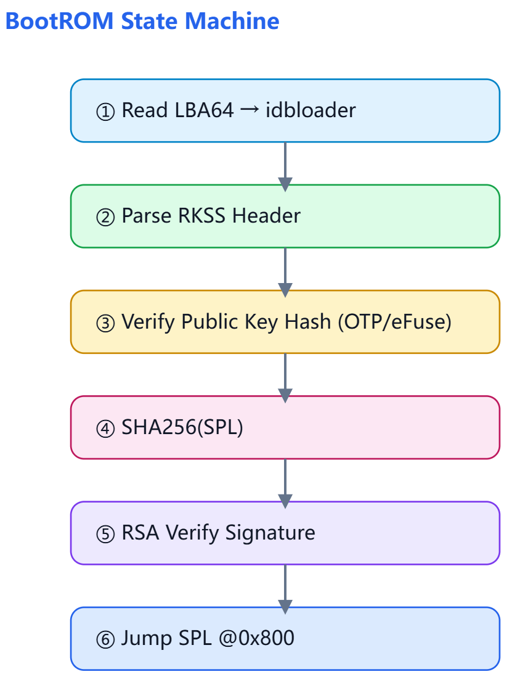

# 原厂固件分析


## 分区表

全盘镜像，分区表信息：

```shell
00000000  00 00 00 00 00 00 00 00  00 00 00 00 00 00 00 00  |................|
*
000001c0  00 00 ee 00 00 00 01 00  00 00 ff ff ff ff 00 00  |................|
000001d0  00 00 00 00 00 00 00 00  00 00 00 00 00 00 00 00  |................|
*
000001f0  00 00 00 00 00 00 00 00  00 00 00 00 00 00 55 aa  |..............U.|
00000200  45 46 49 20 50 41 52 54  00 00 01 00 5c 00 00 00  |EFI PART....\...|
00000210  d8 c7 8c 97 00 00 00 00  01 00 00 00 00 00 00 00  |................|
00000220  ff ef d1 01 00 00 00 00  22 00 00 00 00 00 00 00  |........".......|
00000230  de ef d1 01 00 00 00 00  00 00 4b 09 00 00 31 46  |..........K...1F|
00000240  80 00 57 2c 00 00 41 9b  02 00 00 00 00 00 00 00  |..W,..A.........|
00000250  80 00 00 00 80 00 00 00  c8 be 73 da 00 00 00 00  |..........s.....|
00000260  00 00 00 00 00 00 00 00  00 00 00 00 00 00 00 00  |................|
*
00000400  00 00 3f 75 00 00 7e 45  80 00 64 c2 00 00 7c 64  |..?u..~E..d...|d|
00000410  00 00 66 b7 00 00 28 4d  80 00 48 39 00 00 0e 59  |..f...(M..H9...Y|
00000420  00 40 00 00 00 00 00 00  ff 5f 00 00 00 00 00 00  |.@......._......|
00000430  00 00 00 00 00 00 00 00  75 00 62 00 6f 00 6f 00  |........u.b.o.o.|
00000440  74 00 00 00 00 00 00 00  00 00 00 00 00 00 00 00  |t...............|
00000450  00 00 00 00 00 00 00 00  00 00 00 00 00 00 00 00  |................|
*
00000480  00 00 5d f3 00 00 73 44  80 00 0d d4 00 00 3b 4e  |..]...sD......;N|
00000490  00 00 61 8f 00 00 27 4d  80 00 67 1a 00 00 55 59  |..a...'M..g...UY|
000004a0  00 60 00 00 00 00 00 00  ff 7f 00 00 00 00 00 00  |.`..............|
000004b0  00 00 00 00 00 00 00 00  6d 00 69 00 73 00 63 00  |........m.i.s.c.|
000004c0  00 00 00 00 00 00 00 00  00 00 00 00 00 00 00 00  |................|
*
00000500  00 00 61 30 00 00 21 4e  80 00 44 cf 00 00 49 cd  |..a0..!N..D...I.|
00000510  00 00 3f 7a 00 00 6a 44  80 00 70 2f 00 00 62 73  |..?z..jD..p/..bs|
00000520  00 80 00 00 00 00 00 00  ff 7f 02 00 00 00 00 00  |................|
00000530  00 00 00 00 00 00 00 00  62 00 6f 00 6f 00 74 00  |........b.o.o.t.|
00000540  00 00 00 00 00 00 00 00  00 00 00 00 00 00 00 00  |................|
*
00000580  00 00 66 53 00 00 2b 4c  80 00 3b da 00 00 6c 8a  |..fS..+L..;...l.|
00000590  00 00 4e 5f 00 00 70 42  80 00 5d fa 00 00 19 bc  |..N_..pB..].....|
000005a0  00 80 02 00 00 00 00 00  ff 7f 06 00 00 00 00 00  |................|
000005b0  00 00 00 00 00 00 00 00  72 00 65 00 63 00 6f 00  |........r.e.c.o.|
000005c0  76 00 65 00 72 00 79 00  00 00 00 00 00 00 00 00  |v.e.r.y.........|
000005d0  00 00 00 00 00 00 00 00  00 00 00 00 00 00 00 00  |................|
*
00000600  00 00 1b 84 00 00 07 45  80 00 35 1d 00 00 3f 2d  |.......E..5...?-|
00000610  00 00 20 a7 00 00 27 48  80 00 3c 49 00 00 4c 71  |.. ...'H..<I..Lq|
00000620  00 80 06 00 00 00 00 00  ff 7f 07 00 00 00 00 00  |................|
00000630  00 00 00 00 00 00 00 00  62 00 61 00 63 00 6b 00  |........b.a.c.k.|
00000640  75 00 70 00 00 00 00 00  00 00 00 00 00 00 00 00  |u.p.............|
00000650  00 00 00 00 00 00 00 00  00 00 00 00 00 00 00 00  |................|
*
00000680  00 00 44 ed 00 00 7d 42  80 00 0a c1 00 00 30 5d  |..D...}B......0]|
00000690  00 00 4e 61 00 00 53 4b  80 00 1d 28 00 00 54 a9  |..Na..SK...(..T.|
000006a0  00 80 07 00 00 00 00 00  ff 7f d7 00 00 00 00 00  |................|
000006b0  00 00 00 00 00 00 00 00  72 00 6f 00 6f 00 74 00  |........r.o.o.t.|
000006c0  66 00 73 00 00 00 00 00  00 00 00 00 00 00 00 00  |f.s.............|
000006d0  00 00 00 00 00 00 00 00  00 00 00 00 00 00 00 00  |................|
*
00000700  00 00 38 b3 00 00 2c 4a  80 00 27 ee 00 00 02 c2  |..8...,J..'.....|
00000710  00 00 3a bf 00 00 39 43  80 00 2f 6c 00 00 4f 26  |..:...9C../l..O&|
00000720  00 80 d7 00 00 00 00 00  ff 7f db 00 00 00 00 00  |................|
00000730  00 00 00 00 00 00 00 00  6f 00 65 00 6d 00 00 00  |........o.e.m...|
00000740  00 00 00 00 00 00 00 00  00 00 00 00 00 00 00 00  |................|
*
00000780  00 00 62 01 00 00 06 46  80 00 0d cb 00 00 4d 05  |..b....F......M.|
00000790  00 00 5a de 00 00 79 48  80 00 43 91 00 00 4c 77  |..Z...yH..C...Lw|
000007a0  00 80 db 00 00 00 00 00  bf ef d1 01 00 00 00 00  |................|
000007b0  00 00 00 00 00 00 00 00  75 00 73 00 65 00 72 00  |........u.s.e.r.|
000007c0  64 00 61 00 74 00 61 00  00 00 00 00 00 00 00 00  |d.a.t.a.........|
000007d0  00 00 00 00 00 00 00 00  00 00 00 00 00 00 00 00  |................|
*
```

32MB镜像分区表信息：

```shell
# hexdump -C my-aigo-backup-32MB.img |more
00000000  00 00 00 00 00 00 00 00  00 00 00 00 00 00 00 00  |................|
*
000001c0  00 00 ee 00 00 00 01 00  00 00 ff ff ff ff 00 00  |................|
000001d0  00 00 00 00 00 00 00 00  00 00 00 00 00 00 00 00  |................|
*
000001f0  00 00 00 00 00 00 00 00  00 00 00 00 00 00 55 aa  |..............U.|
00000200  45 46 49 20 50 41 52 54  00 00 01 00 5c 00 00 00  |EFI PART....\...|
00000210  af 80 36 f3 00 00 00 00  01 00 00 00 00 00 00 00  |..6.............|
00000220  ff ef d1 01 00 00 00 00  22 00 00 00 00 00 00 00  |........".......|
00000230  de ef d1 01 00 00 00 00  00 00 48 75 00 00 62 4a  |..........Hu..bJ|
00000240  80 00 56 f9 00 00 28 07  02 00 00 00 00 00 00 00  |..V...(.........|
00000250  80 00 00 00 80 00 00 00  ff 94 25 5e 00 00 00 00  |..........%^....|
00000260  00 00 00 00 00 00 00 00  00 00 00 00 00 00 00 00  |................|
*
00000400  00 00 78 0c 00 00 5c 47  80 00 02 30 00 00 22 6e  |..x...\G...0.."n|
00000410  00 00 46 8a 00 00 6e 44  80 00 0d 65 00 00 6a 75  |..F...nD...e..ju|
00000420  00 40 00 00 00 00 00 00  ff 5f 00 00 00 00 00 00  |.@......._......|
00000430  00 00 00 00 00 00 00 00  75 00 62 00 6f 00 6f 00  |........u.b.o.o.|
00000440  74 00 00 00 00 00 00 00  00 00 00 00 00 00 00 00  |t...............|
00000450  00 00 00 00 00 00 00 00  00 00 00 00 00 00 00 00  |................|
*
00000480  00 00 64 ad 00 00 26 4f  80 00 3a 75 00 00 21 08  |..d...&O..:u..!.|
00000490  00 00 4b 72 00 00 1c 45  80 00 5c 7d 00 00 3d 54  |..Kr...E..\}..=T|
000004a0  00 60 00 00 00 00 00 00  ff 7f 00 00 00 00 00 00  |.`..............|
000004b0  00 00 00 00 00 00 00 00  6d 00 69 00 73 00 63 00  |........m.i.s.c.|
000004c0  00 00 00 00 00 00 00 00  00 00 00 00 00 00 00 00  |................|
*
00000500  00 00 4b 15 00 00 05 43  80 00 66 da 00 00 15 c6  |..K....C..f.....|
00000510  00 00 3f 7a 00 00 6a 44  80 00 70 2f 00 00 62 73  |..?z..jD..p/..bs|
00000520  00 80 00 00 00 00 00 00  ff 7f 02 00 00 00 00 00  |................|
00000530  00 00 00 00 00 00 00 00  62 00 6f 00 6f 00 74 00  |........b.o.o.t.|
00000540  00 00 00 00 00 00 00 00  00 00 00 00 00 00 00 00  |................|
*
00000580  00 00 6c 2a 00 00 6c 4a  80 00 71 48 00 00 2d 12  |..l*..lJ..qH..-.|
00000590  00 00 71 57 00 00 6a 4d  80 00 03 52 00 00 1d 05  |..qW..jM...R....|
000005a0  00 80 02 00 00 00 00 00  ff 7f 06 00 00 00 00 00  |................|
000005b0  00 00 00 00 00 00 00 00  72 00 65 00 63 00 6f 00  |........r.e.c.o.|
000005c0  76 00 65 00 72 00 79 00  00 00 00 00 00 00 00 00  |v.e.r.y.........|
000005d0  00 00 00 00 00 00 00 00  00 00 00 00 00 00 00 00  |................|
*
00000600  00 00 7a d6 00 00 7f 4b  80 00 3d a5 00 00 4c 53  |..z....K..=...LS|
00000610  00 00 79 25 00 00 57 43  80 00 1b de 00 00 70 a7  |..y%..WC......p.|
00000620  00 80 06 00 00 00 00 00  ff 7f 07 00 00 00 00 00  |................|
00000630  00 00 00 00 00 00 00 00  62 00 61 00 63 00 6b 00  |........b.a.c.k.|
00000640  75 00 70 00 00 00 00 00  00 00 00 00 00 00 00 00  |u.p.............|
00000650  00 00 00 00 00 00 00 00  00 00 00 00 00 00 00 00  |................|
*
00000680  00 00 1b 00 00 00 19 40  80 00 1c db 00 00 07 f0  |.......@........|
00000690  00 00 4e 61 00 00 53 4b  80 00 1d 28 00 00 54 a9  |..Na..SK...(..T.|
000006a0  00 80 07 00 00 00 00 00  ff 7f d7 00 00 00 00 00  |................|
000006b0  00 00 00 00 00 00 00 00  72 00 6f 00 6f 00 74 00  |........r.o.o.t.|
000006c0  66 00 73 00 00 00 00 00  00 00 00 00 00 00 00 00  |f.s.............|
000006d0  00 00 00 00 00 00 00 00  00 00 00 00 00 00 00 00  |................|
*
00000700  00 00 6c 90 00 00 47 40  80 00 57 d0 00 00 2a 53  |..l...G@..W...*S|
00000710  00 00 16 fe 00 00 7b 4c  80 00 18 c3 00 00 0e 87  |......{L........|
00000720  00 80 d7 00 00 00 00 00  ff 7f db 00 00 00 00 00  |................|
00000730  00 00 00 00 00 00 00 00  6f 00 65 00 6d 00 00 00  |........o.e.m...|
00000740  00 00 00 00 00 00 00 00  00 00 00 00 00 00 00 00  |................|
*
00000780  00 00 7b 6d 00 00 4b 43  80 00 29 6e 00 00 33 e3  |..{m..KC..)n..3.|
00000790  00 00 49 da 00 00 36 40  80 00 75 ec 00 00 55 95  |..I...6@..u...U.|
000007a0  00 80 db 00 00 00 00 00  bf ef d1 01 00 00 00 00  |................|
000007b0  00 00 00 00 00 00 00 00  75 00 73 00 65 00 72 00  |........u.s.e.r.|
000007c0  64 00 61 00 74 00 61 00  00 00 00 00 00 00 00 00  |d.a.t.a.........|
000007d0  00 00 00 00 00 00 00 00  00 00 00 00 00 00 00 00  |................|
*

```

**结论：两份 dump 的分区布局完全相同，差异只在 GUID 和两个 CRC 上。**

### 1. 保护性 MBR（0x000–0x1FF）：完全相同

| 偏移 | 字段 | 两者的值 | 含义 |
|---|---|---|---|
| 0x1C2 | 分区类型 | `ee` | GPT 保护分区 |
| 0x1C6 | 起始 LBA | `01 00 00 00` | 从 LBA 1 开始 |
| 0x1CA | 扇区数 | `ff ff ff ff` | 盘太大时的占位值 |
| 0x1FE | 引导签名 | `55 aa` | |

### 2. GPT 头（0x200，LBA 1）

| 偏移 | 字段 | 全盘镜像 | 32MB 镜像 | 是否相同 |
|---|---|---|---|---|
| 0x200 | 签名 | `EFI PART` | `EFI PART` | 相同 |
| 0x208 | 版本 | 1.0 | 1.0 | 相同 |
| 0x20C | 头大小 | 0x5C (92) | 0x5C (92) | 相同 |
| 0x210 | **头 CRC32** | `0x978CC7D8` | `0xF33680AF` | **不同** |
| 0x218 | 保留 | 0 | 0 | 相同 |
| 0x218+ | 当前 LBA | 1 | 1 | 相同 |
| 0x220 | 备份头 LBA | 0x01D1EFFF (30,535,679) | 同左 | 相同 |
| 0x228 | 首个可用 LBA | 34 | 34 | 相同 |
| 0x230 | 末个可用 LBA | 0x01D1EFDE (30,535,646) | 同左 | 相同 |
| 0x238 | **磁盘 GUID** | `094b0000-0000-4631-8000-572c0000419b` | `75480000-0000-4a62-8000-56f900002807` | **不同** |
| 0x248 | 分区表起始 LBA | 2 | 2 | 相同 |
| 0x250 | 表项数量 | 128 | 128 | 相同 |
| 0x254 | 每项大小 | 128 字节 | 128 字节 | 相同 |
| 0x258 | **分区数组 CRC32** | `0xDA73BEC8` | `0x5E2594FF` | **不同** |

- 磁盘总容量是 30,535,680 个扇区，约 15.6 GB。
- 头 CRC 覆盖整个头，包括磁盘 GUID 和数组 CRC。数组 CRC 覆盖全部 128 个表项。所以两个 CRC 不同是 GUID 不同的必然结果，不是独立的差异。

### 3. 分区表项（0x400 起，每项 128 字节）

每项的结构是：类型 GUID（16 字节）、唯一 GUID（16 字节）、起始 LBA、结束 LBA、属性、UTF-16LE 名称。

| # | 名称 | 起始 LBA | 结束 LBA | 大小 | 布局 | 类型 GUID | 唯一 GUID |
|---|---|---|---|---|---|---|---|
| 1 | uboot | 0x4000 | 0x5FFF | 4 MiB | 相同 | 不同 | 不同 |
| 2 | misc | 0x6000 | 0x7FFF | 4 MiB | 相同 | 不同 | 不同 |
| 3 | boot | 0x8000 | 0x27FFF | 64 MiB | 相同 | 不同 | **相同** |
| 4 | recovery | 0x28000 | 0x67FFF | 128 MiB | 相同 | 不同 | 不同 |
| 5 | backup | 0x68000 | 0x77FFF | 32 MiB | 相同 | 不同 | 不同 |
| 6 | rootfs | 0x78000 | 0xD77FFF | 6.5 GiB | 相同 | 不同 | **相同** |
| 7 | oem | 0xD78000 | 0xDB7FFF | 128 MiB | 相同 | 不同 | 不同 |
| 8 | userdata | 0xDB8000 | 0x1D1EFBF | 约 7.7 GiB | 相同 | 不同 | 不同 |

- 所有分区的属性字段都是 0，名称也都相同。
- 只有 boot 和 rootfs 的唯一 GUID 两边一致：
    - boot 是 `7a3f0000-0000-446a-8000-702f00006273`。
    - rootfs 是 `614e0000-0000-4b53-8000-1d28000054a9`。
- 这两个值我认得是 Rockchip 平台常见的写死 PARTUUID，内核命令行里 `root=PARTUUID=614e0000-...` 是典型写法。这是我凭记忆判断的，你可以对照 parameter 文件确认。
- 其余 GUID 应该是烧录工具写分区表时随机生成的，所以每次都会变。
- 这些 GUID 的高位字节大多是 0，像是低熵的随机数生成器产出的，属于正常现象。

### 4. 这说明什么

- 两份分区表来自同一份分区定义（同一个 parameter/布局），但不是同一次分区表写入产生的。要么是不同设备，要么是同一设备重新烧录过。光看这些数据分不出是哪种。
- 32MB 镜像只是磁盘的前 32MB，即 65536 个扇区。它的 GPT 头仍然声明备份头在 LBA 30,535,679，而这个位置在镜像里并不存在。
- 32MB 镜像里实际只有 uboot、misc 和 boot 的前 16 MiB。recovery 及之后的分区都在镜像之外。
- 用 gdisk 或 fdisk 打开这个 32MB 镜像，会提示备份 GPT 缺失、分区超出磁盘范围。主 GPT 本身是完好的，可以正常读取。


## RKSS idbloader


提取命令

```shell
dd if=full_disk.img of=idbloader.bin bs=1 skip=$((0x8000)) count=$((0x20180)) status=progress

```

```shell
00008000  52 4b 53 53 00 00 00 00  80 01 02 00 11 00 00 00  |RKSS............|
00008010  00 00 00 00 00 00 00 00  00 00 00 00 00 00 00 00  |................|
*
00008070  00 00 00 00 00 00 00 00  04 00 90 00 ff ff ff ff  |................|
00008080  00 00 00 00 01 00 00 00  00 00 00 00 00 00 00 00  |................|
00008090  e0 33 3e 57 e1 fc 08 6d  48 3e ab d8 82 8e f1 c6  |.3>W...mH>......|
000080a0  1b b3 35 a8 96 93 c3 8f  0e 42 d7 9f 7c e9 62 df  |..5......B..|.b.|
000080b0  00 00 00 00 00 00 00 00  00 00 00 00 00 00 00 00  |................|
*
000080d0  94 00 fc 01 ff ff ff ff  00 00 00 00 02 00 00 00  |................|
000080e0  00 00 00 00 00 00 00 00  04 dc b1 9d 10 dd 6a 7b  |..............j{|
000080f0  e8 aa 6a 15 79 56 99 6d  db 9e 24 d2 02 7d 2c 7c  |..j.yV.m..$..},||
00008100  08 6d 69 10 d4 79 a6 50  00 00 00 00 00 00 00 00  |.mi..y.P........|
00008110  00 00 00 00 00 00 00 00  00 00 00 00 00 00 00 00  |................|
*
00008200  0f 26 d1 9b 5a d5 58 5f  a2 1a 2c 62 35 fd fc 13  |.&..Z.X_..,b5...|
00008210  c6 89 cf 25 cb 6d 77 c9  9d a8 d0 66 89 8e 5c 7e  |...%.mw....f..\~|
00008220  a5 a3 36 fd 6f 85 65 c4  fd 2d d4 85 66 1e 80 f8  |..6.o.e..-..f...|
00008230  9f 58 81 31 11 b9 f0 e1  34 7a 1e 53 2a a0 1d ac  |.X.1....4z.S*...|
00008240  7e 69 e7 2d 99 32 56 55  b1 11 de ac b2 f2 23 10  |~i.-.2VU......#.|
00008250  cb e2 ff e8 c3 b6 3c 88  c1 26 6e f5 4c ca 78 b2  |......<..&n.L.x.|
00008260  43 30 61 22 22 e9 11 07  36 f4 3a f9 01 e9 b8 3d  |C0a""...6.:....=|
00008270  57 53 39 47 1f 12 0d 9e  a1 78 fc 41 98 2c d6 27  |WS9G.....x.A.,.'|
00008280  56 e6 1e e0 2c c4 e2 14  45 c9 56 85 10 97 b2 78  |V...,...E.V....x|
00008290  06 65 38 05 ce a1 0c ac  f7 2a 07 ce 8a 45 c5 3d  |.e8......*...E.=|
000082a0  ec 89 12 3c eb 6d 82 a0  29 a3 55 56 51 f9 19 c2  |...<.m..).UVQ...|
000082b0  41 f4 7d 6c 6e 97 17 72  fd 7b 74 70 30 a5 63 1f  |A.}ln..r.{tp0.c.|
000082c0  47 80 a1 21 74 f0 73 e5  43 bb 20 3d 05 86 63 bd  |G..!t.s.C. =..c.|
000082d0  1e 9f 4d 8d 66 67 3d 3b  5b 8d 9b 3f 45 a5 db ff  |..M.fg=;[..?E...|
000082e0  b4 83 69 e3 7b 80 d6 f1  8b 5a c7 84 8f 89 f4 be  |..i.{....Z......|
000082f0  30 a0 2f 37 44 f0 16 5a  e4 70 ae a7 80 02 55 ae  |0./7D..Z.p....U.|
00008300  00 00 00 00 00 00 00 00  00 00 00 00 00 00 00 00  |................|
*
00008400  01 00 01 00 00 00 00 00  00 00 00 00 00 00 00 00  |................|
00008410  30 6f 0e 35 07 b4 24 4b  ce a7 32 e8 cb e4 d1 7e  |0o.5..$K..2....~|
00008420  17 00 00 00 00 00 00 00  00 00 00 00 00 00 00 00  |................|
00008430  00 00 00 00 00 00 00 00  00 00 00 00 00 00 00 00  |................|
*
00008600  03 78 b5 25 6c bb 67 5e  56 70 8d 25 53 56 6b 0a  |.x.%l.g^Vp.%SVk.|
```


根据您提供的 `idbloader.txt` 文件内容，以下是针对该 RKSS idbloader 二进制结构的详细字段拆解与分析。

### 📋 RKSS idbloader 结构字段拆解表

| 偏移 (Hex) | 长度 | 字段名称 | 原始值 (Little-Endian) | 解析值 / 含义 | 详细说明 |
| :--- | :--- | :--- | :--- | :--- | :--- |
| **0x0000** | 4B | Magic Number | `52 4B 53 53` | **"RKSS"** | Rockchip Secure Storage 格式标识符。区别于标准 U-Boot SPL 的 "RK33" 或 "SPL!"，表明启用了安全启动/加密容器封装。 |
| 0x0004 | 4B | Version / Flags | `00 00 00 00` | 0 | 格式版本或特性标志位。当前为 0，表示基础 RKSS v1 结构。 |
| 0x0008 | 4B | Total Image Size | `80 01 02 00` | **131,456 B** (0x20180) | 整个 idbloader.bin 镜像的总大小（含头部、描述符、签名及代码载荷）。即 128KB + 384B。 |
| 0x000C | 4B | Header Version | `11 00 00 00` | **v17** | 头部结构版本号。v17 对应较新的 Rockchip SoC 平台（如 RK3588/RK3568/RK3566 系列）。 |
| 0x0010 | 96B | Reserved | `00...00` | - | 保留区域，全零填充，用于未来扩展或对齐。 |
| 0x0070 | 4B | Key/Cert Offset | `04 00 90 00` | 0x00900004 | 指向公钥证书链或密钥表的偏移地址/索引。在 RKSS 中用于定位验签所需的公钥信息。 |
| 0x0074 | 4B | Header Terminator | `FF FF FF FF` | 0xFFFFFFFF | 头部结束标记，表示全局头部字段到此为止。 |


| 偏移 (Hex) | 长度 | 字段名称 | 原始值 (Little-Endian) | 解析值 / 含义 | 详细说明 |
| :--- | :--- | :--- | :--- | :--- | :--- |
| **0x0080** | 64B | Stage 0 Descriptor | *(见下方详解)* | TPL/First Stage | 第一阶段加载描述符。包含 Stage ID=1 及对应的 Hash/Signature 前 32 字节。 |
| **0x00D0** | 64B | Stage 1 Descriptor | *(见下方详解)* | SPL/Second Stage | 第二阶段加载描述符。包含 Stage ID=2、Size/Offset 参数 (0x01FC0094) 及 48B 验证数据块。 |
| **0x0200** | 512B | Crypto Payload | *(高熵随机数据)* | 签名/加密块 | 数字签名区或加密配置数据。BootROM 使用 OTP/eFuse 中的公钥对此区域验签，失败则拒绝启动。 |
| **0x0400** | 16B | Runtime Config | `01 00 01 00...` | 安全启动标志 | 运行时参数。`01 00 01 00` 通常表示 Secure Boot + Encryption 双使能。 |
| 0x0410 | 16B | Device Fingerprint | `30 6f 0e 35...` | Chip ID / Binding | 设备指纹或芯片绑定数据。用于将固件绑定到特定硬件，防止跨设备克隆。 |
| 0x0420 | 4B | Anti-Rollback Ver | `17 00 00 00` | **23** | 防回滚版本号。BootROM 会对比 eFuse 中的版本计数器，低于已烧录值的固件将被拒绝。 |
| **0x0600** | 16B+ | Secondary Verify | `03 78 b5 25...` | HMAC / IV / DDR Checksum | 二级校验数据。可能是 HMAC Tag、AES 初始化向量(IV)，或 DDR 初始化参数的完整性校验和。 |


1. Stage 描述符结构 (每个 64B)

Stage 描述符是 RKSS 的核心调度单元，BootROM 按顺序读取并加载各阶段：

| 子偏移 | 字段 | Stage 0 值 | Stage 1 值 | 说明 |
| :--- | :--- | :--- | :--- | :--- |
| +0x00 | Flags/Attr | `00 00 00 00` | `94 00 FC 01` | 属性标志。Stage1 的值可能编码了该阶段在镜像内的偏移与长度 |
| +0x04 | Next Stage | `FF FF FF FF` | `FF FF FF FF` | 下一阶段指针。0xFFFFFFFF 表示无后续链接或终止 |
| +0x08 | Reserved | `00 00 00 00` | `00 00 00 00` | 保留 |
| +0x0C | Stage ID | `01 00 00 00` | `02 00 00 00` | 阶段编号。1=TPL, 2=SPL, 3=Trust 等 |
| +0x10 | Crypto Data | 32B Hash/Sig | 48B Verify Block | 该阶段的完整性验证数据。Stage0 为 32B (SHA-256)，Stage1 为 48B (可能含 HMAC) |
| +0x30 | Padding | 16B Zero | 16B Zero | 填充至 64B 对齐 |

2. 安全机制三重验证

该 idbloader 体现了 Rockchip 安全启动的三层防护：

-   **镜像级验签:** 0x0200 处的 512B Crypto Payload 是整个镜像的数字签名，BootROM 首先验证此签名。
-   **阶段级校验:** 每个 Stage Descriptor 内嵌独立的 Hash/HMAC，确保各加载阶段代码完整性。
-   **硬件绑定 + 防回滚:** 0x0410 的设备指纹防止固件被移植到其他设备；0x0420 的 Anti-Rollback Version=23 防止降级攻击。

3. 平台代际判断

Header Version = **v17** 是关键指标：

-   v3/v5 → RK3288 / RK3399 (老一代)
-   v9/v11 → RK3328 / RK3368
-   **v17 → RK3568 / RK3588 / RK3566** (新一代 ARMv8.2-A 平台)

这意味着该 idbloader 适用于 RK35xx 系列芯片，其 BootROM 支持更复杂的信任链和更大的寻址空间。

4. 重要注意事项

> **不可直接编辑：** 由于 RKSS 是安全容器格式，所有关键字段均受密码学保护。使用 Hex Editor 修改任何字段（包括 DDR 参数、UART 配置等）都会导致验签失败，设备将无法启动。
>
> **重新打包要求：** 如需修改，必须拥有：
> 1.  原始私钥文件 (.pem / .key)
> 2.  Rockchip 官方打包工具 (`rkImageMaker`, `afptool`)
> 3.  完整的源码或预编译二进制组件
>
> 修改后需重新签名生成新的 idbloader.bin。





安全校验的完整分析过程：


1. 硬件根信任与 BROM 启动

-   **上电/复位：** RK3588 内部固化的 BootROM 开始执行。BROM 代码位于只读存储区，不可篡改，是整个信任链的**硬件根**。
-   **eFuse 读取：** BROM 首先读取芯片内部的 eFuse，获取以下关键安全状态：
  -   **Secure Boot Enable:** 确认是否开启安全启动。
  -   **Public Key Hash:** 预烧录的公钥哈希值（通常为 SHA-256）。
  -   **Anti-Rollback Counter:** 当前允许的最小固件版本号。
  -   **Chip ID / UID:** 用于设备绑定的唯一标识。

2. RKSS 头部解析与完整性预检

BROM 从存储介质（eMMC/SPI NOR）加载 `idbloader.bin` 到 SRAM 后，进行初步结构验证：

| 校验步骤 | 对应字段 (Offset) | 校验逻辑 | 失败后果 |
| :--- | :--- | :--- | :--- |
| Magic 检查 | `0x0000` ("RKSS") | 确认是否为有效的 RKSS 容器 | 停止启动，进入 Maskrom |
| 版本兼容性 | `0x000C` (v17) | 确认 Header Version 是否被当前 BROM 支持 | 拒绝加载 |
| 大小边界检查 | `0x0008` (0x20180) | 确认 Total Size 未超出 SRAM 容量且对齐合法 | 拒绝加载 |
| 防回滚预检 | `0x0420` (Ver=23) | 比较镜像版本 ≥ eFuse 中的 Anti-Rollback Counter | **永久拒绝**，防止降级攻击 |

3. 公钥验证与镜像级验签 (核心步骤)

这是建立软件信任锚点的关键环节：

1.  **提取公钥：** BROM 根据 `0x0070` (Key Offset = 0x00900004) 定位并提取嵌入在镜像中的公钥证书。
2.  **公钥合法性验证：** 计算提取公钥的 SHA-256 哈希，与 eFuse 中烧录的 **Public Key Hash** 进行比对。
  -   ✅ **匹配：** 确认该公钥是由 OEM 授权的合法密钥。
  -   ❌ **不匹配：** 立即终止启动（防止攻击者替换签名和公钥）。
3.  **镜像签名验证：** 使用验证通过的公钥，对 `0x0200` 处的 **512B Crypto Payload** 进行 RSA/ECDSA 验签。
  -   该签名覆盖了 RKSS 头部 + Stage Descriptors + 代码载荷的哈希摘要。
  -   ✅ **验签通过：** 确认整个 idbloader 镜像未被篡改。

4. 设备绑定校验 (Anti-Clone)

-   BROM 读取 `0x0410` 处的 **Device Fingerprint** (16B)。
-   将其与当前芯片的 eFuse UID/Chip ID 进行运算比对。
-   **目的：** 确保该固件只能在指定的硬件设备上运行，防止从量产设备中提取固件并刷入其他设备。

5. 分阶段加载与逐级校验

RKSS 的多 Stage 设计实现了**最小权限原则**，每个阶段独立校验：

```text
┌─────────────┐     ┌──────────────────┐     ┌──────────────────┐
│  BROM       │────▶│ Stage 0 (TPL)    │────▶│ Stage 1 (SPL)    │
│ (HW Root)   │     │ Desc @ 0x0080    │     │ Desc @ 0x00D0    │
└─────────────┘     │ Hash/Sig Verify  │     │ HMAC/Hash Verify │
                    └──────────────────┘     └──────────────────┘
                             │                        │
                             ▼                        ▼
                      DDR Init / Early         U-Boot SPL / Trust
                      Security Setup           OS Loading Prep
```

-   **Stage 0 (TPL) 校验：** BROM 使用 `0x0080` 描述符中的 32B Hash/Signature 验证 TPL 代码体。通过后跳转执行 TPL（通常负责 DDR 初始化和早期安全配置）。
-   **Stage 1 (SPL) 校验：** TPL 执行完毕后，读取 `0x00D0` 描述符，使用其中的 48B 验证数据块校验 SPL 代码体。通过后跳转执行 SPL。
-   **关键点：** 每一级只校验下一级的完整性，形成严格的**信任传递链**。任何一级校验失败都会触发安全异常处理。

6. 运行时安全参数生效

-   `0x0400` 处的 Runtime Config (`01 00 01 00`) 指示 SPL/Trust 阶段启用额外的安全特性：
  -   Secure Boot 持续使能标志
  -   加密存储解密使能
  -   JTAG/SWD 调试端口锁定策略
-   这些参数本身受镜像签名保护，无法被单独篡改。


安全模型总结与攻击面分析

| 安全机制 | 防护目标 | 强度评估 |
| :--- | :--- | :--- |
| eFuse Public Key Hash | 防止伪造签名 | 🟢 极高 (硬件级) |
| RSA/ECDSA 镜像签名 | 防止代码篡改 | 🟢 高 (取决于密钥长度) |
| Anti-Rollback Version | 防止降级攻击 | 🟢 高 (eFuse 单调递增) |
| Device Fingerprint | 防止固件克隆 | 🟡 中 (依赖 UID 不可读性) |
| Stage-wise Verification | 防止单点突破 | 🟢 高 (纵深防御) |
| Crypto Payload (0x0200) | 保护敏感配置 | 🟢 高 (加密+签名双重保护) |

> **⚠️ 重要提示：** RK3588 的 RKSS 安全校验完全依赖 **私钥保密性**。如果 OEM 的签名私钥泄露，整个信任链将从根本上崩塌。此外，BROM 本身的漏洞（如早期 Rockchip SoC 曾出现的 USB 下载模式绕过）也可能绕过上述校验流程。对于高安全场景，建议同时启用 eFuse 写保护、JTAG 永久禁用和 Secure Debug 认证机制。


